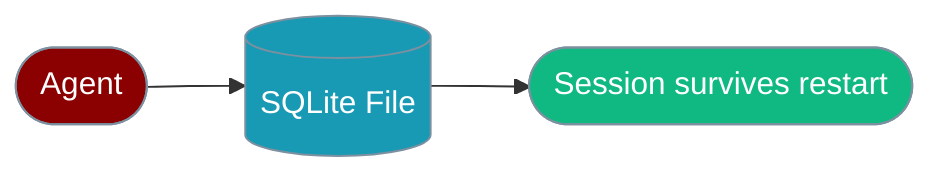
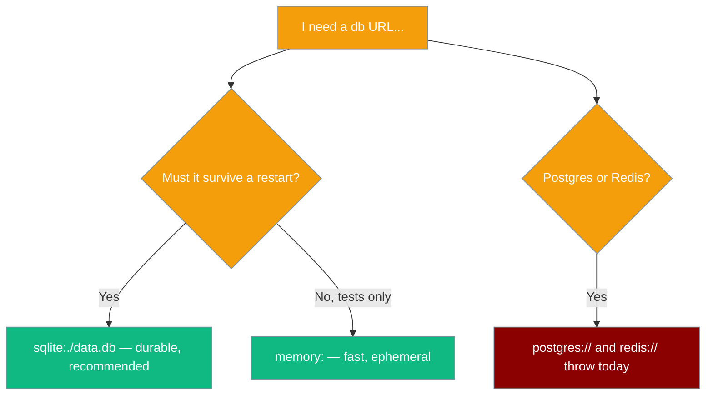

Give your Agent a real SQLite file so conversations survive a restart.



## Quick Start

<Steps>

<Step title="Durable SQLite (recommended)">
```typescript
import { Agent, db } from 'praisonai';

const agent = new Agent({
  name: 'Support Agent',
  instructions: 'You are a helpful support agent.',
  db: db('sqlite:./conversations.db'),  // Real durable SQLite — survives restarts
  sessionId: 'user-123',
});

await agent.chat('My name is Alice');
// Restart the process, then:
await agent.chat('What did I tell you my name was?');  // "You said your name is Alice."
```
</Step>

<Step title="In-memory (tests only)">
```typescript
import { Agent, db } from 'praisonai';

const agent = new Agent({
  name: 'Support Agent',
  instructions: 'You are a helpful support agent.',
  db: db('memory:'),  // In-process Maps — lost when the process exits
  sessionId: 'user-123',
});
```
</Step>

</Steps>

<Note>
**Driver requirements.** `db("sqlite:…")` tries two drivers in order: [`better-sqlite3`](https://www.npmjs.com/package/better-sqlite3) (the declared dependency), then Node's built-in `node:sqlite` (Node ≥ 22.5, no native build). There is **no memory fallback** — if neither driver can open the file, every operation rejects with an actionable error.
</Note>

---

## Which URL Should I Use?

Pick the URL that matches what you need. Only `sqlite:` and `memory:` are wired to the Agent's session/message/run contract today.



### Database URL Formats

| URL | Status | Notes |
|-----|--------|-------|
| `sqlite:./data.db` | ✅ Working (durable) | Real `SqliteDbAdapter`, survives restarts |
| `sqlite::memory:` | ⚠️ Memory-only | Real SQLite, but process-local |
| `memory:` | ⚠️ Memory-only | In-process Maps, lost on exit |
| `postgres://…` / `neon://…` | ❌ Throws | Remote-only Neon HTTP transport, not the session contract |
| `redis://…` / `upstash://…` | ❌ Throws | Remote-only Upstash REST transport, not the session contract |

<Warning>
`db("postgres://…")` and `db("redis://…")` **throw deliberately**. Both back remote-only HTTP transports (Neon, Upstash) that expose `query`/`get`/`set` — not the sessions/messages/runs contract the Agent calls. Their errors point you at `db("sqlite:…")` as the working durable option. Use the low-level `createNeonPostgres` / `createUpstashRedis` factories directly if you need those key/value transports.
</Warning>

---

## Agent with Persistent Memory

```typescript
import { Agent, db } from 'praisonai';

const agent = new Agent({
  name: 'Support Agent',
  instructions: 'You are a helpful support agent.',
  db: db('sqlite:./conversations.db'),
  sessionId: 'user-123',
});

// First conversation
await agent.chat('My name is Alice and I need help with billing');

// Later — even after the process restarts
await agent.chat('What was my issue?');
// "You mentioned billing issues, Alice."
```

## Multi-Agent with Shared Database

```typescript
import { Agent, AgentTeam, db } from 'praisonai';

// One durable file, shared by the team
const sharedDb = db('sqlite:./team.db');

const researcher = new Agent({
  name: 'Researcher',
  instructions: 'Research topics thoroughly.',
  db: sharedDb,
  sessionId: 'project-alpha',
});

const writer = new Agent({
  name: 'Writer',
  instructions: 'Write based on research.',
  db: sharedDb,
  sessionId: 'project-alpha',
});

const agents = new AgentTeam([researcher, writer]);
await agents.start();
```

## Session Management

```typescript
import { Agent, db } from 'praisonai';

const database = db('sqlite:./support.db');

function createAgentForUser(userId: string) {
  return new Agent({
    name: 'Support Agent',
    instructions: 'You provide personalized support.',
    db: database,
    sessionId: `user-${userId}`,
  });
}

const aliceAgent = createAgentForUser('alice');
const bobAgent = createAgentForUser('bob');

await aliceAgent.chat('I prefer dark mode');
await bobAgent.chat('I prefer light mode');

// Later — history is per-session
await aliceAgent.chat('What theme do I prefer?'); // "dark mode"
await bobAgent.chat('What theme do I prefer?');   // "light mode"
```

## Direct Database Operations

Access the adapter directly for advanced use cases. `getMessages(sessionId, limit)` returns the last `limit` messages in chronological order.

```typescript
import { Agent, db } from 'praisonai';

const database = db('sqlite:./data.db');

// Last 50 messages, oldest-to-newest
const messages = await database.getMessages('session-123', 50);
console.log(`Found ${messages.length} messages`);

const agent = new Agent({
  instructions: 'Continue the conversation.',
  db: database,
  sessionId: 'session-123',
});

await agent.chat('Summarize our conversation so far');
```

<Note>
Swapping `db('memory:')` for `db('sqlite:./data.db')` changes durability and nothing else — same read order, and unset optional fields read back as `undefined` (never `null`) on both backends.
</Note>

## What Happens When Neither Driver Is Available

If neither `better-sqlite3` nor `node:sqlite` can open the file, the first read or write **rejects** — it never quietly falls back to memory.

```text
SQLite persistence is unavailable for "./data.db". No driver could open it.
  - better-sqlite3: Cannot find module 'better-sqlite3'
  - node:sqlite: node:sqlite did not export DatabaseSync (Node >= 22.5 required)
  → Install the driver (`npm install better-sqlite3`), or run Node >= 22.5 so the
    built-in `node:sqlite` can be used.
  → db("memory:") works everywhere, but does not survive the process.
```

<Tip>
In CI that must never silently skip persistence, set `PRAISONAI_REQUIRE_SQLITE=1` so a driver-unavailable state becomes a hard failure instead of a soft skip.
</Tip>

## Auto-Restore and Caching

Agents restore history and can cache responses automatically:

```typescript
import { Agent, db } from 'praisonai';

const agent = new Agent({
  instructions: 'You are helpful.',
  db: db('sqlite:./data.db'),
  sessionId: 'user-123',

  autoRestore: true,   // Restore history on first chat (default: true)
  autoPersist: true,   // Persist messages (default: true)
  historyLimit: 50,    // Limit restored messages (default: 100)

  cache: true,
  cacheTTL: 3600,      // 1 hour
});

await agent.chat('Continue our conversation');

console.log(agent.getHistory());
await agent.clearHistory();
```

---

## Best Practices

<AccordionGroup>
  <Accordion title="Use sqlite: in production, memory: in tests">
    `db('sqlite:./data.db')` is the working durable option for `praisonai-ts` today. Reserve `db('memory:')` for tests where you want a clean slate every run.
  </Accordion>
  <Accordion title="Install better-sqlite3, or run Node ≥ 22.5">
    `better-sqlite3` is tried first. If you cannot ship a native build, run Node ≥ 22.5 so the built-in `node:sqlite` driver is available. No driver means a hard reject, not a silent memory fallback.
  </Accordion>
  <Accordion title="Point sqlite: at its own file">
    A file written by the low-level `SQLiteAdapter` (`praisonai/db/sqlite`) has a different table shape. Opening it through `db('sqlite:…')` is diagnosed on open with a clear error — give the durable adapter its own file.
  </Accordion>
  <Accordion title="Don't assume postgres:// or redis:// work">
    They throw today. Swap only between `sqlite:` and `memory:` when changing durability; use the `createNeonPostgres` / `createUpstashRedis` factories for those remote transports.
  </Accordion>
</AccordionGroup>

---

## Related

<CardGroup cols={2}>
  <Card title="Database CLI" icon="terminal" href="/js/database-cli">
    CLI database commands
  </Card>
  <Card title="SqliteDbAdapter Reference" icon="hard-drive" href="/sdk/typescript/db-adapters">
    Adapter internals and driver order
  </Card>
  <Card title="Sessions" icon="database" href="/js/sessions">
    Conversation persistence
  </Card>
  <Card title="Memory" icon="brain" href="/js/memory">
    Agent memory systems
  </Card>
</CardGroup>
