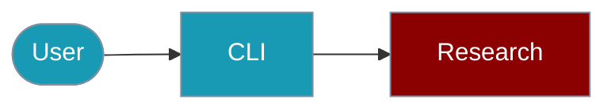

The `praisonai-ts` CLI provides the `research` command for comprehensive research.



## Quick Start

<Steps>

<Step title="Simple Usage">
```bash
praisonai-ts research "What are the latest AI trends?"
```
</Step>

<Step title="With Configuration">
```bash
praisonai-ts research "TypeScript best practices" --depth 5 --json
```
</Step>

</Steps>

---

## Basic Research

```bash
# Research a topic
praisonai-ts research "What are the latest AI trends?"

# Research with depth control
praisonai-ts research "TypeScript best practices" --depth 5

# Limit sources
praisonai-ts research "Machine learning" --max-sources 10

# Get JSON output
praisonai-ts research "AI history" --json
```

**Example Output:**
```json
{
  "success": true,
  "data": {
    "answer": "The latest AI trends include...",
    "citations": [
      { "title": "AI Research Paper", "url": "https://..." }
    ],
    "reasoning": [...],
    "confidence": 0.85
  }
}
```

## Research Options

| Option | Description |
|--------|-------------|
| `--depth` | Research depth (iterations) |
| `--max-sources` | Maximum sources to use |
| `--verbose` | Enable verbose output |

## SDK Usage

For programmatic research:

```typescript
import { DeepResearchAgent } from 'praisonai';

const agent = new DeepResearchAgent({
  llm: 'openai/gpt-4o-mini',
  maxIterations: 5
});

const result = await agent.research('What is machine learning?');
console.log('Answer:', result.answer);
console.log('Confidence:', result.confidence);
console.log('Citations:', result.citations.length);
```

For more details, see the [Deep Research SDK documentation](/docs/js/deep-research).

## Related

<CardGroup cols={2}>
  <Card title="Deep Research" icon="book" href="/docs/js/deep-research">
    SDK research agent
  </Card>
  <Card title="Citations" icon="book" href="/docs/js/citations">
    Source tracking
  </Card>
</CardGroup>
