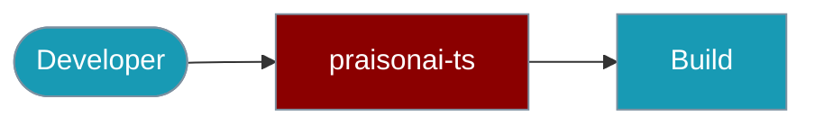

Set up a local PraisonAI TypeScript development environment.



## Development Setup

<Steps>
  <Step title="Clone Repository">
    ```bash
    git clone https://github.com/MervinPraison/PraisonAI.git
    cd src/praisonai-ts
    ```
  </Step>

  <Step title="Install Dependencies">
    ```bash
    npm install
    ```
  </Step>

  <Step title="Build Package">
    ```bash
    npm run build
    ```
  </Step>
</Steps>

## Package Structure

```
src/
├── agent/         # Agent-related interfaces and implementations
├── task/          # Task management and execution
├── utils/         # Utility functions and helpers
└── types/         # TypeScript type definitions