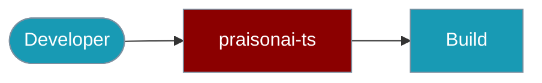

Set up a local PraisonAI TypeScript development environment.


```mermaid
graph LR
    Dev([Developer]) --> Repo[praisonai-ts]
    Repo --> Build[Build]

    classDef agent fill:#8B0000,stroke:#7C90A0,color:#fff
    classDef tool fill:#189AB4,stroke:#7C90A0,color:#fff

    class Repo agent
    class Dev,Build tool
    classDef agent fill:#8B0000,color:#fff
    classDef tool fill:#189AB4,color:#fff

```

## Where the code lives

TypeScript source is in the **PraisonAI monorepo** at `src/praisonai-ts/`, while [`MervinPraison/praisonai-js`](https://github.com/MervinPraison/praisonai-js) is a **read-only npm mirror** updated automatically from the monorepo by the `Sync to praisonai-js` GitHub Actions workflow.

<Warning>
Open **all** TypeScript issues and pull requests against [`MervinPraison/PraisonAI`](https://github.com/MervinPraison/PraisonAI). PRs opened against `praisonai-js` will be overwritten on the next sync.
</Warning>


```mermaid
graph LR
    Dev([Developer]) --> Monorepo[MervinPraison/PraisonAI<br/>src/praisonai-ts/]
    Monorepo -->|Sync to praisonai-js<br/>workflow| Mirror[MervinPraison/praisonai-js<br/>npm mirror]
    Mirror --> NPM[npm install praisonai]

    classDef source fill:#8B0000,stroke:#7C90A0,color:#fff
    classDef process fill:#189AB4,stroke:#7C90A0,color:#fff
    classDef output fill:#10B981,stroke:#7C90A0,color:#fff

    class Dev,Monorepo source
    class Mirror process
    class NPM output
```

<AccordionGroup>
<Accordion title="Maintainers: run the mirror sync">
Run the mirror sync after a TypeScript change merges to `main`:

```bash
gh workflow run "Sync to praisonai-js" --repo MervinPraison/PraisonAI
```

The workflow rsyncs `src/praisonai-ts/` → `praisonai-js` (excludes `node_modules/`, `dist/`, `coverage/`, `.github/`). Default mode opens a PR against `praisonai-js`; `mode=commit` pushes directly.
</Accordion>
</AccordionGroup>

## Development Setup

## Quick Start

<Steps>
  <Step title="Simple Usage">
    ```bash
    git clone https://github.com/MervinPraison/PraisonAI.git
    cd src/praisonai-ts
    ```
  </Step>

  <Step title="With Configuration">
    ```bash
    npm install
    ```
  </Step>

  <Step title="Build Package">
    ```bash
    npm run build
    ```
  </Step>
</Steps>

## Package Structure

```
src/
├── agent/         # Agent-related interfaces and implementations
├── task/          # Task management and execution
├── utils/         # Utility functions and helpers
└── types/         # TypeScript type definitions

## Related

<CardGroup cols={2}>
  <Card title="TypeScript" icon="book" href="/docs/js/typescript">TypeScript overview</Card>
  <Card title="Node.js" icon="robot" href="/docs/js/nodejs">Node.js overview</Card>
</CardGroup>
