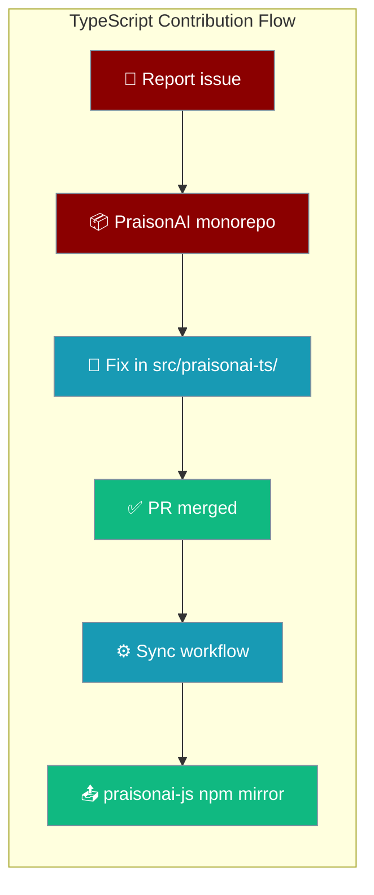

Set up a local PraisonAI TypeScript development environment.


```mermaid
graph LR
    Dev([Developer]) --> Repo[praisonai-ts]
    Repo --> Build[Build]

    classDef agent fill:#8B0000,stroke:#7C90A0,color:#fff
    classDef tool fill:#189AB4,stroke:#7C90A0,color:#fff

    class Repo agent
    class Dev,Build tool
    classDef agent fill:#8B0000,color:#fff
    classDef tool fill:#189AB4,color:#fff

```

## Development Setup

## Quick Start

<Steps>
  <Step title="Simple Usage">
    ```bash
    git clone https://github.com/MervinPraison/PraisonAI.git
    cd src/praisonai-ts
    ```
  </Step>

  <Step title="With Configuration">
    ```bash
    npm install
    ```
  </Step>

  <Step title="Build Package">
    ```bash
    npm run build
    ```
  </Step>
</Steps>

## Issue Routing & npm Mirror

File TypeScript issues on the monorepo, fix them in `src/praisonai-ts/`, and let maintainers publish the npm mirror.


```mermaid
graph LR
    subgraph "TypeScript Contribution Flow"
        Issue[🐛 Report issue] --> Repo[📦 PraisonAI monorepo]
        Repo --> Fix[🔧 Fix in src/praisonai-ts/]
        Fix --> Merge[✅ PR merged]
        Merge --> Sync[⚙️ Sync workflow]
        Sync --> Mirror[📤 praisonai-js npm mirror]
    end

    classDef input fill:#8B0000,stroke:#7C90A0,color:#fff
    classDef process fill:#189AB4,stroke:#7C90A0,color:#fff
    classDef result fill:#10B981,stroke:#7C90A0,color:#fff

    class Issue,Repo input
    class Fix,Sync process
    class Merge,Mirror result
```

File every TypeScript SDK bug or feature request on [MervinPraison/PraisonAI](https://github.com/MervinPraison/PraisonAI) using the bug or feature template. Do not open TypeScript issues on `praisonai-js`.

All TypeScript source lives in `src/praisonai-ts/` inside the [PraisonAI monorepo](https://github.com/MervinPraison/PraisonAI). Fork the monorepo, branch off `main`, and open your PR there.

<Info>
[`MervinPraison/praisonai-js`](https://github.com/MervinPraison/praisonai-js) is a one-way, downstream mirror. It exists so the `praisonai` npm package can be published from a standalone repo. It is **not** a fix target — do not open code PRs against it.

After a TypeScript PR merges on the monorepo, a maintainer syncs the mirror:

```bash
gh workflow run "Sync to praisonai-js" --repo MervinPraison/PraisonAI
```

Direction is **monorepo → `praisonai-js`** only.
</Info>

## Package Structure

```
src/
├── agent/         # Agent-related interfaces and implementations
├── task/          # Task management and execution
├── utils/         # Utility functions and helpers
└── types/         # TypeScript type definitions
```

- Bundles cleanly for non-Node runtimes (Tauri, React Native, browser). See [Browser & Mobile Runtimes](/docs/js/browser-runtime) for runtime-specific patterns.

## Related

<CardGroup cols={2}>
  <Card title="Contributing" icon="code-branch" href="/contributing">General contribution guide</Card>
  <Card title="TypeScript" icon="book" href="/docs/js/typescript">TypeScript overview</Card>
  <Card title="Node.js" icon="robot" href="/docs/js/nodejs">Node.js overview</Card>
  <Card title="Browser & Mobile" icon="globe" href="/docs/js/browser-runtime">Run in Tauri, React Native, browser, and edge runtimes</Card>
</CardGroup>
