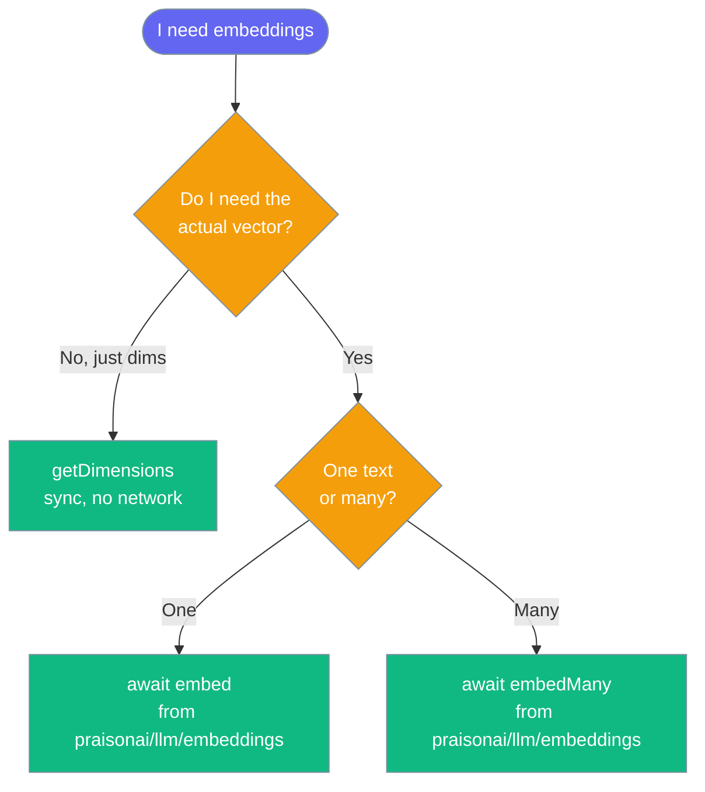

Generate text embeddings with AI SDK and native fallback providers.


## Quick Start

<Steps>

<Step title="Simple Usage">
```typescript
import { Agent } from 'praisonai';

const agent = new Agent({
  instructions: 'You are a helpful assistant',
  llm: 'openai/gpt-4o-mini'
});

// Embed single text
const embedding = await agent.embed('Hello world');
console.log('Dimensions:', embedding.length); // 1536

// Embed multiple texts
const embeddings = await agent.embed(['Hello', 'World']);
console.log('Count:', embeddings.length); // 2
```
</Step>

</Steps>

## EmbeddingAgent class

`EmbeddingAgent` wraps the embedding functions in an agent with similarity helpers.

```typescript
import { EmbeddingAgent } from 'praisonai';

const agent = new EmbeddingAgent({
  name: 'Embedder',
  model: 'text-embedding-3-small',
});

const { embedding } = await agent.embed('Hello world');
const { embeddings } = await agent.embedMany(['a', 'b', 'c']);
const sim = agent.cosineSimilarity(embeddings[0], embeddings[1]);
const best = await agent.findMostSimilar('query', ['a', 'b', 'c']);
```

### EmbeddingAgentConfig

| Field | Type | Default | Description |
|-------|------|---------|-------------|
| `name` | `string` | `'EmbeddingAgent'` | Agent name |
| `llm` / `model` | `string` | `'text-embedding-3-small'` | Embedding model (`model` is an alias for `llm`) |
| `embedding` | `boolean \| EmbeddingConfig` | — | Embedding settings; `true`/`false` use defaults |
| `verbose` | `boolean` | `true` | Log progress messages |

### EmbeddingConfig

| Field | Type | Default | Description |
|-------|------|---------|-------------|
| `model` | `string` | `'text-embedding-3-small'` | Embedding model |
| `dimensions` | `number` | — | Forwarded to the provider only when set |
| `batchSize` | `number` | `100` | Batch size for multiple texts |
| `timeout` | `number` | `60` | Timeout in seconds |

<Warning>
`EmbeddingAgent` no longer defaults `dimensions` to `1536`. Code that relied on a fixed 1536 dimension for a non-OpenAI model must now pass `dimensions: 1536` explicitly.
</Warning>

<Note>
`embed()` and `embedMany()` never fall back to fake vectors — a provider failure throws. `embedMany()` makes one batched provider call, not N sequential calls.
</Note>

## Direct Embedding API

For more control, use the embedding functions directly:

```typescript
import { embed, embedMany, createEmbeddingProvider } from 'praisonai';

// Single embedding
const result = await embed('Hello world', {
  model: 'text-embedding-3-small',
  dimensions: 512,   // optional; forwarded to the provider when supported
  backend: 'ai-sdk' // or 'native' or 'auto'
});
console.log('Embedding:', result.embedding);
console.log('Tokens used:', result.usage?.tokens);

// Batch embeddings
const batchResult = await embedMany(
  ['First text', 'Second text', 'Third text'],
  { model: 'text-embedding-3-large' }
);
console.log('Embeddings:', batchResult.embeddings.length);
```

The `dimensions?: number` option is forwarded to OpenAI as `dimensions` and to the AI SDK as `providerOptions.openai.dimensions`. Other providers ignore it today. Omit it to use the model's native size.

## Sync vs. Async

Embeddings need a network call, so the sync API cannot produce real vectors — the async API does.



The sync `embed(...)` and `embeddings(...)` functions from `praisonai` throw — they cannot make a network call. The error names the async replacement:

```text
Cannot embed synchronously (model 'text-embedding-3-small', 1536 dims).
Use the async embedder instead:
  import { embed } from 'praisonai/llm/embeddings';
  const { embedding } = await embed(text, { model });
```

For batches:

```text
Cannot embed N text(s) synchronously (model '...', ... dims).
Use the async embedder instead:
  import { embedMany } from 'praisonai/llm/embeddings';
  const vectors = await embedMany(texts, { model });
```

`getDimensions(model)` stays synchronous — it is a lookup, no network — so callers who only need the dimension size do not `await`:

```typescript
import { getDimensions } from 'praisonai';

const dims = getDimensions('text-embedding-3-small'); // 1536, no network
```

`aembed(...)` and `aembeddings(...)` delegate to the real network-backed embedder in `praisonai/llm/embeddings` (AI SDK preferred, native OpenAI fallback). The returned `dimensions` is the **real vector length**, not a lookup:

```typescript
import { aembed } from 'praisonai';

const result = await aembed('Hello world', { model: 'text-embedding-3-small' });
console.log(result.dimensions); // real vector length
```

## Embedding Models

### OpenAI Models

| Model | Dimensions | Description |
|-------|------------|-------------|
| `text-embedding-3-small` | 1536 | Fast, cost-effective (default) |
| `text-embedding-3-large` | 3072 | Higher quality |
| `text-embedding-ada-002` | 1536 | Legacy model |

### Google Models

| Model | Dimensions | Description |
|-------|------------|-------------|
| `text-embedding-004` | 768 | Google embedding |

### Cohere Models

| Model | Dimensions | Description |
|-------|------------|-------------|
| `embed-english-v3.0` | 1024 | English optimized |
| `embed-multilingual-v3.0` | 1024 | Multilingual support |

## Integration with Knowledge Base

Use embeddings with `Knowledge` for semantic search:

```typescript
import { Knowledge, createEmbeddingProvider } from 'praisonai';

// Create knowledge store with an embedding provider
const kb = new Knowledge({
  embeddingProvider: createEmbeddingProvider({ model: 'text-embedding-3-small' }),
  similarityThreshold: 0.7,
});

// Add documents
await kb.store('PraisonAI is an AI agent framework', { userId: 'u1' });
await kb.store('Embeddings enable semantic search', { userId: 'u1' });

// Search
const found = await kb.search('What is PraisonAI?', { userId: 'u1' });
console.log('Top match:', found.results[0].text);
```

Passing `embeddingProvider` in the `Knowledge` config is what turns on vector
similarity in the in-process store. Without it, search falls back to keyword overlap.

## Integration with Memory

Use embeddings for semantic memory search:

```typescript
import { Memory, createEmbeddingProvider } from 'praisonai';

const memory = new Memory({
  embeddingProvider: createEmbeddingProvider(),
  maxEntries: 1000
});

// Add memories
await memory.add('User prefers dark mode', 'user');
await memory.add('User is interested in AI', 'user');

// Semantic search
const relevant = await memory.search('What does the user like?');
```

## Custom providers work for both chat and embeddings

A provider registered through the [Provider Registry](/js/provider-registry) now applies to embeddings as well as chat. As of [PraisonAI PR #4874](https://github.com/MervinPraison/PraisonAI/pull/4874), `embed(...)`, `embedMany(...)`, and `agent.embed(...)` resolve their provider through the same `createAISDKProvider(...)` path chat has always used. Previously a `registerCustomProvider('openai', ...)` call took effect for a chat completion and was silently ignored for an embedding of the same provider.

```typescript
import { registerCustomProvider, embed } from 'praisonai';

// Register a custom provider factory once
registerCustomProvider('openai', () => myCustomOpenAIProvider);

// The embedding now routes through your custom provider too
const result = await embed('Hello world', { model: 'openai/text-embedding-3-small' });
```

### Embedding provider aliases

These provider names resolve through the AI SDK embedding path:

| Alias | Resolves to |
|-------|-------------|
| `openai`, `oai` | openai |
| `google`, `gemini` | google |
| `cohere` | cohere |

## Backend Selection

PraisonAI automatically selects the best backend:

1. **AI SDK** (preferred): When `ai` package is installed
2. **Native**: Falls back to direct OpenAI client

For the AI SDK backend, the provider package is loaded through a **computed specifier** (`await import(providerInfo.package)`), the same registry chat uses. A bundler cannot discover this at build time — that is deliberate: the provider package is a host-supplied optional peer dependency. In a webview or phone build, only `native` works for providers whose package the host cannot resolve.

### Force Backend

```typescript
// Force AI SDK
const result = await embed('Hello', { backend: 'ai-sdk' });

// Force native OpenAI
const result = await embed('Hello', { backend: 'native' });

// Auto-select (default)
const result = await embed('Hello', { backend: 'auto' });
```

### Environment Variable

```bash
# Force backend globally
export PRAISONAI_BACKEND=ai-sdk  # or 'native' or 'auto'
```

## Similarity Functions

Built-in similarity functions for comparing embeddings:

```typescript
import { cosineSimilarity, euclideanDistance } from 'praisonai';

const emb1 = await embed('Hello');
const emb2 = await embed('Hi there');

// Cosine similarity (0-1, higher = more similar)
const similarity = cosineSimilarity(emb1.embedding, emb2.embedding);
console.log('Similarity:', similarity); // ~0.9

// Euclidean distance (lower = more similar)
const distance = euclideanDistance(emb1.embedding, emb2.embedding);
console.log('Distance:', distance);
```

## Performance Tips

1. **Batch embeddings**: Use `embedMany` for multiple texts
2. **Cache embeddings**: Store embeddings to avoid re-computation
3. **Choose model wisely**: `text-embedding-3-small` is fast and cheap

```typescript
// Efficient batch processing
const texts = documents.map(d => d.content);
const { embeddings } = await embedMany(texts);

// Store with documents
documents.forEach((doc, i) => {
  doc.embedding = embeddings[i];
});
```

## Error Handling

```typescript
try {
  const result = await embed('Hello');
} catch (error) {
  if (error.message.includes('API key')) {
    console.error('Missing OPENAI_API_KEY');
  } else if (error.message.includes('not installed')) {
    console.error('Install AI SDK: npm install ai @ai-sdk/openai');
  }
}
```

Unavailable provider packages surface one of two messages:

- **Cohere** keeps its exact wording — `Cohere provider not installed. Install with: npm install @ai-sdk/cohere` — because `@ai-sdk/cohere` is the one embedding provider the SDK does not itself depend on.
- **Any other provider** surfaces the registry's generic `MISSING_DEPENDENCY` message: `AI SDK provider package '<package>' is not installed. Install it with: npm install <package>`.

## TypeScript Types

```typescript
import type { 
  EmbeddingOptions, 
  EmbeddingResult, 
  EmbeddingBatchResult,
  EmbeddingProvider 
} from 'praisonai';

const options: EmbeddingOptions = {
  model: 'text-embedding-3-small',
  dimensions: 512,   // optional
  backend: 'auto',
  maxRetries: 2
};

const result: EmbeddingResult = await embed('Hello', options);
```

## Related

<CardGroup cols={2}>
  <Card title="Embeddings CLI" icon="book" href="/js/embeddings-cli">Embeddings CLI overview</Card>
  <Card title="Knowledge Base" icon="robot" href="/js/knowledge-base">Knowledge Base overview</Card>
  <Card title="Memory System" icon="brain" href="/js/memory">Semantic memory with real embeddings by default</Card>
</CardGroup>
