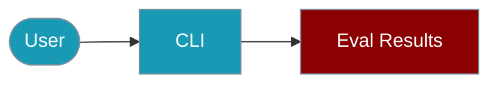

Manage evaluation results from the PraisonAI CLI.



## Quick Start

<Steps>

<Step title="Simple Usage">
```bash
npx praisonai eval results summary results.json
```
</Step>

<Step title="With Configuration">
```bash
npx praisonai eval results export results.json --format csv
```
</Step>

</Steps>

# Eval Results CLI

Manage and analyze Agent evaluation results from the command line.

## View Results

```bash
# List all results
npx praisonai eval results list

# Filter by status
npx praisonai eval results list --passed
npx praisonai eval results list --failed

# Filter by category
npx praisonai eval results list --category math
```

## Aggregate Stats

```bash
# Show summary
npx praisonai eval results summary

# Show by category
npx praisonai eval results summary --by-category

# Show trend
npx praisonai eval results trend --window 1h
```

## Format Output

```bash
# Table format
npx praisonai eval results --format table

# JSON format
npx praisonai eval results --format json

# Markdown format
npx praisonai eval results --format markdown
```

## Export Results

```bash
# Export to JSON
npx praisonai eval results export --output results.json

# Export to CSV
npx praisonai eval results export --format csv --output results.csv
```

## Import Results

```bash
# Import from file
npx praisonai eval results import results.json

# Merge with existing
npx praisonai eval results import new-results.json --merge
```

## Programmatic (TypeScript)

```typescript
import { EvalResults, createEvalResults } from 'praisonai';

const results = createEvalResults();
results.add({ name: 'test', passed: true, score: 0.9, duration: 100 });
console.log(results.formatSummary());
```

## Related

<CardGroup cols={2}>
  <Card title="Eval Results" icon="chart-line" href="/docs/js/eval-results">
    SDK result collection
  </Card>
  <Card title="Evaluation CLI" icon="terminal" href="/docs/js/evaluation-cli">
    Run evaluations
  </Card>
</CardGroup>
