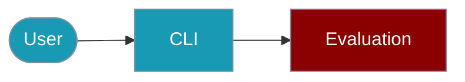

The `praisonai-ts` CLI provides the `eval` command for agent evaluation.



## Quick Start

<Steps>

<Step title="Simple Usage">
```bash
praisonai-ts eval accuracy --input "2+2" --expected "4"
```
</Step>

<Step title="With Configuration">
```bash
praisonai-ts eval performance --iterations 10 --json
```
</Step>

</Steps>

## Accuracy Evaluation

```bash
# Run accuracy evaluation
praisonai-ts eval accuracy --input "2+2" --expected "4"

# With multiple iterations
praisonai-ts eval accuracy --input "What is 2+2?" --expected "4" --iterations 3 --json
```

## Performance Evaluation

```bash
# Run performance benchmark
praisonai-ts eval performance --iterations 10

# With warmup runs
praisonai-ts eval performance --iterations 50 --warmup 5 --json
```

## Reliability Evaluation

```bash
# Check tool call reliability
praisonai-ts eval reliability --expected-tools "calculator,web_search"
```

## SDK Usage

For programmatic evaluation:

```typescript
import { AccuracyEval, PerformanceEval, ReliabilityEval } from 'praisonai';

// Accuracy evaluation
const accuracy = new AccuracyEval({
  agent: myAgent,
  input: "What is 2+2?",
  expectedOutput: "4",
  numIterations: 3
});
const result = await accuracy.run();

// Performance evaluation
const perf = new PerformanceEval({
  func: () => agent.chat("Hello"),
  numIterations: 50,
  warmupRuns: 10
});
const perfResult = await perf.run();
```

For more details, see the [Evaluation SDK documentation](/docs/js/evaluation).

## Related

<CardGroup cols={2}>
  <Card title="Evaluation" icon="book" href="/docs/js/evaluation">Evaluation overview</Card>
  <Card title="Benchmarks CLI" icon="robot" href="/docs/js/benchmarks-cli">Benchmarks CLI overview</Card>
</CardGroup>
