Events provides a publish-subscribe system for decoupled agent communication and event-driven workflows.

```mermaid
graph LR
    subgraph "Event System"
        A[📤 Publisher] -->|publish| B[📬 Topic]
        B -->|deliver| C[📥 Subscriber 1]
        B -->|deliver| D[📥 Subscriber 2]
    end
    
    classDef pub fill:#6366F1,stroke:#7C90A0,color:#fff
    classDef topic fill:#F59E0B,stroke:#7C90A0,color:#fff
    classDef sub fill:#10B981,stroke:#7C90A0,color:#fff
    
    class A pub
    class B topic
    class C,D sub
```



## Quick Start

<Steps>

<Step title="Create PubSub">
```typescript
import { createPubSub } from 'praisonai';

const pubsub = createPubSub();

// Subscribe to topic
await pubsub.subscribe('user.created', (event) => {
  console.log('New user:', event.data);
});

// Publish event
await pubsub.publish('user.created', { id: 123, name: 'Alice' });
```
</Step>

<Step title="Agent Event Bus">
```typescript
import { createEventBus, AgentEvents } from 'praisonai';

const bus = createEventBus('agent-1');

// Listen for events
await bus.on(AgentEvents.TOOL_CALLED, (data) => {
  console.log('Tool called:', data);
});

// Emit event
await bus.emit(AgentEvents.STARTED, { task: 'Process data' });
```
</Step>

<Step title="Agent-to-Agent Communication">
```typescript
const agent1Bus = createEventBus('agent-1');
const agent2Bus = createEventBus('agent-2');

// Agent 2 listens
await agent2Bus.on('request', (data) => {
  console.log('Received request:', data);
});

// Agent 1 sends to Agent 2
await agent1Bus.sendTo('agent-2', 'request', { query: 'Hello' });
```
</Step>

</Steps>

---

## How It Works


---

## Configuration Options

### Event

| Field | Type | Description |
|-------|------|-------------|
| `id` | `string` | Unique event ID (auto-generated) |
| `topic` | `string` | Topic name |
| `data` | `any` | Event payload |
| `createdAt` | `Date` | Timestamp |
| `metadata` | `object` | Additional metadata |

### Standard Agent Events

```typescript
import { AgentEvents } from 'praisonai';

// Available event types
AgentEvents.STARTED           // Agent started
AgentEvents.COMPLETED         // Agent completed
AgentEvents.ERROR             // Error occurred
AgentEvents.TOOL_CALLED       // Tool was called
AgentEvents.TOOL_RESULT       // Tool returned result
AgentEvents.MESSAGE_RECEIVED  // Message received
AgentEvents.MESSAGE_SENT      // Message sent
AgentEvents.HANDOFF_INITIATED // Handoff started
AgentEvents.HANDOFF_COMPLETED // Handoff finished
```

---

## Common Patterns

### Wait for Specific Event

```typescript
const pubsub = createPubSub();

// Wait with timeout
try {
  const event = await pubsub.waitFor('job.completed', 30000);
  console.log('Job completed:', event.data);
} catch (error) {
  console.error('Timeout waiting for job');
}
```

### Broadcast to All Agents

```typescript
const bus = createEventBus('coordinator');

// Broadcast status update
await bus.broadcast('status', { 
  phase: 'processing',
  progress: 50 
});

// Other agents receive
await otherBus.onBroadcast('status', (data, sourceId) => {
  console.log(`${sourceId} status: ${data.phase}`);
});
```

### Event Metadata

```typescript
await pubsub.publish('order.created', orderData, {
  userId: 'user-123',
  priority: 'high',
  correlationId: 'req-456'
});
```

### Cleanup

```typescript
const pubsub = createPubSub();

// Unsubscribe specific handler
await pubsub.unsubscribe('topic', handlerFn);

// Close all subscriptions
await pubsub.close();
```

---

## Best Practices

<AccordionGroup>
  <Accordion title="Use descriptive topic names">
    Structure topics hierarchically like `user.created`, `order.shipped` for clarity and filtered subscriptions.
  </Accordion>
  
  <Accordion title="Include correlation IDs">
    Add correlation IDs in metadata to trace events across distributed workflows.
  </Accordion>
  
  <Accordion title="Handle errors in subscribers">
    Wrap subscriber logic in try-catch to prevent one handler from breaking others.
  </Accordion>
  
  <Accordion title="Clean up on shutdown">
    Call `close()` on PubSub and EventBus instances when shutting down to prevent memory leaks.
  </Accordion>
</AccordionGroup>

---

## Related

<CardGroup cols={2}>
  <Card title="Hooks" icon="webhook" href="/docs/js/hooks">
    Lifecycle hooks and callbacks
  </Card>
  <Card title="Handoffs" icon="hand" href="/docs/js/handoffs">
    Agent-to-agent handoffs
  </Card>
</CardGroup>
