Agents emit events you can listen to - track progress, log activity, and extend behavior.

```mermaid
graph LR
    subgraph "Event System"
        A[🤖 Agent] --> B[📡 Events]
        B --> C[📝 Logger]
        B --> D[📊 Analytics]
        B --> E[🔔 Alerts]
    end
    
    classDef agent fill:#F59E0B,stroke:#7C90A0,color:#fff
    classDef event fill:#6366F1,stroke:#7C90A0,color:#fff
    classDef handler fill:#10B981,stroke:#7C90A0,color:#fff
    
    class A agent
    class B event
    class C,D,E handler
```



## Quick Start

<Steps>

<Step title="Listen to Events">
```typescript
import { Agent } from 'praisonai';

const agent = new Agent({
  instructions: 'You are a helpful assistant'
});

agent.on('message', (event) => {
  console.log('Agent said:', event.content);
});

agent.on('tool_call', (event) => {
  console.log('Tool used:', event.name);
});

await agent.chat('Search for weather');
```
</Step>

<Step title="Track All Events">
```typescript
agent.on('*', (event) => {
  console.log(`[${event.type}]`, event.data);
});
```
</Step>

</Steps>

---

## User Interaction Flow


---

## Configuration Levels

```typescript
// Level 1: Method - Simple listener
agent.on('message', (e) => console.log(e));

// Level 2: Array - Multiple events
agent.on(['start', 'complete'], (e) => {
  console.log(`${e.type} at ${e.timestamp}`);
});

// Level 3: Instance - Event bus
import { AgentEventBus } from 'praisonai';

const bus = new AgentEventBus();

bus.subscribe('agent.*', (event) => {
  sendToAnalytics(event);
});

const agent = new Agent({ eventBus: bus });
```

---

## Event Types

| Event | When |
|-------|------|
| `start` | Agent begins processing |
| `message` | Agent produces output |
| `tool_call` | Agent calls a tool |
| `error` | Something goes wrong |
| `complete` | Agent finishes |

---

## Best Practices

<AccordionGroup>
  <Accordion title="Log important events">
    Track tool calls and errors for debugging.
  </Accordion>
  
  <Accordion title="Use wildcards sparingly">
    Subscribe to specific events for better performance.
  </Accordion>
  
  <Accordion title="Handle errors">
    Always listen for 'error' events in production.
  </Accordion>
</AccordionGroup>

---

## Related

<CardGroup cols={2}>
  <Card title="Hooks" icon="webhook" href="/docs/js/hooks">
    Lifecycle hooks
  </Card>
  <Card title="PubSub" icon="envelope" href="/docs/js/pubsub">
    Publish-subscribe
  </Card>
</CardGroup>
