Agents can run with different execution settings - timeouts, retries, and parallel processing.

```mermaid
graph LR
    subgraph "Execution Control"
        A[📋 Task] --> B{Mode?}
        B -->|Sequential| C[➡️ One by One]
        B -->|Parallel| D[⚡ All at Once]
        B -->|Retry| E[🔄 Auto Retry]
    end
    
    classDef task fill:#6366F1,stroke:#7C90A0,color:#fff
    classDef mode fill:#F59E0B,stroke:#7C90A0,color:#fff
    classDef exec fill:#10B981,stroke:#7C90A0,color:#fff
    
    class A task
    class B mode
    class C,D,E exec
```



## Quick Start

<Steps>

<Step title="Set Timeout">
```typescript
import { Agent } from 'praisonai';

const agent = new Agent({
  instructions: 'You complete tasks',
  timeout: 30000  // 30 seconds max
});

await agent.chat('Analyze this document');
// Times out after 30 seconds if not complete
```
</Step>

<Step title="With Retries">
```typescript
const agent = new Agent({
  timeout: 30000,
  retries: 3,
  retryDelay: 1000
});
```
</Step>

</Steps>

---

## User Interaction Flow


---

## Configuration Levels

```typescript
// Level 1: Number - Simple timeout
const agent = new Agent({
  timeout: 30000
});

// Level 2: Dict - Multiple options
const agent = new Agent({
  execution: {
    timeout: 30000,
    retries: 3,
    retryDelay: 1000
  }
});

// Level 3: Instance - Full control
const agent = new Agent({
  execution: {
    timeout: 60000,
    retries: 5,
    retryDelay: 2000,
    maxConcurrent: 3,
    onRetry: (attempt) => console.log(`Retry ${attempt}`)
  }
});
```

---

## Execution Options

| Option | Default | Description |
|--------|---------|-------------|
| `timeout` | `60000` | Max time in ms |
| `retries` | `0` | Retry attempts |
| `retryDelay` | `1000` | Delay between retries |
| `maxConcurrent` | `5` | Parallel limit |

---

## Best Practices

<AccordionGroup>
  <Accordion title="Set reasonable timeouts">
    Most tasks complete in 30-60 seconds.
  </Accordion>
  
  <Accordion title="Use retries for flaky operations">
    Network calls and external APIs benefit from retries.
  </Accordion>
  
  <Accordion title="Limit concurrency">
    Too many parallel tasks can overwhelm resources.
  </Accordion>
</AccordionGroup>

---

## Related

<CardGroup cols={2}>
  <Card title="Workflows" icon="diagram-project" href="/docs/js/workflows">
    Multi-step workflows
  </Card>
  <Card title="Failover" icon="arrows-rotate" href="/docs/js/failover">
    Automatic backup
  </Card>
</CardGroup>
