Failover automatically switches to backup options when the primary fails - keeping your agents running.

```mermaid
graph LR
    subgraph "Automatic Failover"
        A[📤 Request] --> B[🤖 Primary]
        B -->|Fails| C[🤖 Backup 1]
        C -->|Fails| D[🤖 Backup 2]
        D --> E[✅ Success]
    end
    
    classDef request fill:#6366F1,stroke:#7C90A0,color:#fff
    classDef primary fill:#F59E0B,stroke:#7C90A0,color:#fff
    classDef backup fill:#10B981,stroke:#7C90A0,color:#fff
    
    class A request
    class B primary
    class C,D,E backup
```



## Quick Start

```typescript
import { Agent } from 'praisonai';

const agent = new Agent({
  llm: 'gpt-4o',
  fallbackModels: ['gpt-4-turbo', 'gpt-3.5-turbo']
});

// Automatically tries backups if primary fails
const response = await agent.chat('Hello');
```

## Failover Options

| Option | Description |
|--------|-------------|
| `fallbackModels` | List of backup models |
| `retries` | Times to retry before failover |
| `timeout` | When to consider a failure |

---

## Common Patterns

### Multiple Providers

```typescript
const agent = new Agent({
  llm: 'gpt-4o',
  fallbackModels: [
    'anthropic/claude-3',     // Different provider
    'google/gemini-1.5-pro'   // Another provider
  ]
});
```

### Cost-Optimized Failover

```typescript
const agent = new Agent({
  llm: 'gpt-4o',              // Best quality
  fallbackModels: [
    'gpt-4-turbo',            // Good quality, lower cost
    'gpt-3.5-turbo'           // Acceptable quality, lowest cost
  ]
});
```

---

## Related

<CardGroup cols={2}>
  <Card title="Execution" icon="play" href="/docs/js/execution">
    Execution settings
  </Card>
  <Card title="Providers" icon="plug" href="/docs/js/providers">
    LLM providers
  </Card>
</CardGroup>
