Agents can failover to backup models when the primary fails.

```mermaid
graph LR
    subgraph "Automatic Failover"
        A[📤 Request] --> B[🤖 Primary]
        B -->|Fails| C[🤖 Backup]
        C --> D[✅ Success]
    end
    
    classDef request fill:#6366F1,stroke:#7C90A0,color:#fff
    classDef primary fill:#F59E0B,stroke:#7C90A0,color:#fff
    classDef backup fill:#10B981,stroke:#7C90A0,color:#fff
    
    class A request
    class B primary
    class C,D backup
```



## Quick Start

<Steps>

<Step title="Set Fallback Models">
```typescript
import { Agent } from 'praisonai';

const agent = new Agent({
  llm: 'gpt-4o',
  fallback: ['gpt-4-turbo', 'gpt-3.5-turbo']
});

await agent.chat('Hello');
// Uses gpt-4o, falls back if unavailable
```
</Step>

<Step title="Multi-Provider Failover">
```typescript
const agent = new Agent({
  llm: 'gpt-4o',
  fallback: [
    'anthropic/claude-3',
    'google/gemini-pro'
  ]
});
```
</Step>

</Steps>

---

## User Interaction Flow


---

## Configuration Levels

```typescript
// Level 1: Array - Simple fallback list
const agent = new Agent({
  llm: 'gpt-4o',
  fallback: ['gpt-4-turbo', 'gpt-3.5-turbo']
});

// Level 2: Dict - With options
const agent = new Agent({
  llm: 'gpt-4o',
  fallback: {
    models: ['gpt-4-turbo', 'gpt-3.5-turbo'],
    retries: 2
  }
});

// Level 3: Instance - Full control
const agent = new Agent({
  failover: {
    primary: 'gpt-4o',
    fallbacks: ['gpt-4-turbo', 'claude-3'],
    strategy: 'round-robin',  // or 'priority'
    healthCheck: true
  }
});
```

---

## Failover Options

| Option | Description |
|--------|-------------|
| `fallback` | Backup models list |
| `retries` | Attempts per model |
| `strategy` | How to select backup |
| `healthCheck` | Skip known-down models |

---

## API Reference

<Card title="FailoverConfig" icon="code" href="/docs/sdk/reference/typescript/classes/FailoverConfig">
  Complete configuration options
</Card>
<Card title="FailoverManager" icon="robot" href="/docs/sdk/reference/typescript/classes/FailoverManager">
  Manager class documentation
</Card>

---

## Best Practices

<AccordionGroup>
  <Accordion title="Include cheaper fallbacks">
    Use lower-cost models as last resort.
  </Accordion>
  
  <Accordion title="Mix providers">
    Different providers have different outages.
  </Accordion>
  
  <Accordion title="Test fallback paths">
    Verify backups work before production.
  </Accordion>
</AccordionGroup>

---

## Related

<CardGroup cols={2}>
  <Card title="Execution" icon="play" href="/docs/js/execution">
    Execution settings
  </Card>
  <Card title="Providers" icon="plug" href="/docs/js/providers">
    LLM providers
  </Card>
</CardGroup>
