File tools let agents read, write, and manage files - perfect for document processing and automation.

```mermaid
graph LR
    subgraph "File Operations"
        A[🤖 Agent] --> B[📖 Read]
        A --> C[✏️ Write]
        A --> D[📂 List]
    end
    
    classDef agent fill:#6366F1,stroke:#7C90A0,color:#fff
    classDef op fill:#10B981,stroke:#7C90A0,color:#fff
    
    class A agent
    class B,C,D op
```



## Quick Start

<Steps>

<Step title="Add File Tools">
```typescript
import { Agent, fileTools } from 'praisonai';

const agent = new Agent({
  instructions: 'You can read and write files',
  tools: [fileTools]
});
```
</Step>

<Step title="Read Files">
```typescript
const content = await agent.chat('Read the contents of config.json');
// Agent reads and returns file content
```
</Step>

<Step title="Write Files">
```typescript
await agent.chat('Create a new file called notes.txt with today\'s summary');
// Agent creates the file
```
</Step>

</Steps>

---

## Available Tools

| Tool | Purpose |
|------|---------|
| `readFile` | Read file contents |
| `writeFile` | Create or update a file |
| `listFiles` | List directory contents |
| `deleteFile` | Remove a file |
| `copyFile` | Copy a file |
| `moveFile` | Move or rename a file |

---

## Common Examples

### Document Processing

```typescript
await agent.chat('Read all .txt files in /docs and summarize them');
```

### Report Generation

```typescript
await agent.chat('Create a report.md file with our sales data analysis');
```

### Batch Operations

```typescript
await agent.chat('Rename all files in /photos to include today\'s date');
```

---

## Best Practices

<AccordionGroup>
  <Accordion title="Use approval for writes">
    Enable approval for file write operations to prevent accidental overwrites.
  </Accordion>
  
  <Accordion title="Limit accessible paths">
    Configure which directories the agent can access for security.
  </Accordion>
</AccordionGroup>

---

## Related

<CardGroup cols={2}>
  <Card title="Tools" icon="wrench" href="/docs/js/tools">
    Agent tools overview
  </Card>
  <Card title="Approval" icon="shield-check" href="/docs/js/approval">
    Human-in-the-loop
  </Card>
</CardGroup>
