Agents can work with files - read documents, write outputs, and manage data.

```mermaid
graph LR
    subgraph "File Operations"
        A[👤 User] --> B[🤖 Agent]
        B --> C[📄 Read]
        B --> D[✏️ Write]
        B --> E[📁 Manage]
    end
    
    classDef user fill:#6366F1,stroke:#7C90A0,color:#fff
    classDef agent fill:#F59E0B,stroke:#7C90A0,color:#fff
    classDef ops fill:#10B981,stroke:#7C90A0,color:#fff
    
    class A user
    class B agent
    class C,D,E ops
```



## Quick Start

<Steps>

<Step title="Read Files">
```typescript
import { Agent } from 'praisonai';

const agent = new Agent({
  instructions: 'You analyze documents',
  tools: ['read_file']
});

await agent.chat('Summarize the contents of report.pdf');
// Agent reads and summarizes the file
```
</Step>

<Step title="Write Files">
```typescript
const agent = new Agent({
  tools: ['read_file', 'write_file']
});

await agent.chat('Create a summary.txt with key points');
// Agent creates the file
```
</Step>

</Steps>

---

## User Interaction Flow


---

## Configuration Levels

```typescript
// Level 1: Array - Enable file tools
const agent = new Agent({
  tools: ['read_file', 'write_file']
});

// Level 2: String - Allow directory access
const agent = new Agent({
  tools: ['read_file'],
  allowedPaths: './docs/'
});

// Level 3: Dict - Full control
const agent = new Agent({
  files: {
    read: true,
    write: true,
    delete: false,
    allowedPaths: ['./docs/', './output/'],
    maxFileSize: '10MB'
  }
});
```

---

## File Tools

| Tool | Description |
|------|-------------|
| `read_file` | Read file contents |
| `write_file` | Create or update files |
| `list_files` | List directory contents |
| `delete_file` | Remove files (use carefully) |

---

## Best Practices

<AccordionGroup>
  <Accordion title="Limit allowed paths">
    Restrict file access to specific directories.
  </Accordion>
  
  <Accordion title="Disable delete by default">
    Only enable delete_file when absolutely needed.
  </Accordion>
  
  <Accordion title="Use approval for writes">
    Combine with approval for production safety.
  </Accordion>
</AccordionGroup>

---

## Related

<CardGroup cols={2}>
  <Card title="Tools" icon="wrench" href="/docs/js/tools">
    Agent tools
  </Card>
  <Card title="Approval" icon="shield-check" href="/docs/js/approval">
    Human oversight
  </Card>
</CardGroup>
