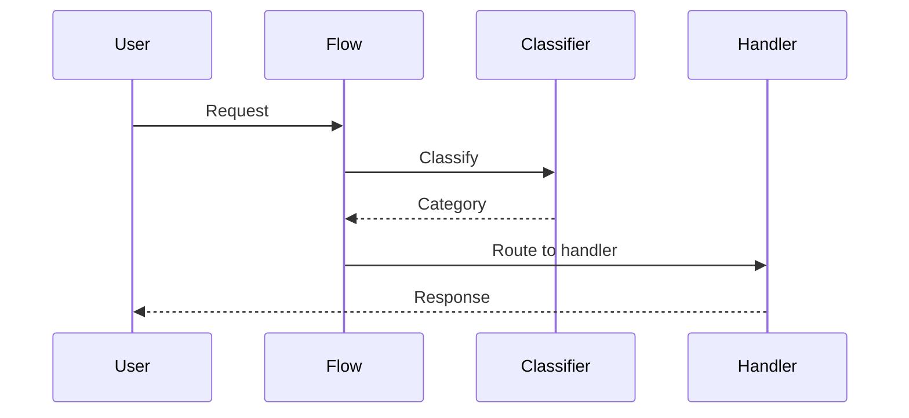

Agents can follow conditional flows - branch based on conditions and data.

```mermaid
graph TB
    subgraph "Conditional Flow"
        A[🤖 Start] --> B{Condition?}
        B -->|yes| C[Path A]
        B -->|no| D[Path B]
        C --> E[🏁 End]
        D --> E
    end
    
    classDef start fill:#6366F1,stroke:#7C90A0,color:#fff
    classDef decision fill:#F59E0B,stroke:#7C90A0,color:#fff
    classDef end fill:#10B981,stroke:#7C90A0,color:#fff
    
    class A start
    class B decision
    class C,D,E end
```

## Quick Start

<Steps>

<Step title="Create a Flow">
```typescript
import { Agent, Flow, when } from 'praisonai';

const classifier = new Agent({ instructions: 'Classify requests' });
const support = new Agent({ instructions: 'Handle support' });
const sales = new Agent({ instructions: 'Handle sales' });

const flow = new Flow()
  .start(classifier)
  .when('support', support)
  .when('sales', sales);

await flow.run('I need help with billing');
// Classifier routes to appropriate agent
```
</Step>

<Step title="With Default Path">
```typescript
const flow = new Flow()
  .start(classifier)
  .when('support', support)
  .otherwise(generalAgent);
```
</Step>

</Steps>

---

## User Interaction Flow



---

## Configuration Levels

```typescript
// Level 1: Method chain - Simple flow
const flow = new Flow()
  .start(classifier)
  .when('A', agentA)
  .when('B', agentB);

// Level 2: Array - Multiple conditions
const flow = new Flow({
  routes: [
    { condition: 'support', agent: support },
    { condition: 'sales', agent: sales }
  ]
});

// Level 3: Instance - Full control
const flow = new Flow({
  start: classifier,
  routes: [
    {
      condition: (output) => output.includes('urgent'),
      agent: urgentHandler,
      priority: 1
    }
  ],
  fallback: generalAgent
});
```

---

## Flow Methods

| Method | Description |
|--------|-------------|
| `.start()` | Set starting agent |
| `.when()` | Add conditional branch |
| `.otherwise()` | Set fallback handler |
| `.run()` | Execute the flow |

---

## API Reference

<Card title="Workflows Module" icon="code" href="/docs/sdk/reference/typescript/modules/workflows">
  Workflow and flow patterns
</Card>
<Card title="Conditions Module" icon="code" href="/docs/sdk/reference/typescript/modules/conditions">
  Conditional routing
</Card>

---

## Best Practices

<AccordionGroup>
  <Accordion title="Keep flows simple">
    Start with 2-3 branches, add complexity as needed.
  </Accordion>
  
  <Accordion title="Always have a fallback">
    Use `.otherwise()` to catch unmatched cases.
  </Accordion>
  
  <Accordion title="Test each path">
    Verify all branches work before production.
  </Accordion>
</AccordionGroup>

---

## Related

<CardGroup cols={2}>
  <Card title="Routing" icon="route" href="/docs/js/routing">
    Request routing
  </Card>
  <Card title="Workflows" icon="diagram-project" href="/docs/js/workflows">
    Multi-step workflows
  </Card>
</CardGroup>
