Flow lets you create visual, step-by-step agent workflows - like connecting blocks in a flowchart.

```mermaid
graph LR
    subgraph "Agent Flow"
        A[🚀 Start] --> B[📊 Analyze]
        B --> C[✏️ Write]
        C --> D[✅ Review]
        D --> E[🎯 Complete]
    end
    
    classDef step fill:#10B981,stroke:#7C90A0,color:#fff
    classDef start fill:#6366F1,stroke:#7C90A0,color:#fff
    
    class A,E start
    class B,C,D step
```



## Quick Start

<Steps>

<Step title="Define Flow Steps">
```typescript
import { Flow, Agent } from 'praisonai';

const analyzer = new Agent({ instructions: 'Analyze data' });
const writer = new Agent({ instructions: 'Write reports' });
const reviewer = new Agent({ instructions: 'Review content' });
```
</Step>

<Step title="Create Flow">
```typescript
const flow = new Flow({
  steps: [
    { name: 'analyze', agent: analyzer },
    { name: 'write', agent: writer, dependsOn: ['analyze'] },
    { name: 'review', agent: reviewer, dependsOn: ['write'] }
  ]
});
```
</Step>

<Step title="Run Flow">
```typescript
const result = await flow.run('Quarterly sales data');
console.log(result.review);  // Final reviewed output
```
</Step>

</Steps>

---

## Flow Patterns

| Pattern | When to Use |
|---------|-------------|
| Sequential | Each step depends on the previous |
| Parallel | Independent steps run simultaneously |
| Branching | Different paths based on conditions |

### Sequential Flow

```typescript
const flow = new Flow({
  steps: [
    { name: 'step1', agent: agent1 },
    { name: 'step2', agent: agent2, dependsOn: ['step1'] },
    { name: 'step3', agent: agent3, dependsOn: ['step2'] }
  ]
});
```

### Parallel Flow

```typescript
const flow = new Flow({
  steps: [
    { name: 'research', agent: researcher },
    { name: 'design', agent: designer },       // Runs in parallel
    { name: 'report', agent: writer, dependsOn: ['research', 'design'] }
  ]
});
```

---

## Best Practices

<AccordionGroup>
  <Accordion title="Keep steps focused">
    Each step should do one thing well. Complex logic should be split into multiple steps.
  </Accordion>
  
  <Accordion title="Use parallel when possible">
    Run independent steps in parallel to save time.
  </Accordion>
</AccordionGroup>

---

## Related

<CardGroup cols={2}>
  <Card title="Workflows" icon="sitemap" href="/docs/js/workflows">
    YAML workflows
  </Card>
  <Card title="Loops" icon="repeat" href="/docs/js/loops">
    Process multiple items
  </Card>
</CardGroup>
