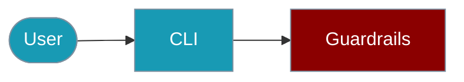

The `praisonai-ts` CLI provides the `guardrail` command for content validation.



## Quick Start

<Steps>

<Step title="Simple Usage">
```bash
praisonai-ts guardrail check "Your content here"
```
</Step>

<Step title="With Configuration">
```bash
praisonai-ts guardrail check "Content" --criteria "Must be professional" --json
```
</Step>

</Steps>

# Guardrails CLI Commands

The `praisonai-ts` CLI provides the `guardrail` command for content validation.

## Check Content

```bash
# Check content against guardrails
praisonai-ts guardrail check "Your content here"

# Check with custom criteria
praisonai-ts guardrail check "Content" --criteria "Must be professional"

# Get JSON output
praisonai-ts guardrail check "Hello world" --json
```

**Example Output:**
```json
{
  "success": true,
  "data": {
    "status": "passed",
    "score": 0.95,
    "message": "Content passes validation"
  }
}
```

## SDK Usage

For programmatic guardrail usage:

```typescript
import { LLMGuardrail, builtinGuardrails } from 'praisonai';

// LLM-based guardrail
const guard = new LLMGuardrail({
  name: 'safety',
  criteria: 'Content must be safe and appropriate'
});
const result = await guard.check('Hello world');

// Built-in guardrails
const maxLength = builtinGuardrails.maxLength(100);
const lengthResult = await maxLength.run('Hello');
```

For more details, see the [Guardrails SDK documentation](/docs/js/guardrails).
