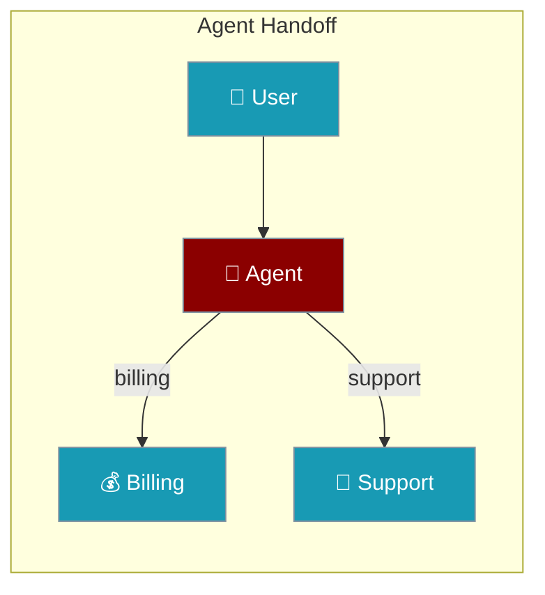
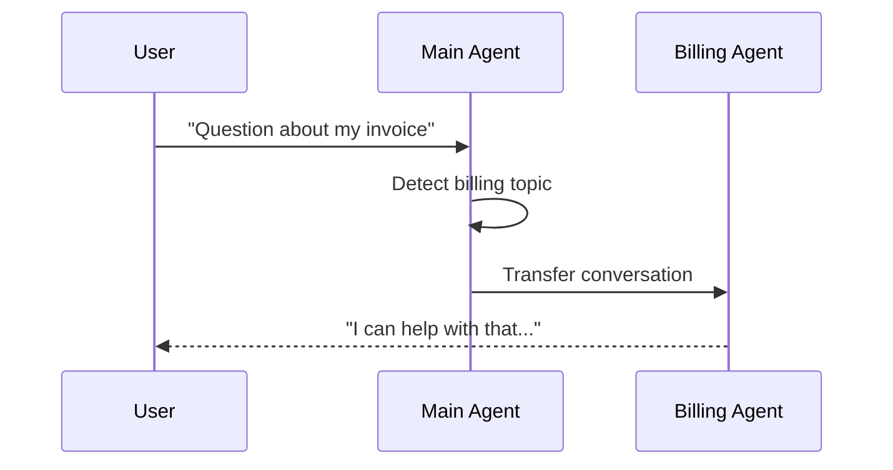
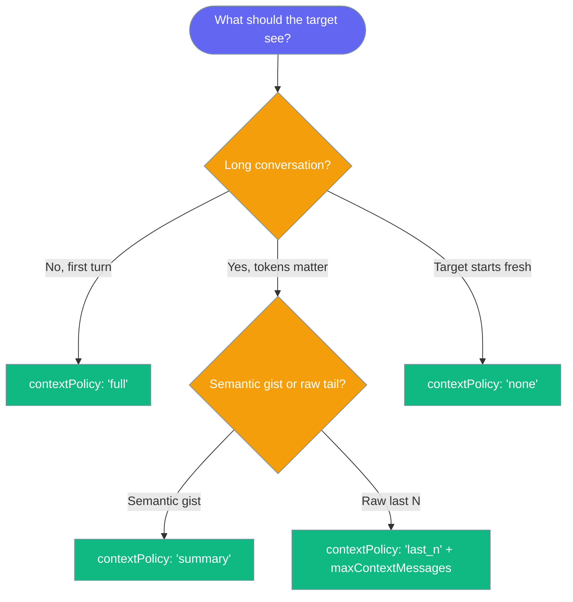
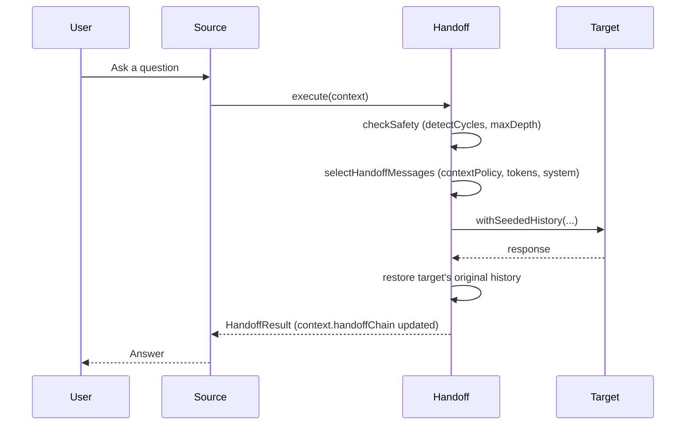

Agents can transfer conversations to other specialized agents when needed.


```mermaid
graph LR
    subgraph "Agent Handoff"
        A[👤 User] --> B[🤖 Agent]
        B -->|"billing"| C[💰 Billing]
        B -->|"support"| D[🔧 Support]
    end

    classDef agent fill:#8B0000,stroke:#7C90A0,color:#fff
    classDef tool fill:#189AB4,stroke:#7C90A0,color:#fff
    class B agent
    class A,C,D tool
    classDef agent fill:#8B0000,color:#fff
    classDef tool fill:#189AB4,color:#fff

```

## Quick Start

<Steps>

<Step title="Simple Usage">
```typescript
import { Agent, handoff } from 'praisonai';

const billingAgent = new Agent({
  name: 'Billing',
  instructions: 'You handle billing and payment questions'
});

const mainAgent = new Agent({
  name: 'Assistant',
  instructions: 'You are a helpful assistant',
  handoffs: [billingAgent]
});

// Automatically transfers billing questions
await mainAgent.chat("I have a question about my invoice");
// → Billing agent responds
```
</Step>

<Step title="With Configuration">
```typescript
const mainAgent = new Agent({
  handoffs: [
    handoff({
      agent: billingAgent,
      description: 'Transfer for payment or billing questions'
    }),
    handoff({
      agent: supportAgent,
      description: 'Transfer for technical issues'
    })
  ]
});
```
</Step>

</Steps>

---

## User Interaction Flow


```mermaid
sequenceDiagram
    participant User
    participant Main as Main Agent
    participant Billing as Billing Agent
    
    User->>Main: "Question about my invoice"
    Main->>Main: Detect billing topic
    Main->>Billing: Transfer conversation
    Billing-->>User: "I can help with that..."
```

---

## Configuration Levels

```typescript
// Level 1: Array - Simple agent list
const agent = new Agent({
  handoffs: [billingAgent, supportAgent]
});

// Level 2: Dict - With descriptions
const agent = new Agent({
  handoffs: [
    { agent: billingAgent, description: 'For billing questions' }
  ]
});

// Level 3: Instance - Full control with conditions
import { handoff, handoffFilters } from 'praisonai';

const agent = new Agent({
  handoffs: [
    handoff({
      agent: billingAgent,
      description: 'For billing',
      condition: handoffFilters.topic(['invoice', 'payment', 'refund'])
    })
  ]
});
```

---

## Generated tool name

Each handoff is exposed to the model as a tool named `transfer_to_<lowercased_snake_of_agent_name>`. The SDK sanitizes the agent name so any name — including spaces or punctuation — becomes a provider-legal tool name (capped at 64 characters).

| Agent name | Generated tool name |
|------------|---------------------|
| `"Billing"` | `transfer_to_billing` |
| `"Support Bot"` | `transfer_to_support_bot` |
| `"Tier-2 Ops"` | `transfer_to_tier-2_ops` |

Pass a `name:` on `handoff()` to override it. This matters when you reference the tool in prompts or read it in logs.

---

## Generated tool description

The tool's description is what the model reads to decide when to hand off. When you don't pass a `description:`, the SDK builds one from the target agent's `name`, `role`, and `goal`.

```typescript
// No role/goal → sparse description
const plain = new Agent({ name: 'Support Bot' });
// Handoff description: "Transfer task to Support Bot"

// With role and goal → richer description, better routing
const rich = new Agent({
  name: 'Support Bot',
  role: 'Support Specialist',
  goal: 'Resolve customer tickets',
});
// Handoff description: "Transfer task to Support Bot (Support Specialist) - Resolve customer tickets"
```

Define `role` and `goal` on handoff targets and the main agent routes more accurately — no custom `description:` needed.

---

## When to Transfer

| User Topic | Best Agent |
|------------|------------|
| Payment questions | Billing Agent |
| Technical issues | Support Agent |
| Product inquiries | Sales Agent |
| General questions | Main Agent |

---

## Safety Features

Handoffs include built-in protections, all controllable per handoff:

- **Cycle detection**: Prevents A → B → A loops. Toggle via `detectCycles`; enabled by default. Raises `HandoffCycleError` before touching the target.
- **Depth limits**: Maximum 10 handoffs in a chain by default; override with `maxDepth`. Raises `HandoffDepthError` before touching the target.
- **Timeouts**: Handoffs time out after 5 minutes by default; override with `timeoutSeconds` (in seconds; `<= 0` disables). Raises `HandoffTimeoutError` (always retryable).
- **Concurrency**: Each `Handoff` instance has its own concurrency semaphore (default 5); override with `maxConcurrent`. Not process-wide.

The cycle check runs before the depth check, and both run before anything is pushed onto the chain — a rejected handoff never consumes a chain slot.

---

## Controlling context, safety, and concurrency

`handoff()` accepts eight settings that steer what the target sees and how the transfer behaves. Add them one at a time.

<Steps>

<Step title="Steer what the target sees">
Show the target only the last N messages instead of the summary default.

```typescript
import { Agent, handoff } from 'praisonai';

const billing = new Agent({ name: 'Billing', instructions: 'Handle billing questions.' });

const mainAgent = new Agent({
  name: 'Assistant',
  instructions: 'You are a helpful assistant',
  handoffs: [
    handoff({ agent: billing, contextPolicy: 'last_n', maxContextMessages: 10 })
  ]
});
```
</Step>

<Step title="Cap tokens and keep the system prompt">
Drop the oldest messages until the context fits a token budget, but never drop `system` messages.

```typescript
handoff({
  agent: billing,
  contextPolicy: 'last_n',
  maxContextTokens: 4000,
  preserveSystem: true,
});
```
</Step>

<Step title="Bound execution">
Give the target a time limit and cap how many copies run at once.

```typescript
handoff({ agent: billing, timeoutSeconds: 30, maxConcurrent: 3 });
```
</Step>

<Step title="Add safety guards">
Refuse cycles and cap the chain depth.

```typescript
handoff({ agent: billing, detectCycles: true, maxDepth: 5 });
```
</Step>

<Step title="Set everything at once">
Combine all eight in one config object.

```typescript
handoff({
  agent: billing,
  contextPolicy: 'last_n',
  maxContextMessages: 10,
  maxContextTokens: 4000,
  preserveSystem: true,
  timeoutSeconds: 30,
  maxConcurrent: 3,
  detectCycles: true,
  maxDepth: 5,
});
```
</Step>

</Steps>

---

## Which context policy should I pick?

`contextPolicy` decides how much history the target sees.


```mermaid
graph TB
    Start([What should the target see?]) --> Q1{Long conversation?}
    Q1 -->|"No, first turn"| Full["contextPolicy: 'full'"]
    Q1 -->|"Yes, tokens matter"| Q2{Semantic gist or raw tail?}
    Q2 -->|"Semantic gist"| Summary["contextPolicy: 'summary'"]
    Q2 -->|"Raw last N"| LastN["contextPolicy: 'last_n' + maxContextMessages"]
    Q1 -->|"Target starts fresh"| None["contextPolicy: 'none'"]

    classDef start fill:#6366F1,stroke:#7C90A0,color:#fff
    classDef question fill:#F59E0B,stroke:#7C90A0,color:#fff
    classDef answer fill:#10B981,stroke:#7C90A0,color:#fff
    class Start start
    class Q1,Q2 question
    class Full,Summary,LastN,None answer
```

---

## Inside a handoff

`execute()` runs a safety check, selects the context, seeds it onto the target, runs the target, then restores the target's original history.


```mermaid
sequenceDiagram
    participant User
    participant Source
    participant Handoff
    participant Target

    User->>Source: Ask a question
    Source->>Handoff: execute(context)
    Handoff->>Handoff: checkSafety (detectCycles, maxDepth)
    Handoff->>Handoff: selectHandoffMessages (contextPolicy, tokens, system)
    Handoff->>Target: withSeededHistory(...)
    Target-->>Handoff: response
    Handoff->>Handoff: restore target's original history
    Handoff-->>Source: HandoffResult (context.handoffChain updated)
    Source-->>User: Answer
```

---

## HandoffConfig reference

Every option lives on the `HandoffConfig` object passed to `handoff()` (or `new Handoff({ agent, ... })`).

| Option | Type | Default | Description |
|---|---|---|---|
| `contextPolicy` | `'none' \| 'last_n' \| 'summary' \| 'full'` | `'summary'` | What the target sees. `none` = nothing; `last_n` = last `maxContextMessages`; `summary` = last 3 messages (hard-coded); `full` = everything. |
| `maxContextMessages` | `number` | `10` | Slice size for `last_n` only. `<= 0` keeps everything. Ignored by other policies. |
| `maxContextTokens` | `number` | `4000` | Token ceiling applied last; drops oldest first. `<= 0` disables. TypeScript honours this beyond Python, which declares but never reads the field. |
| `preserveSystem` | `boolean` | `true` | Keep `system` messages regardless of slice or token budget. A system prompt larger than the budget is kept in full. |
| `timeoutSeconds` | `number` | `300` | Bounds the target's turn. `<= 0` disables. Throws `HandoffTimeoutError` (always retryable). |
| `maxConcurrent` | `number` | `5` | Per-instance semaphore. `<= 0` = unlimited. Not process-wide — two `Handoff` instances at 1 each run in parallel. |
| `detectCycles` | `boolean` | `true` | Throws `HandoffCycleError` if the target is already in the handoff chain. |
| `maxDepth` | `number` | `10` | Throws `HandoffDepthError` before the target is touched when the chain is already this deep. |

<Note>
Python's `HandoffConfig` declares `max_context_tokens` and serialises it, but no code path reads it. TypeScript implements the documented meaning, so `maxContextTokens` actually caps tokens here. If you port behavioural tests from Python, expect this one divergence.
</Note>

---

## Chain threading

The handoff chain tracks the agents already traversed to reach the current point. `HandoffContext` carries it on an optional field:

```typescript
handoffChain?: readonly string[];
```

Leave it unset and the chain in force for the current execution is used — what nested handoffs want. Set it to resume a chain that crossed a process boundary (a queued handoff, a rehydrated request) or to start one deliberately deep. `execute()` writes the extended chain back onto the result's context, so passing `result.context` onward threads it by hand.

The handoff module exposes helpers for advanced flows: `currentHandoffChain()` reads the chain in scope (oldest first), `currentHandoffDepth()` its length, `runWithHandoffChain(chain, fn)` runs `fn` under a given chain, `selectHandoffMessages(messages, config)` is the standalone context selector, and `resetHandoffChain()` clears the module-level fallback used where `AsyncLocalStorage` is unavailable (Node 18, browsers).

`parallelHandoffs` snapshots the current chain once and passes each sibling an explicit copy, so fan-out never reads the ambient value — each sibling gets an isolated chain, and cycle detection and `maxDepth` are enforced per task, not shared across siblings.

---

## API Reference

<Card title="Agent Module" icon="code" href="/sdk/reference/typescript/modules/agent">
  Agent module with handoff support
</Card>
<Card title="AgentConfig" icon="robot" href="/sdk/reference/typescript/classes/AgentConfig">
  Agent configuration
</Card>

---

## Best Practices

<AccordionGroup>
  <Accordion title="Create focused specialists">
    Each agent should handle one domain well. This makes handoffs accurate.
  </Accordion>

  <Accordion title="Give agents clear roles and goals">
    Set `role` and `goal` on each handoff target. They are woven into the auto-generated handoff description (`Transfer task to <name> (<role>) - <goal>`), so the main agent routes more accurately without a custom `description:`.
  </Accordion>

  <Accordion title="Write clear descriptions">
    The main agent uses descriptions to decide when to transfer.
  </Accordion>
  
  <Accordion title="Explain transfers to users">
    Let users know they're being connected to a specialist.
  </Accordion>
</AccordionGroup>

---

## Tool-Boundary Policy & Parallel Handoffs

The TypeScript handoff stack matches the Python surface: a `HandoffToolPolicy` controls which tools survive a transfer, and `parallel_handoffs` fans a source agent's work out across several specialists at once.

```typescript
import { Agent, parallel_handoffs } from 'praisonai';

const billing = new Agent({ name: 'Billing', instructions: 'Handle billing inquiries.' });
const refund = new Agent({ name: 'Refunds', instructions: 'Process refund requests.' });
const triage = new Agent({ name: 'Triage', instructions: 'Route inquiries to specialists.' });

const results = await parallel_handoffs(
  triage,
  [
    [billing, 'Why was I charged twice?'],
    [refund, 'I want a refund for order #42'],
  ],
  { maxConcurrent: 5 },
);

for (const r of results) {
  console.log(r.handedOffTo, r.success, r.durationSeconds);
}
```

<AccordionGroup>
<Accordion title="HandoffToolPolicy modes">
`resolveHandoffToolPolicy` and `HandoffToolPolicyMode` enforce the tool boundary during a transfer — decide whether the target keeps the source's tools, only its own, or a filtered set. `DEFAULT_HANDOFF_TOOL_POLICY` is applied when you don't pass one.
</Accordion>
<Accordion title="HandoffTimeoutError is always retryable">
A `HandoffTimeoutError` sets `isRetryable === true` unconditionally — a timeout may succeed on a second attempt. Cycle and depth failures raise `HandoffCycleError` (carrying `context.cycle_path`) and `HandoffDepthError` (carrying `context.max_depth` / `context.current_depth`).
</Accordion>
<Accordion title="Back-compat context aliases: chain / depth / max_depth">
The handoff context accepts the legacy aliases `chain`, `depth`, and `max_depth` so older Python-shaped snippets keep working without a rewrite.
</Accordion>
</AccordionGroup>

---

## Related

<CardGroup cols={2}>
  <Card title="Agent" icon="user" href="/js/agent">
    Create AI agents
  </Card>
  <Card title="Teams" icon="users" href="/js/teams">
    Multi-agent teams
  </Card>
</CardGroup>
