Agents can transfer conversations to other specialized agents when needed.

```mermaid
graph LR
    subgraph "Agent Handoff"
        A[👤 User] --> B[🤖 Agent]
        B -->|"billing"| C[💰 Billing]
        B -->|"support"| D[🔧 Support]
    end
    
    classDef user fill:#6366F1,stroke:#7C90A0,color:#fff
    classDef agent fill:#F59E0B,stroke:#7C90A0,color:#fff
    classDef specialist fill:#10B981,stroke:#7C90A0,color:#fff
    
    class A user
    class B agent
    class C,D specialist
```



## Quick Start

<Steps>

<Step title="Create Agent with Handoffs">
```typescript
import { Agent, handoff } from 'praisonai';

const billingAgent = new Agent({
  name: 'Billing',
  instructions: 'You handle billing and payment questions'
});

const mainAgent = new Agent({
  name: 'Assistant',
  instructions: 'You are a helpful assistant',
  handoffs: [billingAgent]
});

// Automatically transfers billing questions
await mainAgent.chat("I have a question about my invoice");
// → Billing agent responds
```
</Step>

<Step title="With Descriptions">
```typescript
const mainAgent = new Agent({
  handoffs: [
    handoff({
      agent: billingAgent,
      description: 'Transfer for payment or billing questions'
    }),
    handoff({
      agent: supportAgent,
      description: 'Transfer for technical issues'
    })
  ]
});
```
</Step>

</Steps>

---

## User Interaction Flow


---

## Configuration Levels

```typescript
// Level 1: Array - Simple agent list
const agent = new Agent({
  handoffs: [billingAgent, supportAgent]
});

// Level 2: Dict - With descriptions
const agent = new Agent({
  handoffs: [
    { agent: billingAgent, description: 'For billing questions' }
  ]
});

// Level 3: Instance - Full control with conditions
import { handoff, handoffFilters } from 'praisonai';

const agent = new Agent({
  handoffs: [
    handoff({
      agent: billingAgent,
      description: 'For billing',
      condition: handoffFilters.topic(['invoice', 'payment', 'refund'])
    })
  ]
});
```

---

## When to Transfer

| User Topic | Best Agent |
|------------|------------|
| Payment questions | Billing Agent |
| Technical issues | Support Agent |
| Product inquiries | Sales Agent |
| General questions | Main Agent |

---

## Safety Features

Handoffs include built-in protections:

- **Cycle detection**: Prevents A → B → A loops
- **Depth limits**: Maximum 10 handoffs in a chain
- **Timeouts**: Handoffs timeout after 5 minutes

---

## Best Practices

<AccordionGroup>
  <Accordion title="Create focused specialists">
    Each agent should handle one domain well. This makes handoffs accurate.
  </Accordion>
  
  <Accordion title="Write clear descriptions">
    The main agent uses descriptions to decide when to transfer.
  </Accordion>
  
  <Accordion title="Explain transfers to users">
    Let users know they're being connected to a specialist.
  </Accordion>
</AccordionGroup>

---

## Related

<CardGroup cols={2}>
  <Card title="Agent" icon="user" href="/docs/js/agent">
    Create AI agents
  </Card>
  <Card title="Teams" icon="users" href="/docs/js/teams">
    Multi-agent teams
  </Card>
</CardGroup>
