Handoffs let agents transfer conversations to other specialized agents when needed.

```mermaid
graph LR
    subgraph "Agent Handoff"
        A[👤 User] --> B[🤖 General Agent]
        B -->|"billing question"| C[💰 Billing Agent]
        B -->|"tech support"| D[🔧 Support Agent]
    end
    
    classDef user fill:#6366F1,stroke:#7C90A0,color:#fff
    classDef agent fill:#10B981,stroke:#7C90A0,color:#fff
    
    class A user
    class B,C,D agent
```



## Quick Start

<Steps>

<Step title="Create Specialized Agents">
```typescript
import { Agent, handoff } from 'praisonai';

const billingAgent = new Agent({
  name: 'Billing Agent',
  instructions: 'You handle billing questions'
});

const supportAgent = new Agent({
  name: 'Support Agent', 
  instructions: 'You provide technical support'
});
```
</Step>

<Step title="Set Up Handoffs">
```typescript
const mainAgent = new Agent({
  name: 'Assistant',
  instructions: 'You are a helpful assistant',
  handoffs: [
    handoff({
      agent: billingAgent,
      description: 'Transfer to billing for payment questions'
    }),
    handoff({
      agent: supportAgent,
      description: 'Transfer to support for technical issues'
    })
  ]
});
```
</Step>

<Step title="Chat Naturally">
```typescript
// User asks about billing - automatically transfers
await mainAgent.chat("I have a question about my invoice");
// → Billing Agent responds

// User asks for tech help - transfers to support
await mainAgent.chat("My app keeps crashing");
// → Support Agent responds
```
</Step>

</Steps>

---

## When to Use Handoffs

```mermaid
graph TB
    A[User Question] --> B{What type?}
    B -->|Billing| C[💰 Billing Agent]
    B -->|Technical| D[🔧 Support Agent]
    B -->|Sales| E[📈 Sales Agent]
    B -->|General| F[🤖 Main Agent]
    
    classDef question fill:#F59E0B,stroke:#7C90A0,color:#fff
    classDef agent fill:#10B981,stroke:#7C90A0,color:#fff
    
    class A,B question
    class C,D,E,F agent
```



| Scenario | Best Agent |
|----------|------------|
| Payment questions | Billing Agent |
| Technical issues | Support Agent |
| Product inquiries | Sales Agent |
| General questions | Main Agent |

---

## Conditional Handoffs

Transfer only when specific keywords appear:

```typescript
import { handoff, handoffFilters } from 'praisonai';

const mainAgent = new Agent({
  handoffs: [
    handoff({
      agent: billingAgent,
      condition: handoffFilters.topic(['invoice', 'payment', 'refund'])
    }),
    handoff({
      agent: supportAgent,
      condition: handoffFilters.topic(['bug', 'error', 'crash', 'help'])
    })
  ]
});
```

---

## Safety Features

Handoffs include built-in safety to prevent infinite loops:


- **Cycle detection**: Prevents Agent A → Agent B → Agent A loops
- **Depth limits**: Maximum 10 handoffs in a chain
- **Timeouts**: Handoffs timeout after 5 minutes by default

---

## Best Practices

<AccordionGroup>
  <Accordion title="Create specialized agents">
    Each agent should focus on one domain. This makes handoffs clear and responses more accurate.
  </Accordion>
  
  <Accordion title="Write clear descriptions">
    The main agent uses descriptions to decide when to transfer. Be specific about what each agent handles.
  </Accordion>
  
  <Accordion title="Explain transfers to users">
    When handoffs happen, users appreciate knowing they're being connected to a specialist.
  </Accordion>
</AccordionGroup>

---

## Related

<CardGroup cols={2}>
  <Card title="Agent" icon="user" href="/docs/js/agent">
    Create AI agents
  </Card>
  <Card title="Teams" icon="users" href="/docs/js/teams">
    Multi-agent teams
  </Card>
</CardGroup>
