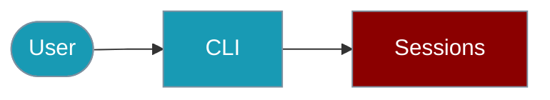

Manage hierarchical agent sessions from the CLI.



## Quick Start

<Steps>

<Step title="Simple Usage">
```bash
npx praisonai session hierarchy tree root-session
```
</Step>

<Step title="With Configuration">
```bash
npx praisonai session hierarchy fork root-session --id child-session
```
</Step>

</Steps>

# Hierarchical Sessions CLI

Create and manage session hierarchies from the command line.

## Create Hierarchy

```bash
# Create root session
npx praisonai session hierarchy create root-session

# Create child session
npx praisonai session hierarchy fork root-session --child research-phase

# List session tree
npx praisonai session hierarchy list root-session
```

## Context Management

```bash
# Set context on session
npx praisonai session hierarchy context root-session --set goal "Build chatbot"

# Get context (includes inherited)
npx praisonai session hierarchy context research-phase --get goal

# Show all context
npx praisonai session hierarchy context research-phase --all
```

## Session Forking

```bash
# Fork for parallel approaches
npx praisonai session hierarchy fork main-session --child approach-a
npx praisonai session hierarchy fork main-session --child approach-b

# Merge winning branch
npx praisonai session hierarchy merge main-session approach-a
```

## Visualization

```bash
# Show session tree
npx praisonai session hierarchy tree root-session

# Output:
# root-session
# ├── research-phase
# │   └── literature-review
# └── implementation-phase
```

## Programmatic (TypeScript)

```typescript
import { HierarchicalSession, createHierarchicalSession } from 'praisonai';

const parent = createHierarchicalSession({ id: 'parent' });
const child = parent.fork({ id: 'child' });
```

## Related

<CardGroup cols={2}>
  <Card title="Hierarchical Sessions" icon="sitemap" href="/docs/js/hierarchy-session">
    SDK documentation
  </Card>
  <Card title="Sessions CLI" icon="terminal" href="/docs/js/sessions-cli">
    Basic session CLI
  </Card>
</CardGroup>
