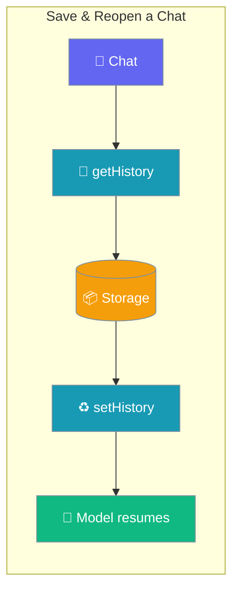
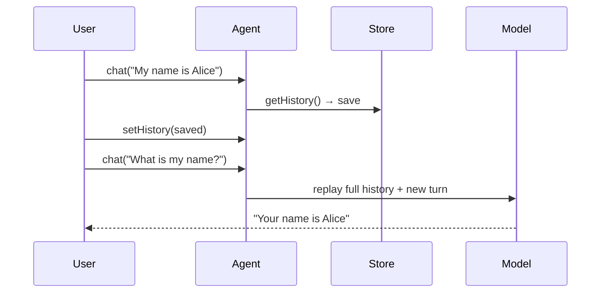
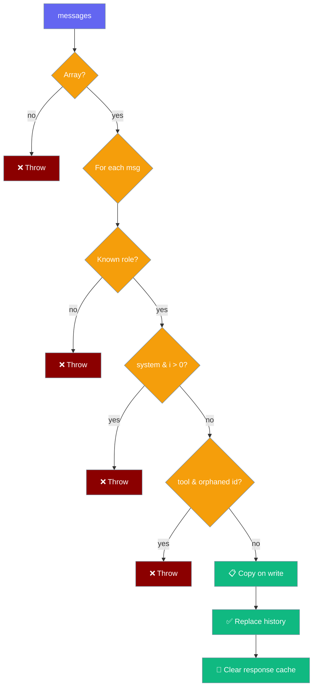

Save a conversation with `getHistory()` and reopen it later with `setHistory()` — the model regains its memory, tool calls included.



## Quick Start

<Steps>

<Step title="Save a chat">
```typescript
import { Agent } from 'praisonai';

const agent = new Agent({ instructions: 'You are helpful' });
await agent.chat('My name is Alice');

const saved = agent.getHistory();  // persist to disk / your store
```
</Step>

<Step title="Reopen the chat">
```typescript
import { Agent } from 'praisonai';

const restored = new Agent({ instructions: 'You are helpful' });
restored.setHistory(saved);
await restored.chat('What is my name?');  // "Your name is Alice"
```
</Step>

</Steps>

---

## How It Works

`getHistory()` returns a copy of the conversation; `setHistory()` validates it and replaces the agent's history, so the next `chat()` replays the full conversation to the model.



---

## AgentMessage

Each saved message is an `AgentMessage`. Persist the array `getHistory()` returns and pass it back to `setHistory()`.

| Field | Type | Required | Description |
|-------|------|----------|-------------|
| `role` | `'system' \| 'user' \| 'assistant' \| 'tool'` | yes | Provider role. Unknown values are rejected by `setHistory`. |
| `content` | `string \| null` | yes | Text content. `null` on an assistant turn that only called tools. |
| `tool_calls` | `Array<{ id, type, function: { name, arguments } }>` | no | Present on an assistant turn that called tools. Survives the round-trip. |
| `tool_call_id` | `string` | no | Present on a `tool` turn; pairs it to the assistant's `tool_calls` entry above. |
| `name` | `string` | no | Tool name on a `tool` turn — required so restored tool results keep a non-empty `toolName` on the AI SDK backend (non-OpenAI providers). |

```typescript
import { Agent, type AgentMessage } from 'praisonai';

const agent = new Agent({ instructions: 'You are helpful' });
await agent.chat('Hello');

const saved: AgentMessage[] = agent.getHistory();
```

---

## Validation Rules

`setHistory()` validates at load time and throws a descriptive `Error` before the next model call. The messages are copied on write, so mutating the array you pass in never changes the agent's state.



| Input | Result |
|-------|--------|
| A non-array input | Throws `expected an array of messages`. |
| A message that is not an object | Throws `message at index N is not an object`. |
| An unknown `role` | Throws `message at index N has unknown role "…"`. |
| A `tool` message whose `tool_call_id` matches no **preceding** `tool_calls` entry | Throws `orphaned tool_call_id "…"`. |
| A **leading** `system` message | Accepted and **stripped** — `start()` already prepends the agent's instructions, so keeping it would double the system prompt. |
| Any **non-leading** `system` message | Throws `unexpected system message at index N`. |

`setHistory()` also **clears the internal response cache**, so a repeat prompt after a restore is re-evaluated against the restored history rather than served from the pre-restore prompt-keyed cache.

---

## Common Patterns

### Save to disk (Node) and reopen

```typescript
import { Agent } from 'praisonai';
import fs from 'node:fs';

const agent = new Agent({ instructions: 'You are helpful' });
await agent.chat('My name is Alice');
fs.writeFileSync('chat.json', JSON.stringify(agent.getHistory()));

// … later, in a fresh process …
const restored = new Agent({ instructions: 'You are helpful' });
restored.setHistory(JSON.parse(fs.readFileSync('chat.json', 'utf8')));
await restored.chat('What is my name?');  // "Your name is Alice"
```

### Mobile / Tauri key-value store

Mirror the file example using the platform's key-value store — this is the scenario the SDK was designed for (reopening a chat in a mobile app).

```typescript
import { Agent } from 'praisonai/mobile';

const agent = new Agent({ instructions: 'You are helpful' });
await agent.chat('My name is Alice');
await store.set('chat', JSON.stringify(agent.getHistory()));

// … after the app reopens …
const restored = new Agent({ instructions: 'You are helpful' });
restored.setHistory(JSON.parse(await store.get('chat')));
await restored.chat('What is my name?');  // "Your name is Alice"
```

### Tool-calling conversation round-trip

Restored tool results carry over, so the model does **not** re-run the tool — it already "remembers" the result.

```typescript
import { Agent } from 'praisonai';

const getWeather = (city: string) => `Weather in ${city}: 22°C, Sunny`;

const agent = new Agent({ instructions: 'You are helpful', tools: [getWeather] });
await agent.chat("What's the weather in Paris?");  // calls getWeather

const restored = new Agent({ instructions: 'You are helpful', tools: [getWeather] });
restored.setHistory(agent.getHistory());
await restored.chat('Is that warm?');  // no re-run; answers from the saved result
```

---

## Best Practices

<AccordionGroup>

<Accordion title="Copy on read, copy on write">
Mutating the array returned by `getHistory()` or passed to `setHistory()` does not mutate the agent's state, so store references freely.
</Accordion>

<Accordion title="Validate at load time, not at model time">
Catch the `Error` from `setHistory()` and surface it to the user. A malformed history accepted silently would otherwise 400 on the next model call, far from the loading code.
</Accordion>

<Accordion title="Do not include a leading system message when serialising">
A leading `system` message is stripped anyway — the agent prepends its own instructions on every run. Keep the stored payload compact.
</Accordion>

<Accordion title="Cross-provider tool restoration">
Always keep the `name` field on `tool` messages when serialising. Without it, restoring a tool history and running against a non-OpenAI provider is rejected by the adapter.
</Accordion>

</AccordionGroup>

---

## Related

<CardGroup cols={2}>
  <Card title="Agent" icon="robot" href="/js/agent">
    The class `getHistory` / `setHistory` live on.
  </Card>
  <Card title="Sessions" icon="clock-rotate-left" href="/js/sessions">
    Multi-turn conversations via `Session` / `SessionManager`.
  </Card>
</CardGroup>
