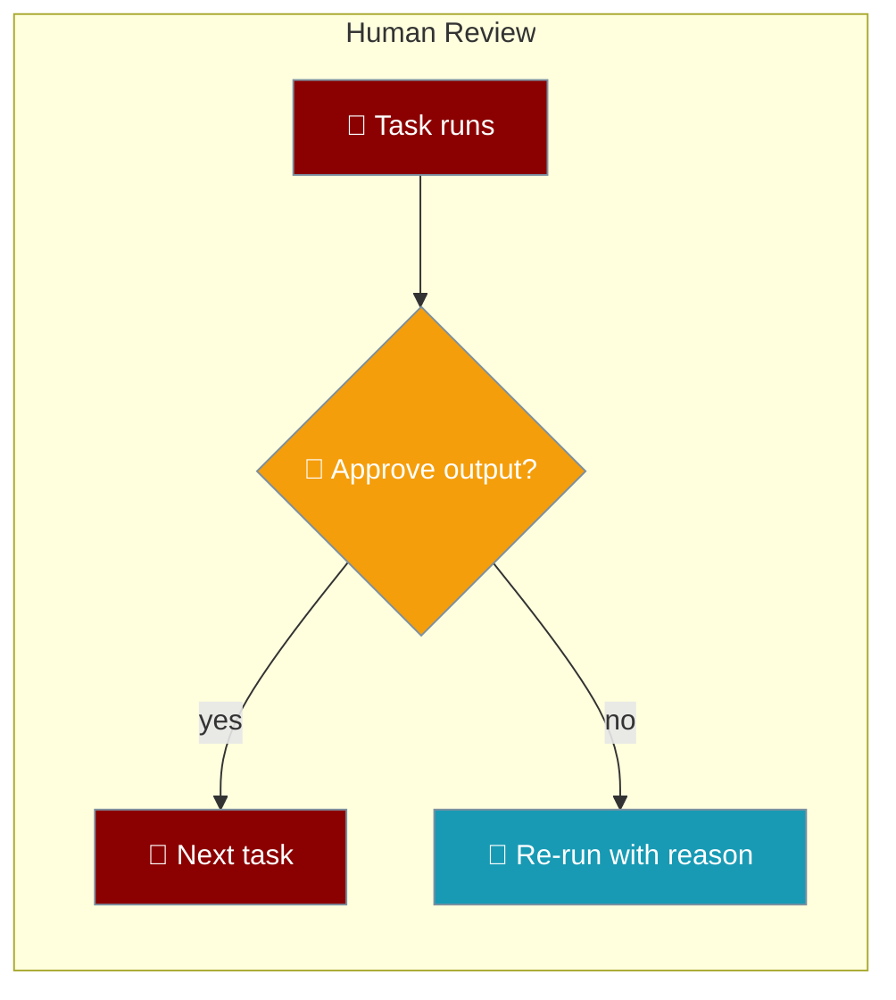
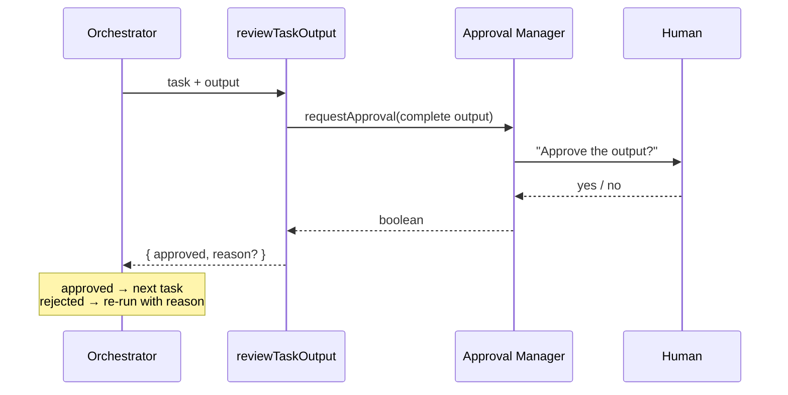
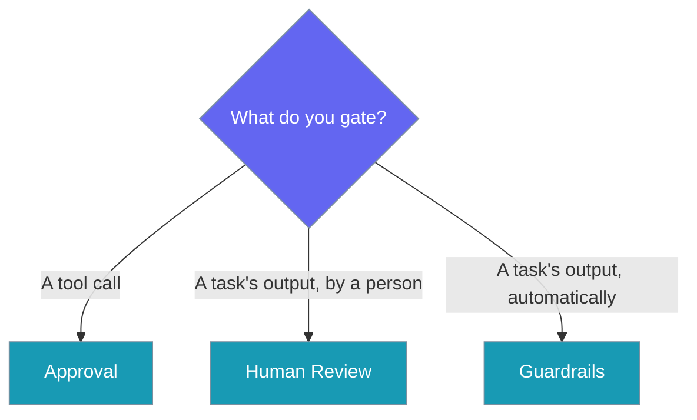

Require a person to sign off on a task's output before the next task can read it.



<Note>
Coming from Python? The parity page is [Human-in-the-Loop Review](/features/human-in-the-loop-review) — this is its TypeScript counterpart for `Task(human_input=True)`.
</Note>

## Quick Start

<Steps>

<Step title="Mark a task for review">
Set `humanInput: true` on the task, then call `reviewTaskOutput` after the task produces its output.

```typescript
import { Task, reviewTaskOutput } from 'praisonai';

const task = new Task({
  description: 'Draft a customer refund reply',
  expected_output: 'A one-paragraph reply',
  humanInput: true,
  humanReviewPrompt: 'Is this legally safe to send?',
});

const output = '...draft reply...';

const outcome = await reviewTaskOutput(task, output);
if (!outcome.approved) {
  // Re-run with outcome.reason folded back into the prompt
}
```
</Step>

<Step title="Plug in your own approver">
Pass an `approvalManager` to route the review through Slack, a webhook, or any UI instead of the built-in terminal prompt.

```typescript
import { Task, reviewTaskOutput } from 'praisonai';

const task = new Task({
  description: 'Draft a customer refund reply',
  expected_output: 'A one-paragraph reply',
  humanInput: true,
});

const output = '...draft reply...';

const outcome = await reviewTaskOutput(task, output, {
  approvalManager: {
    async requestApproval({ toolName, input, reason }) {
      return await askHumanAndReturnTrueOrFalse(reason, input);
    },
  },
  timeout: 300, // seconds — forwarded to the approval manager
});
```
</Step>

</Steps>

<Info>
`reviewTaskOutput` reuses the existing approval manager, so it works wherever [Approval](/js/approval) already does — no separate wiring.
</Info>

---

## How It Works

`reviewTaskOutput` asks the approval manager to approve the complete output, then returns a verdict.



| Rule | Behaviour |
|------|-----------|
| Opt-in | When `humanInput` is falsy, `reviewTaskOutput` returns `{ approved: true }` and never calls the manager. Callers need no `if` of their own. |
| No silent skip | With `humanInput: true` and no manager available, the function **throws** — a task that was supposed to be signed off and simply was not is the exact failure this prevents. |
| Complete output | The reviewer always sees the full output, never a prefix, so no unreviewed trailing content reaches the next task. |
| Strict approval | Only a literal `true` counts as approval. A truthy non-boolean (e.g. `{ approved: false }`) is treated as a rejection. |
| Rejection reason | A rejection returns `reason: "a reviewer rejected this output"` so you can feed it back into a re-run. |
| Custom prompt | `humanReviewPrompt` is passed to the manager as `reason`; otherwise a default question is built from the task name. |
| Audit label | The `toolName` sent to the manager is `task_output:<task.name ?? 'task'>`, so approval rules and audit trails tell task-output reviews apart from tool-call reviews. |

---

## Approval vs. Human Review vs. Guardrails

Three features gate agent work at different points — pick by *what* you are protecting.

> The approval manager gates a TOOL CALL and guardrails validate automatically; neither let an orchestrator require a person to approve an output before the next task consumes it.



| Feature | Gates | Who decides |
|---------|-------|-------------|
| [Approval](/js/approval) | A tool call before it runs | A person |
| Human Review | A task's output before the next task reads it | A person |
| [Guardrails](/js/guardrails) | A task's output | Automatic validation |

---

## Task Options

Two `Task` fields turn on review.

| Option | Type | Default | Description |
|--------|------|---------|-------------|
| `humanInput` | `boolean` | `false` | Require a person to approve this task's output before the next task consumes it. |
| `humanReviewPrompt` | `string` | `undefined` | Custom question the reviewer is asked. Falls back to `Approve the output of task <name>?`. |

---

## `reviewTaskOutput` Reference

`reviewTaskOutput(task, output, options?) → Promise<ReviewOutcome>`

| Parameter | Type | Description |
|-----------|------|-------------|
| `task` | `ReviewableTask` | `{ name?, humanInput?, humanReviewPrompt? }` — usually your `Task`. |
| `output` | `unknown` | The complete output to review. |
| `options.approvalManager` | `ReviewApprovalManager` | Override the manager. Defaults to the global one from `getApprovalManager()`. |
| `options.timeout` | `number` | Seconds to wait, forwarded to the manager. |

`ReviewOutcome` return shape:

| Field | Type | Description |
|-------|------|-------------|
| `approved` | `boolean` | `true` when the reviewer accepted the output. |
| `reason` | `string` | Present on rejection, to fold back into a re-run. |

A `ReviewApprovalManager` is any object with a `requestApproval` that resolves to a boolean:

```typescript
import { Task, reviewTaskOutput, type ReviewApprovalManager } from 'praisonai';

const manager: ReviewApprovalManager = {
  async requestApproval({ toolName, input, reason, timeout }) {
    // toolName === `task_output:<task name>`
    return await askHuman(reason);
  },
};

const task = new Task({
  description: 'Draft a reply',
  expected_output: 'A one-paragraph reply',
  humanInput: true,
});

const outcome = await reviewTaskOutput(task, '...draft...', { approvalManager: manager });
```

<Warning>
With `humanInput: true` and no manager passed or registered, `reviewTaskOutput` throws: `Task <name> sets humanInput but no approval manager is available…`. Configure one, or remove `humanInput`.
</Warning>

---

## Best Practices

<AccordionGroup>
  <Accordion title="Feed the reason back into a re-run">
    A rejection returns `reason: "a reviewer rejected this output"`. Add it to the task's prompt and re-run so the next draft addresses the objection.
  </Accordion>

  <Accordion title="Register a manager before running headless">
    In non-TTY environments the default prompt cannot read stdin. Pass `options.approvalManager` (Slack, webhook, dashboard) so the throw never fires.
  </Accordion>

  <Accordion title="Return a strict boolean">
    Only `=== true` approves. Make sure your `requestApproval` resolves an actual boolean — a truthy object is read as a rejection on purpose.
  </Accordion>

  <Accordion title="Reach for the right gate">
    Use Approval for tool calls, Human Review for outputs a person must sign off, and Guardrails for automatic output validation.
  </Accordion>
</AccordionGroup>

---

## Related

<CardGroup cols={2}>
  <Card title="Approval" icon="shield-check" href="/js/approval">
    Gate a tool call behind a person
  </Card>
  <Card title="Guardrails" icon="shield" href="/js/guardrails">
    Validate outputs automatically
  </Card>
  <Card title="Tasks" icon="list-check" href="/js/tasks">
    Define work for agents
  </Card>
  <Card title="Human Review (Python)" icon="python" href="/features/human-in-the-loop-review">
    The Python parity page
  </Card>
</CardGroup>
