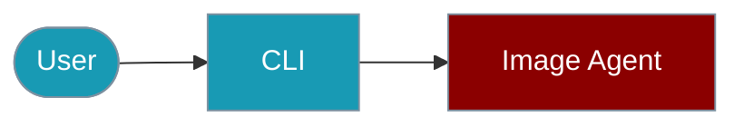

The `praisonai-ts` CLI provides the `image` command for image generation and analysis.



## Quick Start

<Steps>

<Step title="Simple Usage">
```bash
praisonai-ts image generate "A sunset over mountains"
```
</Step>

<Step title="With Configuration">
```bash
praisonai-ts image analyze https://example.com/image.jpg --json
```
</Step>

</Steps>

# Image Agent CLI Commands

The `praisonai-ts` CLI provides the `image` command for image generation and analysis.

## Generate Images

```bash
# Generate an image from text
praisonai-ts image generate "A sunset over mountains"

# Generate with options
praisonai-ts image generate "A cat" --size 1024x1024 --quality hd

# Get JSON output
praisonai-ts image generate "A futuristic city" --json
```

**Example Output:**
```json
{
  "success": true,
  "data": {
    "images": ["https://...generated-image-url..."],
    "prompt": "A sunset over mountains"
  }
}
```

## Analyze Images

```bash
# Analyze an image from URL
praisonai-ts image analyze https://example.com/image.jpg

# Analyze with custom prompt
praisonai-ts image analyze https://example.com/image.jpg "What objects are in this image?"

# Get JSON output
praisonai-ts image analyze https://example.com/image.jpg --json
```

## Generation Options

| Option | Description |
|--------|-------------|
| `--size` | Image size (256x256, 512x512, 1024x1024, 1792x1024, 1024x1792) |
| `--quality` | Quality level (standard, hd) |
| `--style` | Style (vivid, natural) |

## SDK Usage

For programmatic usage:

```typescript
import { ImageAgent } from 'praisonai';

const agent = new ImageAgent();

// Generate image
const images = await agent.generate({
  prompt: 'A sunset over mountains',
  size: '1024x1024',
  quality: 'hd'
});

// Analyze image
const analysis = await agent.analyze({
  imageUrl: 'https://example.com/image.jpg',
  prompt: 'Describe this image'
});
```

For more details, see the [Image Agent SDK documentation](/docs/js/image-agent).

## Related

<CardGroup cols={2}>
  <Card title="Image Agent" icon="book" href="/docs/js/image-agent">Image Agent overview</Card>
  <Card title="Multimodal Agent" icon="robot" href="/docs/js/multimodal-agent">Multimodal Agent overview</Card>
</CardGroup>
