Agents can run on a schedule - daily reports, hourly checks, or one-time tasks.

```mermaid
graph LR
    subgraph "Job Scheduling"
        A[⏰ Schedule] --> B[📋 Queue]
        B --> C[🤖 Agent]
        C --> D[📊 Result]
    end
    
    classDef schedule fill:#6366F1,stroke:#7C90A0,color:#fff
    classDef queue fill:#F59E0B,stroke:#7C90A0,color:#fff
    classDef result fill:#10B981,stroke:#7C90A0,color:#fff
    
    class A schedule
    class B queue
    class C,D result
```



## Quick Start

<Steps>

<Step title="Schedule a Job">
```typescript
import { Agent, Job } from 'praisonai';

const agent = new Agent({
  instructions: 'Generate daily sales reports'
});

const job = new Job({
  agent,
  task: 'Create the daily sales summary',
  schedule: '0 9 * * *'  // Every day at 9 AM
});

await job.start();
```
</Step>

<Step title="Interval Job">
```typescript
const job = new Job({
  agent,
  task: 'Check system status',
  interval: '30m'  // Every 30 minutes
});
```
</Step>

</Steps>

---

## User Interaction Flow


---

## Configuration Levels

```typescript
// Level 1: String - Cron schedule
const job = new Job({
  agent,
  task: 'Daily report',
  schedule: '0 9 * * *'
});

// Level 2: Dict - With options
const job = new Job({
  agent,
  task: 'Check status',
  interval: '1h',
  runOnStart: true
});

// Level 3: Instance - Full control
const job = new Job({
  agent,
  task: 'Generate report',
  schedule: '0 9 * * 1-5',  // Weekdays only
  timezone: 'America/New_York',
  onComplete: (result) => sendEmail(result),
  retries: 2
});
```

---

## Schedule Types

| Type | Example |
|------|---------|
| Cron | `'0 9 * * *'` (daily at 9 AM) |
| Interval | `'30m'`, `'1h'`, `'1d'` |
| One-time | `new Date('2024-03-15')` |

---

## Best Practices

<AccordionGroup>
  <Accordion title="Use cron for fixed times">
    Cron is best for "every day at 9 AM" type schedules.
  </Accordion>
  
  <Accordion title="Handle failures">
    Set retries and notifications for important jobs.
  </Accordion>
  
  <Accordion title="Consider timezones">
    Always specify timezone for user-facing schedules.
  </Accordion>
</AccordionGroup>

---

## Related

<CardGroup cols={2}>
  <Card title="Workflows" icon="diagram-project" href="/docs/js/workflows">
    Multi-step workflows
  </Card>
  <Card title="Execution" icon="play" href="/docs/js/execution">
    Execution settings
  </Card>
</CardGroup>
