Jobs let you schedule agent tasks to run later or on a recurring schedule.

```mermaid
graph LR
    subgraph "Job Scheduling"
        A[⏰ Schedule] --> B[📋 Queue]
        B --> C[🤖 Execute]
        C --> D[📊 Result]
    end
    
    classDef schedule fill:#6366F1,stroke:#7C90A0,color:#fff
    classDef queue fill:#F59E0B,stroke:#7C90A0,color:#fff
    classDef exec fill:#10B981,stroke:#7C90A0,color:#fff
    
    class A schedule
    class B queue
    class C,D exec
```



## Quick Start

```typescript
import { Job, Agent } from 'praisonai';

const agent = new Agent({ instructions: 'Generate reports' });

// Schedule daily report
const job = new Job({
  agent,
  task: 'Generate daily sales summary',
  schedule: '0 9 * * *'  // Every day at 9 AM
});

job.start();
```

## Schedule Types

| Type | Example |
|------|---------|
| Cron | `'0 9 * * *'` (daily at 9 AM) |
| Interval | `{ minutes: 30 }` |
| One-time | `new Date('2024-03-15')` |

---

## Common Examples

### Daily Report

```typescript
const job = new Job({
  agent,
  task: 'Summarize yesterday\'s metrics',
  schedule: '0 8 * * *'  // 8 AM daily
});
```

### Hourly Check

```typescript
const job = new Job({
  agent,
  task: 'Check system status',
  schedule: { hours: 1 }
});
```

---

## Related

<CardGroup cols={2}>
  <Card title="Workflows" icon="diagram-project" href="/docs/js/workflows">
    Multi-step workflows
  </Card>
  <Card title="Execution" icon="play" href="/docs/js/execution">
    Execution settings
  </Card>
</CardGroup>
