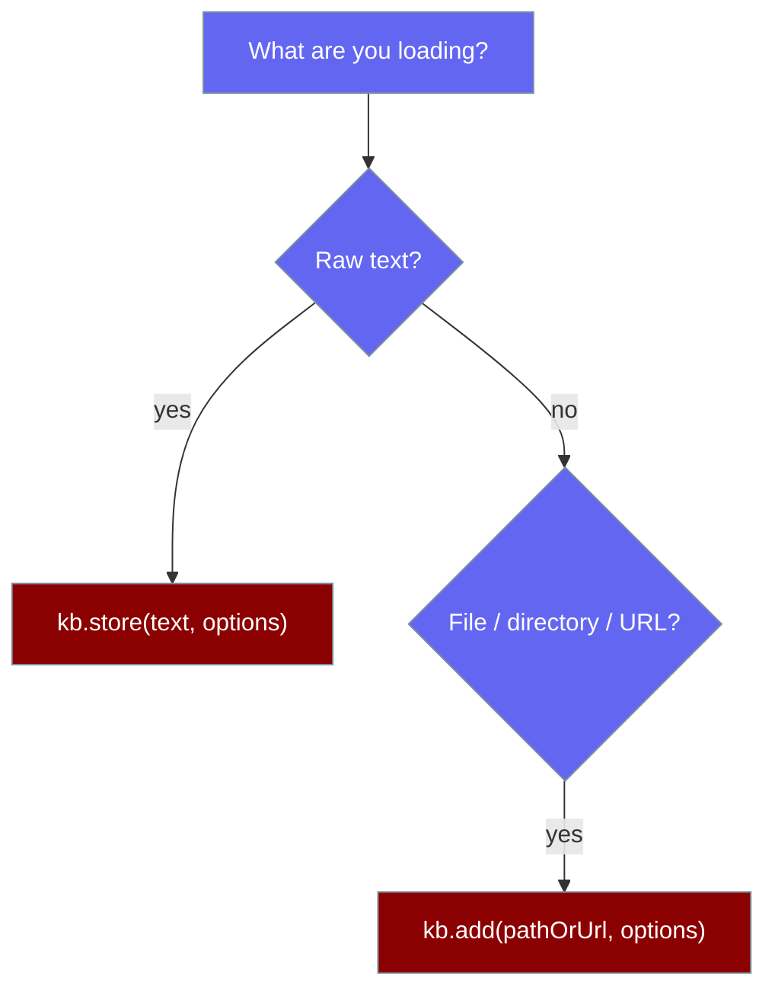
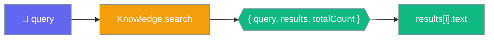

Give an Agent a `Knowledge` store and it searches it before answering.


## Quick Start

<Steps>

<Step title="Simple Usage">

```typescript
import { Agent, Knowledge } from 'praisonai';

const kb = new Knowledge();
await kb.store('Returns are accepted within 30 days.', { userId: 'u1' });
await kb.add('faqs.pdf', { userId: 'u1' });

const agent = new Agent({
  instructions: 'Answer support questions using the knowledge base.',
  knowledge: kb,
});

await agent.start('What is the return policy?');
```

</Step>

<Step title="With Configuration">

```typescript
import { Agent, Knowledge, createEmbeddingProvider } from 'praisonai';

const kb = new Knowledge({
  embeddingProvider: createEmbeddingProvider({ model: 'text-embedding-3-small' }),
});

await kb.store('Returns are accepted within 30 days.', { userId: 'u1' });

const agent = new Agent({
  instructions: 'Answer support questions using the knowledge base.',
  knowledge: kb,
  verbose: true,
});
```

</Step>

</Steps>

---

## Store or Add

Use `store()` for raw text and `add()` for files, directories, or URLs.



```typescript
import { Knowledge } from 'praisonai';

const kb = new Knowledge();

await kb.store('Our return policy allows returns within 30 days.', { userId: 'u1' });

await kb.add('faqs.pdf', { userId: 'u1' });
await kb.add(['a.pdf', 'b.txt'], { userId: 'u1' });
await kb.add('https://example.com/help', { userId: 'u1' });
```

<Note>`kb.add('doc.pdf')` chunks the file internally using the `chunker` block of `KnowledgeStoreConfig`. Use `store()` only for text you already have in memory.</Note>

---

## How Search Works

`search()` returns an envelope, not a bare array.



```typescript
const found = await kb.search('return policy', { userId: 'u1', limit: 5 });

console.log(found.query);        // 'return policy'
console.log(found.totalCount);   // number of matches before limit
console.log(found.results[0].text);
```

Each item in `results`:

| Field | Type | Description |
|-------|------|-------------|
| `id` | `string` | Unique identifier |
| `text` | `string` | The stored content |
| `score` | `number` | Relevance score |
| `metadata` | `object` | Stored metadata (always an object) |
| `source` | `string \| null` | Source identifier (e.g. URL) |
| `filename` | `string \| null` | Origin filename, if any |
| `createdAt` | `string \| null` | Creation timestamp |
| `updatedAt` | `string \| null` | Update timestamp |

---

## Configuration Options

`Knowledge` takes a Python-parity config object as its first argument.

<Card title="Knowledge API Reference" icon="code" href="/sdk/reference/typescript/classes/Knowledge">
  Full `KnowledgeStoreConfig` options
</Card>

---

## Common Patterns

### Scope by user, agent, or run

Every operation isolates memories by `userId`, `agentId`, and `runId`.

```typescript
await kb.store('Refund promised: $49 by Aug 12.', {
  userId: 'customer_42',
  agentId: 'support_bot_v1',
  runId: 'session_2026_09_03',
});

const scoped = await kb.search('refund promise', {
  userId: 'customer_42',
  agentId: 'support_bot_v1',
});
```

### Search from a tool

```typescript
import { Agent, Knowledge, createTool } from 'praisonai';

const kb = new Knowledge();
await kb.store('Important company information...', { userId: 'u1' });

const searchKB = createTool({
  name: 'search_knowledge',
  description: 'Search the knowledge base for relevant information',
  parameters: {
    type: 'object',
    properties: { query: { type: 'string', description: 'Search query' } },
    required: ['query'],
  },
  execute: async ({ query }) => {
    const found = await kb.search(query, { userId: 'u1', limit: 3 });
    return found.results.map(r => r.text).join('\n');
  },
});

const agent = new Agent({
  instructions: 'Use search_knowledge before answering.',
  tools: [searchKB],
});

await agent.start('What do you know about the company?');
```

### Manage stored items

```typescript
const item = kb.get('memory-id');
const all = kb.getAll({ userId: 'u1' });
await kb.update('memory-id', 'Updated content');
kb.delete('memory-id');
kb.deleteAll({ userId: 'u1' });
kb.reset();
```

---

## Best Practices

<AccordionGroup>

<Accordion title="Always pass a scope">
  Supply at least one of `userId`, `agentId`, or `runId` on every `store`, `add`, and `search` call so tenants never read each other's data.
</Accordion>

<Accordion title="Use add() for files, store() for text">
  `add()` reads and chunks files, directories, and URLs. `store()` takes text you already hold in memory.
</Accordion>

<Accordion title="Read results[i].text">
  `search()` returns `{ query, results, totalCount }`. Read `found.results[i].text`, and page with `limit`.
</Accordion>

<Accordion title="Enable embeddings for semantic search">
  Pass `embeddingProvider` in the config to rank results by vector similarity instead of keyword overlap.
</Accordion>

</AccordionGroup>

---

## Related

<CardGroup cols={2}>
  <Card title="Knowledge Base CLI" icon="terminal" href="/js/knowledge-base-cli">
    CLI knowledge commands
  </Card>
  <Card title="Chunking" icon="scissors" href="/js/chunking">
    Split documents before storing
  </Card>
</CardGroup>
