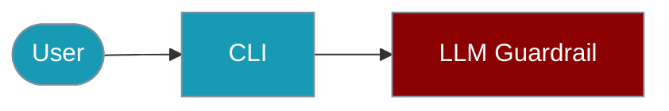

The `praisonai-ts` CLI provides the `guardrail` command for content validation.



## Quick Start

<Steps>

<Step title="Simple Usage">
```bash
praisonai-ts guardrail check "Your content here"
```
</Step>

<Step title="With Configuration">
```bash
praisonai-ts guardrail check "Content to validate" --criteria "Must be professional" --json
```
</Step>

</Steps>

## Basic Usage

```bash
# Check content against guardrails
praisonai-ts guardrail check "Your content here"

# Check with custom criteria
praisonai-ts guardrail check "Content to validate" --criteria "Must be professional"

# Get JSON output
praisonai-ts guardrail check "Hello world" --json
```

**Example Output:**
```json
{
  "success": true,
  "data": {
    "status": "passed",
    "score": 0.95,
    "message": "Content passes all criteria",
    "reasoning": "The content is appropriate and safe"
  }
}
```

## Status Values

| Status | Description |
|--------|-------------|
| `passed` | Content meets all criteria |
| `failed` | Content does not meet criteria |
| `warning` | Content partially meets criteria |

## SDK Usage

For programmatic guardrail usage:

```typescript
import { LLMGuardrail } from 'praisonai';

const guard = new LLMGuardrail({
  name: 'safety',
  criteria: 'Content must be safe and appropriate',
  threshold: 0.8
});

const result = await guard.check('Hello world');
console.log(result.status); // 'passed', 'failed', or 'warning'
console.log(result.score);  // 0-1
console.log(result.reasoning);
```

For more details, see the [LLM Guardrail SDK documentation](/docs/js/llm-guardrail).

## Related

<CardGroup cols={2}>
  <Card title="LLM Guardrail" icon="shield-check" href="/docs/js/llm-guardrail">
    SDK documentation
  </Card>
  <Card title="Guardrails" icon="shield-halved" href="/docs/js/guardrails">
    Built-in guardrail rules
  </Card>
</CardGroup>
