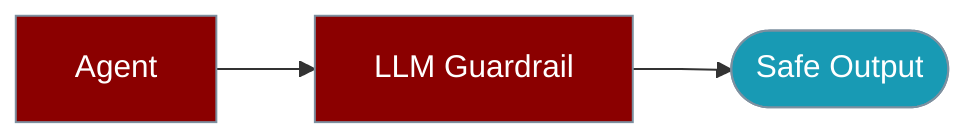

Validate content with LLM-based safety and quality checks.



## Quick Start

<Steps>

<Step title="Simple Usage">

```bash
npm install praisonai
```

```typescript
import { LLMGuardrail } from 'praisonai';

const guard = new LLMGuardrail({
  name: 'safety_check',
  criteria: 'Content must be safe and appropriate for all audiences'
});

const result = await guard.check('Hello, how are you?');
console.log(result.status); // 'passed' or 'failed'
console.log(result.score);  // 0-1 score
```

</Step>

<Step title="With Configuration">

```typescript
import { LLMGuardrail } from 'praisonai';

const guard = new LLMGuardrail({
  name: 'quality_check',
  criteria: 'Response must be helpful, accurate, and well-structured',
  llm: 'openai/gpt-4o',
  threshold: 0.8,
  verbose: true
});

const result = await guard.check(agentResponse);
if (result.status === 'passed') {
  console.log('Quality check passed');
} else {
  console.log('Quality check failed:', result.reasoning);
}
```

</Step>

</Steps>

## Multiple Criteria

```typescript
import { LLMGuardrail } from 'praisonai';

const safetyGuard = new LLMGuardrail({
  name: 'safety',
  criteria: 'No harmful, offensive, or inappropriate content'
});

const accuracyGuard = new LLMGuardrail({
  name: 'accuracy',
  criteria: 'Information must be factually correct'
});

const relevanceGuard = new LLMGuardrail({
  name: 'relevance',
  criteria: 'Response must directly address the question'
});

// Check all guards
const content = 'Your content here';
const results = await Promise.all([
  safetyGuard.check(content),
  accuracyGuard.check(content),
  relevanceGuard.check(content)
]);

const allPassed = results.every(r => r.status === 'passed');
```

## Result Structure

```typescript
interface LLMGuardrailResult {
  status: 'passed' | 'failed' | 'warning';
  score: number;        // 0-1 score
  message?: string;     // Error message if any
  reasoning?: string;   // LLM's reasoning
}
```

## Custom Threshold

```typescript
import { LLMGuardrail } from 'praisonai';

// Strict threshold (0.9)
const strictGuard = new LLMGuardrail({
  name: 'strict',
  criteria: 'Must be perfect',
  threshold: 0.9
});

// Lenient threshold (0.5)
const lenientGuard = new LLMGuardrail({
  name: 'lenient',
  criteria: 'Should be acceptable',
  threshold: 0.5
});
```

## Factory Function

```typescript
import { createLLMGuardrail } from 'praisonai';

const guard = createLLMGuardrail({
  name: 'content_check',
  criteria: 'Content must be professional'
});
```

## Integration with Agents

```typescript
import { Agent, LLMGuardrail } from 'praisonai';

const guard = new LLMGuardrail({
  name: 'output_check',
  criteria: 'Response must be helpful and safe'
});

const agent = new Agent({ instructions: 'You are a helpful assistant' });
const response = await agent.chat('Hello');

const check = await guard.check(response.text);
if (check.status === 'failed') {
  console.log('Response failed guardrail check');
}
```

## Related

<CardGroup cols={2}>
  <Card title="LLM Guardrail CLI" icon="terminal" href="/docs/js/llm-guardrail-cli">
    CLI guardrail checks
  </Card>
  <Card title="Guardrails" icon="shield-check" href="/docs/js/guardrails">
    Built-in guardrail rules
  </Card>
</CardGroup>
