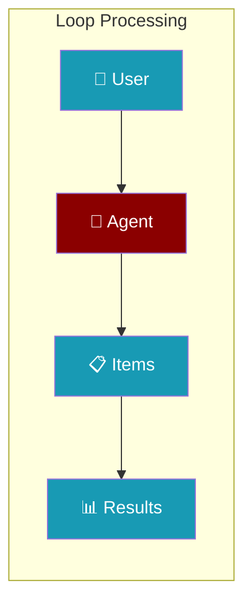
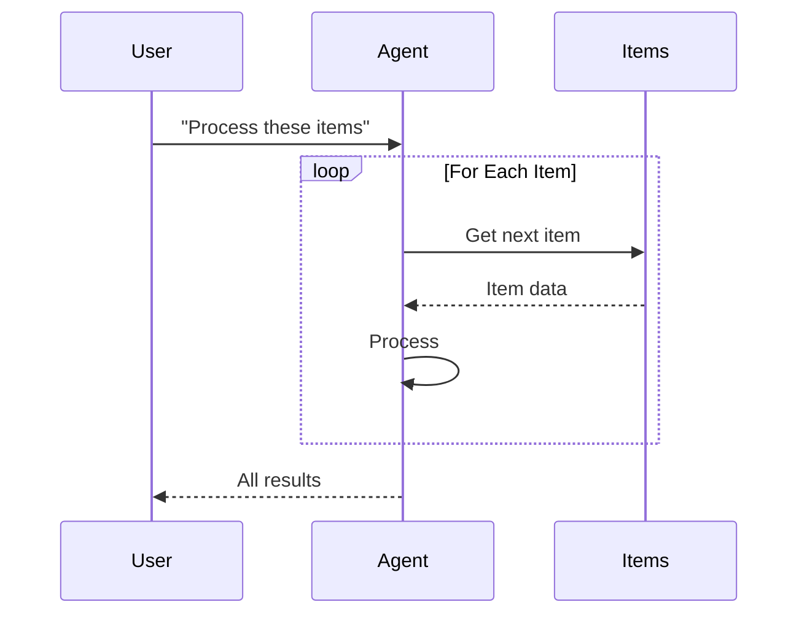

Agents can process lists of items one by one - like handling emails, analyzing files, or transforming data.


```mermaid
graph LR
    subgraph "Loop Processing"
        A[👤 User] --> B[🤖 Agent]
        B --> C[📋 Items]
        C --> D[📊 Results]
    end

    classDef agent fill:#8B0000,color:#fff
    classDef tool fill:#189AB4,color:#fff

    class B agent
    class A,C,D tool
```

## Quick Start

<Steps>

<Step title="Simple Usage">
```typescript
import { Agent, loop } from 'praisonai';

const agent = new Agent({
  instructions: 'Summarize the given text concisely'
});

const texts = [
  'First article about AI...',
  'Second article about robotics...',
  'Third article about automation...'
];

const results = await loop(agent, { over: 'texts' }).run({ texts });
console.log(results);
// ['AI summary...', 'Robotics summary...', 'Automation summary...']
```
</Step>

<Step title="With Configuration">
```typescript
const results = await loop(agent, { 
  fromCsv: './customers.csv'
}).run({});
// Each row is processed by the agent
```
</Step>

</Steps>

---

## User Interaction Flow


```mermaid
sequenceDiagram
    participant User
    participant Agent
    participant Items
    
    User->>Agent: "Process these items"
    loop For Each Item
        Agent->>Items: Get next item
        Items-->>Agent: Item data
        Agent->>Agent: Process
    end
    Agent-->>User: All results
```

---

## Configuration Levels

```typescript
// Level 1: String - Simple field reference
const result = await loop(agent, { over: 'items' }).run({ items });

// Level 2: Dict - With options
const result = await loop(agent, {
  over: 'items',
  maxIterations: 100,
  continueOnError: true
}).run({ items });

// Level 3: Instance - Full control with callbacks
const result = await loop(agent, {
  over: 'items',
  onIteration: (item, index, total) => {
    console.log(`Processing ${index + 1} of ${total}`);
  },
  onError: (error, item) => {
    console.error(`Failed: ${item}`);
  }
}).run({ items });
```

---

## Data Sources

| Source | Use Case |
|--------|----------|
| `over: 'items'` | Array in your code |
| `fromCsv: 'file.csv'` | CSV file with rows |
| `fromFile: 'list.txt'` | Text file (one item per line) |

---

## Common Examples

### Email Processing

```typescript
const emails = [
  { from: 'alice@example.com', body: 'Meeting request...' },
  { from: 'bob@example.com', body: 'Question about...' }
];

const responses = await loop(agent, { over: 'emails' }).run({ emails });
```

### Handle Errors Gracefully

```typescript
const result = await loop(agent, {
  over: 'items',
  continueOnError: true
}).run({ items });

console.log(`Success: ${result.results.length}`);
console.log(`Failed: ${result.errors.length}`);
```

---

## Looping a Task

A `Task` fans itself out with `loopOver` (an array) or `inputFile` (a CSV) — one run per item, all through `team.start()`.

### loopOver an array

`loopOver` names a variable holding an array. Each item binds to `loopVar` (default `"item"`).

```typescript
import { Agent, Team } from 'praisonai';

const team = new Team({
  agents: [new Agent({ instructions: 'help' })],
  tasks: [{
    name: 'greet',
    description: 'greet {{name}}',
    loopOver: 'people',
    loopVar: 'name'
  }],
  variables: { people: ['ada', 'bob'] }
});

await team.start();
// Runs: "greet ada", then "greet bob"
```

<Note>
Pass tasks as plain objects. `import { Task } from 'praisonai'` is the workflow-step class (`{ name, execute }`) and does not accept `loopOver`, `loopVar`, or `inputFile` — `Team` reads those fields directly off the object.
</Note>

`loopState` reaches `onTaskComplete` as `{ name, index, total }` for each item.

```typescript
// a task object inside team.tasks
{
  name: 'greet',
  description: 'greet {{item}}',
  loopOver: 'people',
  onTaskComplete: (_output, metadata) => console.log(metadata?.loopState)
  // { name: 'ada', index: 0, total: 2 }, then { name: 'bob', index: 1, total: 2 }
}
```

### inputFile fans out a CSV

`inputFile` reads a CSV and runs one subtask per row, shaped as `Question: <col1>\nAnswer: <col2>`.

```typescript
// a task object inside team.tasks
{ name: 'quiz', description: 'Check the answer', inputFile: './rows.csv' }
// rows.csv:  Where is Paris?,France
//            Where is Rome?,Italy
// Two runs: "Question: Where is Paris?\nAnswer: France", then Rome/Italy
```

<Note>
If a task sets both, **`inputFile` wins** over `loopOver`.
</Note>

---

## API Reference

<Card title="Loop" icon="code" href="/sdk/reference/typescript/classes/Loop">
  Loop class documentation
</Card>

---

## Best Practices

<AccordionGroup>
  <Accordion title="Set limits for safety">
    Use `maxIterations` to prevent runaway loops. Default is 1000.
  </Accordion>
  
  <Accordion title="Handle errors gracefully">
    Use `continueOnError: true` to process all items even if some fail.
  </Accordion>
  
  <Accordion title="Track progress">
    Use `onIteration` callback to show progress for long-running loops.
  </Accordion>
</AccordionGroup>

---

## Related

<CardGroup cols={2}>
  <Card title="Workflows" icon="diagram-project" href="/js/workflows">
    Multi-step workflows
  </Card>
  <Card title="Agent" icon="user" href="/js/agent">
    Create AI agents
  </Card>
</CardGroup>
