Agents can process lists of items one by one - like handling emails, analyzing files, or transforming data.

```mermaid
graph LR
    subgraph "Loop Processing"
        A[👤 User] --> B[🤖 Agent]
        B --> C[📋 Items]
        C --> D[📊 Results]
    end
    
    classDef user fill:#6366F1,stroke:#7C90A0,color:#fff
    classDef agent fill:#F59E0B,stroke:#7C90A0,color:#fff
    classDef output fill:#10B981,stroke:#7C90A0,color:#fff
    
    class A user
    class B agent
    class C,D output
```



## Quick Start

<Steps>

<Step title="Process a List with Agent">
```typescript
import { Agent, loop } from 'praisonai';

const agent = new Agent({
  instructions: 'Summarize the given text concisely'
});

const texts = [
  'First article about AI...',
  'Second article about robotics...',
  'Third article about automation...'
];

const results = await loop(agent, { over: 'texts' }).run({ texts });
console.log(results);
// ['AI summary...', 'Robotics summary...', 'Automation summary...']
```
</Step>

<Step title="Process CSV File">
```typescript
const results = await loop(agent, { 
  fromCsv: './customers.csv'
}).run({});
// Each row is processed by the agent
```
</Step>

</Steps>

---

## User Interaction Flow


---

## Configuration Levels

```typescript
// Level 1: String - Simple field reference
const result = await loop(agent, { over: 'items' }).run({ items });

// Level 2: Dict - With options
const result = await loop(agent, {
  over: 'items',
  maxIterations: 100,
  continueOnError: true
}).run({ items });

// Level 3: Instance - Full control with callbacks
const result = await loop(agent, {
  over: 'items',
  onIteration: (item, index, total) => {
    console.log(`Processing ${index + 1} of ${total}`);
  },
  onError: (error, item) => {
    console.error(`Failed: ${item}`);
  }
}).run({ items });
```

---

## Data Sources

| Source | Use Case |
|--------|----------|
| `over: 'items'` | Array in your code |
| `fromCsv: 'file.csv'` | CSV file with rows |
| `fromFile: 'list.txt'` | Text file (one item per line) |

---

## Common Examples

### Email Processing

```typescript
const emails = [
  { from: 'alice@example.com', body: 'Meeting request...' },
  { from: 'bob@example.com', body: 'Question about...' }
];

const responses = await loop(agent, { over: 'emails' }).run({ emails });
```

### Handle Errors Gracefully

```typescript
const result = await loop(agent, {
  over: 'items',
  continueOnError: true
}).run({ items });

console.log(`Success: ${result.results.length}`);
console.log(`Failed: ${result.errors.length}`);
```

---

## API Reference

<Card title="Loop" icon="code" href="/docs/sdk/reference/typescript/classes/Loop">
  Loop class documentation
</Card>

---

## Best Practices

<AccordionGroup>
  <Accordion title="Set limits for safety">
    Use `maxIterations` to prevent runaway loops. Default is 1000.
  </Accordion>
  
  <Accordion title="Handle errors gracefully">
    Use `continueOnError: true` to process all items even if some fail.
  </Accordion>
  
  <Accordion title="Track progress">
    Use `onIteration` callback to show progress for long-running loops.
  </Accordion>
</AccordionGroup>

---

## Related

<CardGroup cols={2}>
  <Card title="Workflows" icon="diagram-project" href="/docs/js/workflows">
    Multi-step workflows
  </Card>
  <Card title="Agent" icon="user" href="/docs/js/agent">
    Create AI agents
  </Card>
</CardGroup>
