Loops let agents process lists of items one by one - like processing a list of emails or analyzing multiple files.

```mermaid
graph LR
    subgraph "Loop Processing"
        A[📋 Items] --> B[🔄 For Each]
        B --> C[🤖 Process]
        C --> D[📊 Results]
    end
    
    classDef input fill:#6366F1,stroke:#7C90A0,color:#fff
    classDef process fill:#F59E0B,stroke:#7C90A0,color:#fff
    classDef output fill:#10B981,stroke:#7C90A0,color:#fff
    
    class A input
    class B,C process
    class D output
```



## Quick Start

<Steps>

<Step title="Process a List">
```typescript
import { Agent, loop } from 'praisonai';

const agent = new Agent({
  instructions: 'Summarize the given text'
});

const result = await loop(agent, { over: 'texts' }).run({
  texts: [
    'First article content...',
    'Second article content...',
    'Third article content...'
  ]
});

console.log(result.results);
// ['Summary of first...', 'Summary of second...', ...]
```
</Step>

<Step title="Process from CSV File">
```typescript
// Process each row from a CSV
const result = await loop(agent, { 
  fromCsv: './customers.csv'
}).run({});

// Each row becomes available to the agent
```
</Step>

<Step title="Use Custom Function">
```typescript
const result = await loop(
  async (item, context) => {
    return `Processed: ${item}`;
  },
  { over: 'items' }
).run({ items: ['a', 'b', 'c'] });
```
</Step>

</Steps>

---

## How It Works


---

## Data Sources

| Source | Use Case |
|--------|----------|
| `over: 'items'` | Array in your code |
| `fromCsv: 'file.csv'` | CSV file with rows |
| `fromFile: 'list.txt'` | Text file (one item per line) |

---

## Common Examples

### Email Responses

```typescript
const emails = [
  { from: 'alice@example.com', subject: 'Meeting' },
  { from: 'bob@example.com', subject: 'Question' }
];

const result = await loop(agent, { over: 'emails' }).run({ emails });
```

### Track Progress

```typescript
const result = await loop(agent, {
  over: 'items',
  onIteration: (item, index, total) => {
    console.log(`Processing ${index + 1} of ${total}`);
  }
}).run({ items: myItems });
```

### Handle Errors Gracefully

```typescript
// Continue even if some items fail
const result = await loop(agent, {
  over: 'items',
  continueOnError: true
}).run({ items: myItems });

console.log(`Completed: ${result.results.length}`);
console.log(`Failed: ${result.errors.length}`);
```

---

## Best Practices

<AccordionGroup>
  <Accordion title="Set reasonable limits">
    Use `maxIterations` to prevent runaway loops. Default is 1000.
  </Accordion>
  
  <Accordion title="Handle errors gracefully">
    Use `continueOnError: true` when processing many items to not stop on the first failure.
  </Accordion>
  
  <Accordion title="Track progress for long lists">
    Use the `onIteration` callback to show progress when processing many items.
  </Accordion>
</AccordionGroup>

---

## Related

<CardGroup cols={2}>
  <Card title="Workflows" icon="diagram-project" href="/docs/js/workflows">
    Multi-step workflows
  </Card>
  <Card title="Agent" icon="user" href="/docs/js/agent">
    Create AI agents
  </Card>
</CardGroup>
