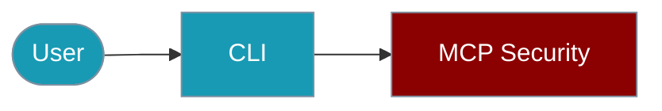

Configure MCP security policies from the command line.



## Quick Start

<Steps>

<Step title="Simple Usage">
```bash
npx praisonai mcp security add-key sk-prod-key-1
```
</Step>

<Step title="With Configuration">
```bash
npx praisonai mcp security rate-limit --requests 100 --window 60
```
</Step>

</Steps>

## API Key Management

```bash
# Add API key
npx praisonai mcp security add-key sk-prod-key-1

# List keys (masked)
npx praisonai mcp security list-keys

# Remove key
npx praisonai mcp security remove-key sk-prod-key-1
```

## Rate Limiting

```bash
# Set rate limit
npx praisonai mcp security rate-limit --requests 100 --window 60

# Show rate limit config
npx praisonai mcp security rate-limit --show

# Reset rate limits
npx praisonai mcp security rate-limit --reset
```

## IP Filtering

```bash
# Add IP to whitelist
npx praisonai mcp security whitelist add 192.168.1.0/24

# Add IP to blacklist
npx praisonai mcp security blacklist add 10.0.0.1

# List filters
npx praisonai mcp security ip-filters --list
```

## Security Status

```bash
# Show security configuration
npx praisonai mcp security status

# Show recent violations
npx praisonai mcp security violations --last 10

# Export security config
npx praisonai mcp security export --output security.json
```

## Programmatic (TypeScript)

```typescript
import { MCPSecurity, createApiKeyPolicy, createRateLimitPolicy } from 'praisonai';

const security = new MCPSecurity();
security.addPolicy(createApiKeyPolicy({ keys: ['key'] }));
security.addPolicy(createRateLimitPolicy({ requests: 100, window: 60000 }));
```

## Related

<CardGroup cols={2}>
  <Card title="MCP Security" icon="plug" href="/docs/js/mcp-security">
    SDK documentation
  </Card>
  <Card title="MCP Tools CLI" icon="plug" href="/docs/js/mcp-tools-cli">
    MCP CLI commands
  </Card>
</CardGroup>
