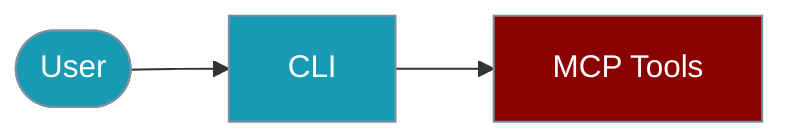

Manage and use MCP servers from the command line.



## Quick Start

<Steps>

<Step title="Simple Usage">
```bash
praisonai-ts mcp list --url https://mcp-server.example.com/api
```
</Step>

<Step title="With Configuration">
```bash
praisonai-ts mcp run --url https://mcp-server.example.com/api --tool read_file --args '{"path":"."}' --json
```
</Step>

</Steps>

## Commands

### List MCP Tools

```bash
# List tools from stdio server
praisonai-ts mcp list \
  --command "npx -y @modelcontextprotocol/server-filesystem /path"

# List from HTTP server
praisonai-ts mcp list --url https://mcp-server.example.com/api
```

### Run MCP Tool

```bash
# Execute a tool
praisonai-ts mcp run read_file \
  --command "npx -y @modelcontextprotocol/server-filesystem /path" \
  --args '{"path": "file.txt"}'
```

### List Resources

```bash
praisonai-ts mcp resources \
  --command "npx -y @modelcontextprotocol/server-filesystem /path"
```

### List Prompts

```bash
praisonai-ts mcp prompts \
  --command "npx -y @modelcontextprotocol/server-filesystem /path"
```

## Options

| Option | Type | Description |
|--------|------|-------------|
| `--command` | string | Stdio command |
| `--url` | string | HTTP/SSE URL |
| `--transport` | string | Transport type |
| `--args` | string | Tool arguments (JSON) |
| `--json` | boolean | JSON output |

## Examples

### Filesystem Server

```bash
# List files
praisonai-ts mcp run list_directory \
  --command "npx -y @modelcontextprotocol/server-filesystem ." \
  --args '{"path": "."}'
```

### GitHub Server

```bash
GITHUB_TOKEN=ghp_... praisonai-ts mcp list \
  --command "npx -y @modelcontextprotocol/server-github"
```

## Environment Variables

| Variable | Description |
|----------|-------------|
| Server-specific | MCP server requirements |

## Related Commands

- `praisonai-ts mcp test` - Test MCP connection
- `praisonai-ts mcp info` - Show server info

## Related

<CardGroup cols={2}>
  <Card title="MCP Tools" icon="book" href="/docs/js/mcp-tools">MCP Tools overview</Card>
  <Card title="Tools CLI" icon="robot" href="/docs/js/tools-cli">Tools CLI overview</Card>
</CardGroup>
