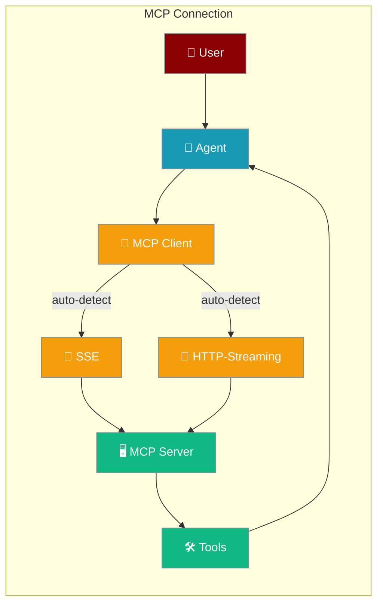
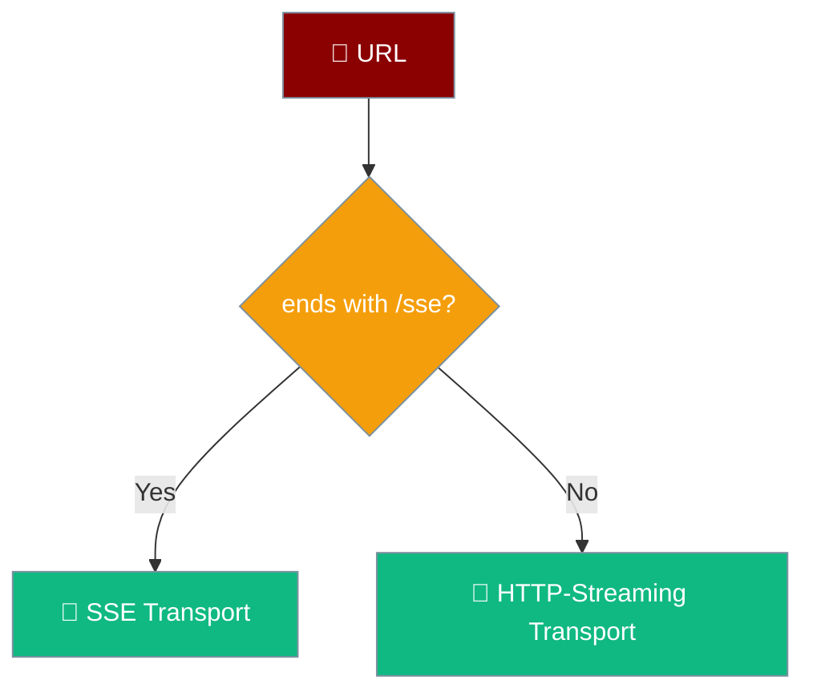
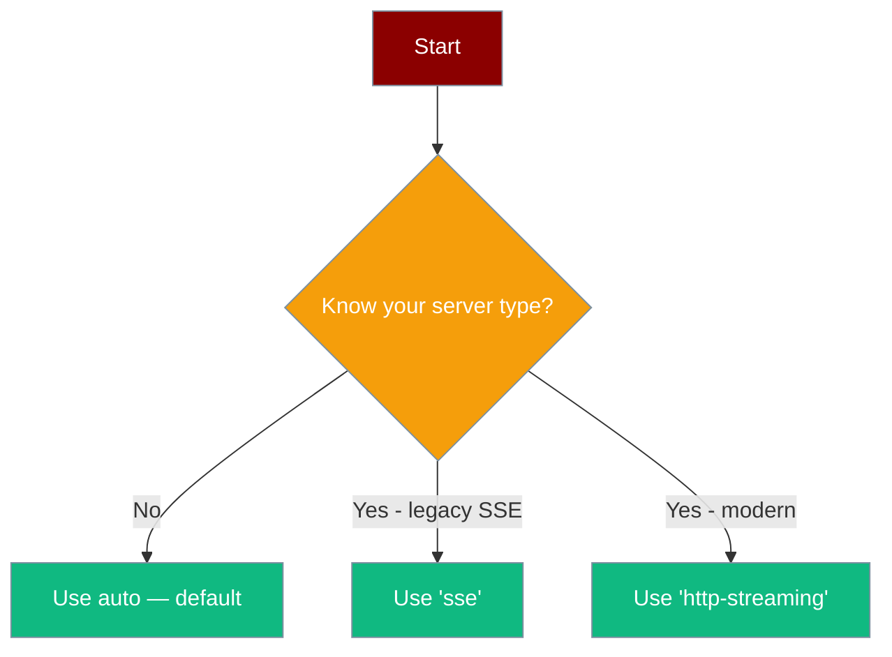
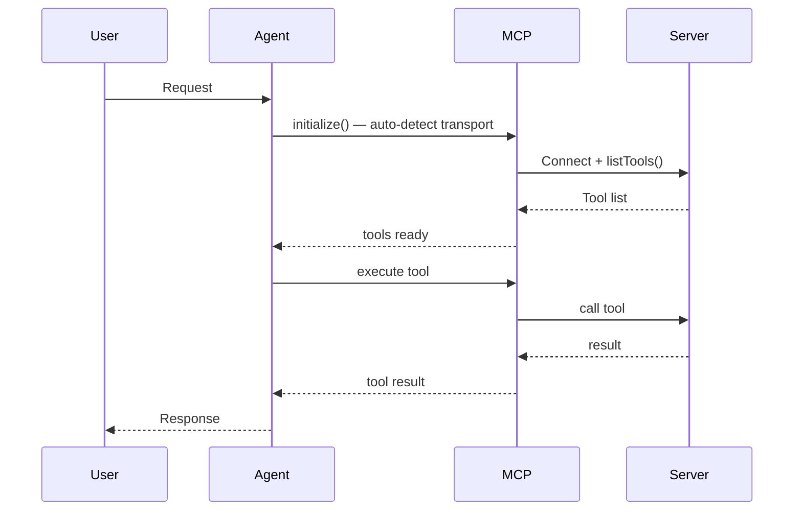

Connect agents to any MCP server using automatic transport detection or explicit SSE / HTTP-Streaming selection.



## Class-based API (Transport Selection)

The new `MCP` class connects to any HTTP-based MCP server with automatic transport detection.

```typescript
import { Agent, MCP } from 'praisonai-ts';

const mcp = new MCP('http://127.0.0.1:8080/sse'); // auto-detects SSE
await mcp.initialize();

const toolFunctions = Object.fromEntries(
  [...mcp].map(tool => [tool.name, async (args: any) => tool.execute(args)])
);

const agent = new Agent({
  name: 'MCPAgent',
  instructions: 'You are a helpful assistant with access to MCP tools.',
  tools: mcp.toOpenAITools(),
  toolFunctions,
});

const response = await agent.runSync('What tools are available?');
await mcp.close();
```

### Auto-Detection

The client picks a transport based on the URL pattern.



### Transport Selection Table

| `transport` value | When to use | Endpoint pattern |
|-------------------|-------------|------------------|
| `'auto'` (default) | Let the client decide | Any URL |
| `'sse'` | Legacy MCP servers using HTTP+SSE | `http(s)://host/sse` |
| `'http-streaming'` | Modern streaming MCP servers | `http(s)://host/...` |

### How to Choose



### All Four Transport Examples

**Auto-detect with SSE URL (`/sse` suffix):**
```typescript
const mcp = new MCP('http://127.0.0.1:8080/sse'); // → SSE
await mcp.initialize();
console.log(mcp.transportType); // "sse"
```

**Explicit SSE:**
```typescript
const mcp = new MCP('http://127.0.0.1:8080/api', 'sse');
await mcp.initialize();
```

**Explicit HTTP-Streaming:**
```typescript
const mcp = new MCP('http://127.0.0.1:8080/stream', 'http-streaming');
await mcp.initialize();
```

**Auto-detect with non-SSE URL (→ HTTP-Streaming):**
```typescript
const mcp = new MCP('http://127.0.0.1:8080/api'); // → HTTP-Streaming
await mcp.initialize();
```

### Class API Reference

| Member | Type | Description |
|--------|------|-------------|
| `new MCP(url, transport?, debug?)` | constructor | `transport` defaults to `'auto'`; `debug` defaults to `false` |
| `initialize()` | `Promise<void>` | Connects and lists available tools |
| `close()` | `Promise<void>` | Closes the connection and clears tools |
| `toOpenAITools()` | `OpenAITool[]` | Returns tools in OpenAI schema format |
| `tools` | `MCPTool[]` | List of discovered tools after `initialize()` |
| `transportType` | `string` | Resolved transport: `'sse'` \| `'http-streaming'` \| `'not initialized'` |
| `isConnected` | `boolean` | Whether the client is connected |
| `[Symbol.iterator]` | iterable | Iterate over `MCPTool` instances |

### User Interaction Flow



<Note>
The old `createMCP({ transport: { ... } })` factory continues to work — it is re-exported for backward compatibility. The new `MCP` class is additive and works alongside the existing API shown below.
</Note>

---

## Quick Start (Factory API)

```typescript
import { Agent, createMCP } from 'praisonai-ts';

// Connect to MCP server
const mcp = await createMCP({
  transport: {
    type: 'stdio',
    command: 'npx',
    args: ['-y', '@modelcontextprotocol/server-filesystem', '/path/to/dir'],
  },
});

// Get tools from MCP server
const tools = await mcp.tools();

// Create agent with MCP tools
const agent = new Agent({
  name: 'FileAgent',
  instructions: 'You help manage files.',
  tools: Object.values(tools),
});

const response = await agent.chat('List all files in the directory');
```

## Transport Types

### Stdio (Local Servers)

```typescript
const mcp = await createMCP({
  transport: {
    type: 'stdio',
    command: 'npx',
    args: ['-y', '@modelcontextprotocol/server-filesystem', '/path'],
    env: { NODE_ENV: 'production' },
  },
});
```

### SSE (Server-Sent Events)

```typescript
const mcp = await createMCP({
  transport: {
    type: 'sse',
    url: 'https://mcp-server.example.com/sse',
    headers: { Authorization: 'Bearer token' },
  },
});
```

### HTTP

```typescript
const mcp = await createMCP({
  transport: {
    type: 'http',
    url: 'https://mcp-server.example.com/api',
    headers: { 'X-API-Key': 'key' },
  },
});
```

### WebSocket

```typescript
const mcp = await createMCP({
  transport: {
    type: 'websocket',
    url: 'wss://mcp-server.example.com/ws',
  },
});
```

## OAuth Authentication

```typescript
import { createMCP, type OAuthClientProvider } from 'praisonai-ts';

const oauthProvider: OAuthClientProvider = {
  getAccessToken: async () => {
    return await getStoredToken();
  },
  refreshToken: async () => {
    return await refreshOAuthToken();
  },
};

const mcp = await createMCP({
  transport: {
    type: 'http',
    url: 'https://mcp-server.example.com/api',
    authProvider: oauthProvider,
  },
});
```

## Resources

Access resources from MCP servers:

```typescript
// List available resources
const resources = await mcp.listResources();
console.log('Resources:', resources);

// Read a resource
const content = await mcp.readResource('file:///path/to/file.txt');
console.log('Content:', content.text);
```

## Prompts

Use prompts from MCP servers:

```typescript
// List available prompts
const prompts = await mcp.listPrompts();
console.log('Prompts:', prompts);

// Get a prompt
const prompt = await mcp.getPrompt('summarize', { length: 'short' });
console.log('Prompt messages:', prompt.messages);
```

## Popular MCP Servers

| Server | Package | Description |
|--------|---------|-------------|
| Filesystem | `@modelcontextprotocol/server-filesystem` | File operations |
| GitHub | `@modelcontextprotocol/server-github` | GitHub API |
| Slack | `@modelcontextprotocol/server-slack` | Slack integration |
| PostgreSQL | `@modelcontextprotocol/server-postgres` | Database queries |
| Brave Search | `@modelcontextprotocol/server-brave-search` | Web search |

## Example: Filesystem Server

```typescript
import { Agent, createMCP } from 'praisonai-ts';

const mcp = await createMCP({
  transport: {
    type: 'stdio',
    command: 'npx',
    args: ['-y', '@modelcontextprotocol/server-filesystem', './documents'],
  },
});

const tools = await mcp.tools();

const agent = new Agent({
  name: 'FileManager',
  instructions: 'You help manage files and directories.',
  tools: Object.values(tools),
});

await agent.chat('Create a new file called notes.txt with "Hello World"');
```

## Example: GitHub Server

```typescript
const mcp = await createMCP({
  transport: {
    type: 'stdio',
    command: 'npx',
    args: ['-y', '@modelcontextprotocol/server-github'],
    env: { GITHUB_TOKEN: process.env.GITHUB_TOKEN },
  },
});

const tools = await mcp.tools();

const agent = new Agent({
  name: 'GitHubAgent',
  instructions: 'You help with GitHub operations.',
  tools: Object.values(tools),
});

await agent.chat('List my recent repositories');
```

## Cleanup

Always close MCP connections when done:

```typescript
import { closeMCPClient, closeAllMCPClients } from 'praisonai-ts';

// Close specific client
await closeMCPClient('my-client-id');

// Close all clients
await closeAllMCPClients();
```

## Environment Variables

| Variable | Required | Description |
|----------|----------|-------------|
| `OPENAI_API_KEY` | Yes | For the agent |
| Server-specific | Varies | MCP server requirements |

## Best Practices

<AccordionGroup>
<Accordion title="Close connections">
Always close MCP clients when done to avoid resource leaks. Use `await mcp.close()` with the class API or `closeAllMCPClients()` with the factory API.
</Accordion>
<Accordion title="Handle errors">
MCP servers may fail or timeout. Wrap `initialize()` in try/catch and check `isConnected` before calling tools.
</Accordion>
<Accordion title="Choose the right transport">
Use `'auto'` (default) for most cases. Switch to `'sse'` for legacy servers or `'http-streaming'` for modern servers when you know the server type.
</Accordion>
<Accordion title="Secure credentials">
Use OAuth for authenticated servers. Never hardcode API keys — use environment variables.
</Accordion>
</AccordionGroup>

## Related

<CardGroup cols={2}>
<Card title="Tools" icon="wrench" href="/docs/js/tools">
  TypeScript tool system overview
</Card>
<Card title="Agent" icon="robot" href="/docs/js/agent">
  Agent configuration and usage
</Card>
</CardGroup>
