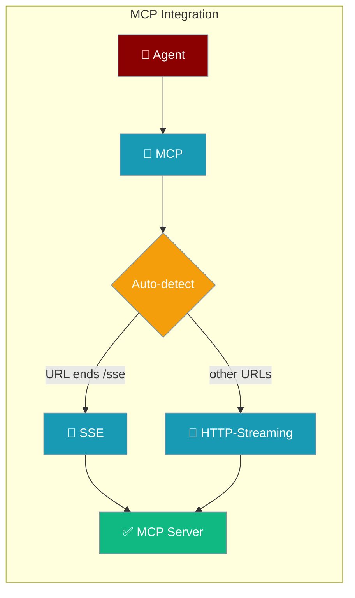
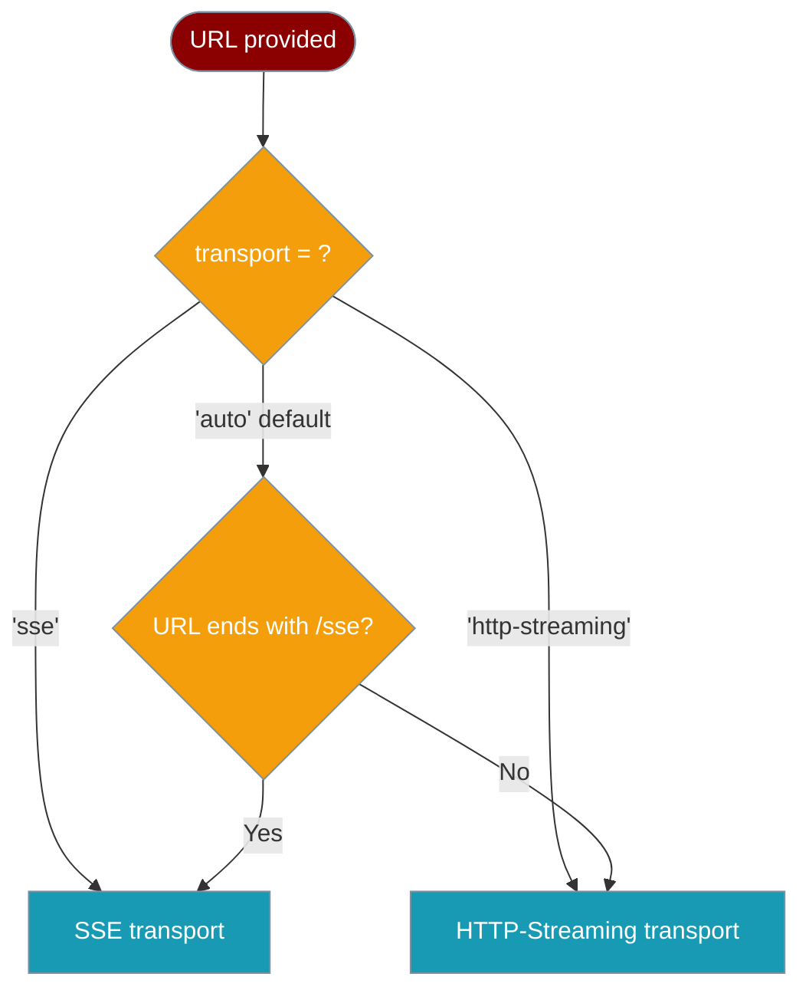

Connect agents to Model Context Protocol (MCP) servers to give them access to external tools, data, and services.



## Quick Start

<Steps>
<Step title="Install and connect to an MCP server">

```typescript
import { Agent, MCP } from 'praisonai-ts';

const mcp = new MCP('http://127.0.0.1:8080/sse');
await mcp.initialize();
```

</Step>

<Step title="Wire MCP tools into an Agent">

```typescript
const toolFunctions = Object.fromEntries(
  [...mcp].map(tool => [tool.name, async (args: any) => tool.execute(args)])
);

const agent = new Agent({
  instructions: 'You are a helpful assistant with access to MCP tools.',
  name: 'MCPAgent',
  tools: mcp.toOpenAITools(),
  toolFunctions,
});

const response = await agent.runSync('What tools are available?');
console.log(response);

await mcp.close();
```

</Step>
</Steps>

---

## Transport Selection

The `MCP` class picks the right transport automatically — no config objects needed.



| URL pattern | `transport` param | Transport used |
|-------------|-------------------|----------------|
| `http://host/sse` | `'auto'` (default) | SSE |
| `http://host/api` | `'auto'` (default) | HTTP-Streaming |
| any URL | `'sse'` | SSE (forced) |
| any URL | `'http-streaming'` | HTTP-Streaming (forced) |

<Warning>
Auto-detection is **suffix-based**: only URLs that end exactly with `/sse` select SSE. A URL like `https://api.example.com/sse/v2` will **not** auto-select SSE — pass `'sse'` explicitly.
</Warning>

---

## Examples

<Tabs>
<Tab title="Auto (default)">

```typescript
import { Agent, MCP } from 'praisonai-ts';

async function main() {
  // URL ends with /sse → auto-selects SSE
  const mcp = new MCP('http://127.0.0.1:8080/sse');
  await mcp.initialize();
  console.log(`Transport: ${mcp.transportType}`); // 'sse'

  const toolFunctions = Object.fromEntries(
    [...mcp].map(tool => [tool.name, async (args: any) => tool.execute(args)])
  );

  const agent = new Agent({
    instructions: 'You are a helpful assistant.',
    name: 'AutoMCPAgent',
    tools: mcp.toOpenAITools(),
    toolFunctions,
  });

  const response = await agent.runSync('What tools are available?');
  console.log(response);

  await mcp.close();
}

main().catch(console.error);
```

</Tab>
<Tab title="Explicit SSE">

```typescript
import { Agent, MCP } from 'praisonai-ts';

async function main() {
  // Force SSE regardless of URL pattern
  const mcp = new MCP('http://127.0.0.1:8080/api', 'sse');
  await mcp.initialize();
  console.log(`Transport: ${mcp.transportType}`); // 'sse'

  const toolFunctions = Object.fromEntries(
    [...mcp].map(tool => [tool.name, async (args: any) => tool.execute(args)])
  );

  const agent = new Agent({
    instructions: 'You are a helpful assistant.',
    name: 'SSEMCPAgent',
    tools: mcp.toOpenAITools(),
    toolFunctions,
  });

  const response = await agent.runSync('List available tools');
  console.log(response);

  await mcp.close();
}

main().catch(console.error);
```

</Tab>
<Tab title="HTTP-Streaming">

```typescript
import { Agent, MCP } from 'praisonai-ts';

async function main() {
  // Force HTTP-Streaming
  const mcp = new MCP('http://127.0.0.1:8080/stream', 'http-streaming');
  await mcp.initialize();
  console.log(`Transport: ${mcp.transportType}`); // 'http-streaming'

  const toolFunctions = Object.fromEntries(
    [...mcp].map(tool => [tool.name, async (args: any) => tool.execute(args)])
  );

  const agent = new Agent({
    instructions: 'You are a helpful assistant.',
    name: 'HTTPMCPAgent',
    tools: mcp.toOpenAITools(),
    toolFunctions,
  });

  const response = await agent.runSync('What can you do?');
  console.log(response);

  await mcp.close();
}

main().catch(console.error);
```

</Tab>
<Tab title="Debug mode">

```typescript
import { Agent, MCP } from 'praisonai-ts';

async function main() {
  // Enable debug logging to see transport selection details
  const mcp = new MCP('http://127.0.0.1:8080/sse', 'auto', true);
  await mcp.initialize();
  // Logs: "MCP client initialized for URL: ... with transport: sse"
  // Logs: "Initialized MCP with N tools using sse transport"

  const agent = new Agent({
    instructions: 'You are a helpful assistant.',
    name: 'DebugMCPAgent',
    tools: mcp.toOpenAITools(),
    toolFunctions: Object.fromEntries(
      [...mcp].map(tool => [tool.name, async (args: any) => tool.execute(args)])
    ),
  });

  const response = await agent.runSync('Hello!');
  console.log(response);

  await mcp.close();
}

main().catch(console.error);
```

</Tab>
</Tabs>

---

## Configuration Options

| Option | Type | Default | Description |
|--------|------|---------|-------------|
| `url` | `string` | required | MCP server URL |
| `transport` | `TransportType` | `'auto'` | One of `'auto' \| 'sse' \| 'http-streaming'` |
| `debug` | `boolean` | `false` | Log transport selection and tool count |

```typescript
import { MCP, TransportType } from 'praisonai-ts';

const mcp = new MCP(
  'http://127.0.0.1:8080/stream',  // url
  'http-streaming',                  // transport
  true                               // debug
);
```

---

## Instance API

| Method / Property | Returns | Description |
|-------------------|---------|-------------|
| `initialize()` | `Promise<void>` | Connect and load tools from the server |
| `close()` | `Promise<void>` | Disconnect and release resources |
| `toOpenAITools()` | `OpenAITool[]` | Convert tools to OpenAI function-call format |
| `[...mcp]` | `MCPTool[]` | Iterate over available tools |
| `mcp.tools` | `MCPTool[]` | Array of loaded tools (after `initialize()`) |
| `mcp.isConnected` | `boolean` | `true` after `initialize()`, `false` after `close()` |
| `mcp.transportType` | `string` | `'sse'`, `'http-streaming'`, or `'not initialized'` |

---

## New Exports

```typescript
import { 
  MCP,                    // Unified MCP client (use this)
  TransportType,          // 'auto' | 'sse' | 'http-streaming'
  HTTPStreamingTransport, // Low-level transport (advanced use)
  MCPHttpStreaming,       // Standalone HTTP-Streaming client
  MCPTool,               // Tool type
  MCPToolInfo            // Tool info type
} from 'praisonai-ts';
```

---

## Best Practices

<AccordionGroup>
<Accordion title="Always call close() when done">
MCP connections stay open until explicitly closed. Always call `await mcp.close()` to release resources, especially in long-running applications or when switching servers.

```typescript
const mcp = new MCP('http://localhost:8080/sse');
try {
  await mcp.initialize();
  // ... use the agent
} finally {
  await mcp.close();
}
```
</Accordion>

<Accordion title="Use debug=true when connecting a new server">
Enable debug mode when first wiring up a new MCP server. It logs the selected transport and number of tools loaded, making misconfiguration easy to spot.

```typescript
const mcp = new MCP('http://localhost:8080/api', 'auto', true);
await mcp.initialize();
// Console: "Initialized MCP with 5 tools using http-streaming transport"
```
</Accordion>

<Accordion title="Pass transport explicitly when URL patterns are ambiguous">
Auto-detection relies on the URL ending in `/sse`. If your server URL doesn't follow this convention, pass the transport explicitly to avoid surprises.

```typescript
// This will use HTTP-Streaming even though it's an SSE server
const wrong = new MCP('https://api.example.com/sse/v2');  // auto = http-streaming

// Correct: pass transport explicitly
const right = new MCP('https://api.example.com/sse/v2', 'sse');
```
</Accordion>

<Accordion title="Prefer MCP over MCPHttpStreaming for new code">
Use the unified `MCP` class for all new integrations. `MCPHttpStreaming` is a standalone client without auto-detection. Only use it if you specifically need direct HTTP-Streaming without the unified interface.
</Accordion>
</AccordionGroup>

---

## Related

<CardGroup cols={2}>
<Card title="MCP Security" icon="shield" href="/docs/js/mcp-security">
  Secure MCP connections with authentication and rate limiting
</Card>
<Card title="Python MCP Transports" icon="python" href="/docs/mcp/transports">
  Python equivalent — stdio, Streamable HTTP, WebSocket, SSE
</Card>
<Card title="Tools" icon="wrench" href="/docs/js/tools">
  Tool system overview for TypeScript agents
</Card>
<Card title="Agent" icon="user" href="/docs/js/agent">
  Agent configuration and capabilities
</Card>
</CardGroup>
