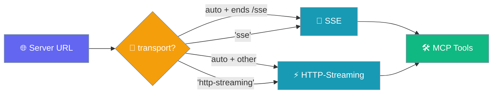
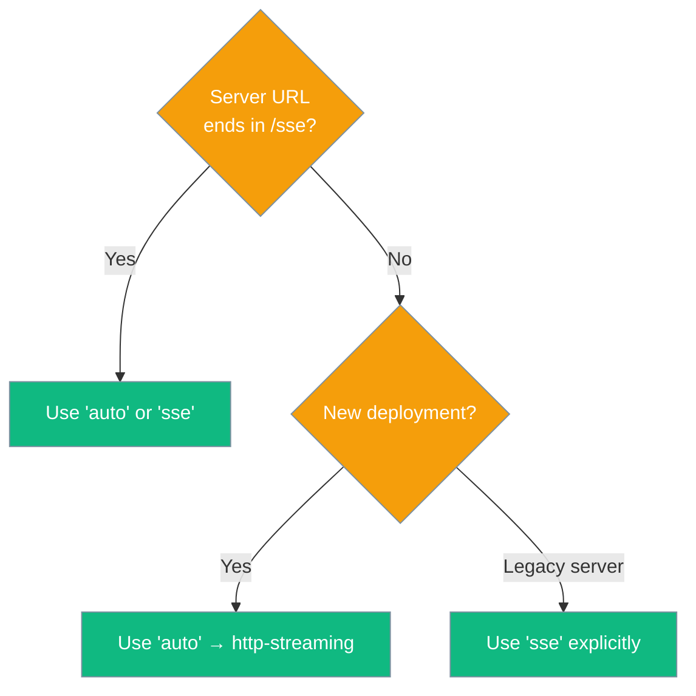

Use `new MCP(url, transportType)` to connect to any MCP server — the transport is auto-detected from the URL, or you can force a specific one.



## Quick Start

<Steps>
<Step title="Install">
```bash
npm install praisonai-ts
```
</Step>

<Step title="Construct">
```typescript
import { MCP } from 'praisonai-ts';

const mcp = new MCP('https://mcp.example.com/api'); // auto → http-streaming
```
</Step>

<Step title="Initialize">
```typescript
await mcp.initialize();
console.log(mcp.transportType); // "http-streaming"
```
</Step>

<Step title="Wire into Agent">
```typescript
import { Agent, MCP } from 'praisonai-ts';

const mcp = new MCP('https://mcp.example.com/api');
await mcp.initialize();

const toolFunctions = Object.fromEntries(
  [...mcp].map(tool => [tool.name, async (args: any) => tool.execute(args)])
);

const agent = new Agent({
  name: 'MCPTransportAgent',
  instructions: 'You are a helpful assistant with access to MCP tools.',
  tools: mcp.toOpenAITools(),
  toolFunctions,
});

const response = await agent.runSync('What tools are available?');
console.log(response);

await mcp.close();
```
</Step>
</Steps>

---

## How It Works

Auto-detection checks whether the URL ends in `/sse`. Any other path routes to HTTP-Streaming.



---

## Transport Examples

**Auto-detect on `/sse` URL — resolves to SSE:**
```typescript
import { Agent, MCP } from 'praisonai-ts';

const mcp = new MCP('http://127.0.0.1:8080/sse'); // → resolves to 'sse'
await mcp.initialize();
console.log(mcp.transportType); // "sse"
```

**Explicit SSE on a non-`/sse` URL:**
```typescript
const mcp = new MCP('http://127.0.0.1:8080/api', 'sse');
await mcp.initialize();
```

**Explicit HTTP-Streaming:**
```typescript
const mcp = new MCP('http://127.0.0.1:8080/stream', 'http-streaming');
await mcp.initialize();
```

**Auto-detect on non-`/sse` URL — resolves to HTTP-Streaming:**
```typescript
const mcp = new MCP('http://127.0.0.1:8080/api'); // → resolves to 'http-streaming'
await mcp.initialize();
```

---

## Configuration

| Parameter | Type | Default | Description |
|-----------|------|---------|-------------|
| `url` | `string` | required | MCP server endpoint URL |
| `transport` | `'auto' \| 'sse' \| 'http-streaming'` | `'auto'` | Force a specific transport, or let auto-detect pick |
| `debug` | `boolean` | `false` | Log transport selection and connection events |

---

## Instance API

```typescript
mcp.initialize(): Promise<void>      // Connect and fetch tools
mcp.close(): Promise<void>           // Disconnect gracefully
mcp.toOpenAITools(): OpenAITool[]    // Get tools in OpenAI format
mcp.transportType: string            // The resolved transport ('sse' or 'http-streaming')
mcp.isConnected: boolean             // Connection status
[Symbol.iterator]()                  // Iterate over MCPTool instances
```

---

## Best Practices

<AccordionGroup>
<Accordion title="Prefer 'auto' first">
Start with `new MCP(url)` (default `'auto'`). Only specify `'sse'` or `'http-streaming'` explicitly when you need to override the URL-based detection — for example, when connecting to a legacy SSE server at a non-`/sse` path.
</Accordion>

<Accordion title="Always close on exit">
Call `await mcp.close()` when the agent is done. This terminates the underlying transport session and avoids dangling connections.

```typescript
try {
  await mcp.initialize();
  // ... use agent
} finally {
  await mcp.close();
}
```
</Accordion>

<Accordion title="Use debug flag for troubleshooting">
Pass `debug=true` to log transport selection and connection events during development. Remove it in production to keep logs clean.

```typescript
const mcp = new MCP('http://127.0.0.1:8080/api', 'auto', true);
```
</Accordion>

<Accordion title="Invalid transport throws immediately">
Passing any value other than `'auto'`, `'sse'`, or `'http-streaming'` throws at construction time — not at `initialize()`. Validate user-supplied transport strings before passing them in.
</Accordion>
</AccordionGroup>

---

## Related

<CardGroup cols={2}>
  <Card title="MCP Transports (Python)" icon="network-wired" href="/docs/mcp/transports">
    Full transport overview for the Python SDK including stdio, WebSocket, and Streamable HTTP options
  </Card>
  <Card title="MCP Tools (TypeScript)" icon="wrench" href="/docs/js/mcp-tools">
    Broader TypeScript MCP tool integration using `createMCP` with stdio, OAuth, and more
  </Card>
  <Card title="MCP API Reference" icon="code" href="/docs/sdk/reference/typescript/classes/MCP">
    Auto-generated TypeScript API reference for the MCP class
  </Card>
  <Card title="HTTPStreamingTransport Reference" icon="code" href="/docs/sdk/reference/typescript/classes/HTTPStreamingTransport">
    Auto-generated reference for the HTTP-Streaming transport class
  </Card>
</CardGroup>
