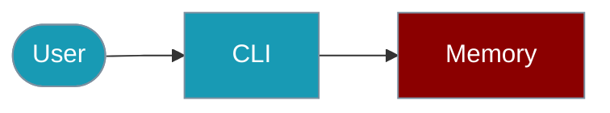

The `praisonai-ts` CLI provides commands for managing agent memory.



## Quick Start

<Steps>

<Step title="Simple Usage">
```bash
praisonai-ts memory list
```
</Step>

<Step title="With Configuration">
```bash
praisonai-ts memory search "important" --json
```
</Step>

</Steps>

## List Memories

```bash
# List all memories
praisonai-ts memory list

# Get JSON output
praisonai-ts memory list --json
```

## Add Memory

```bash
# Add a memory entry
praisonai-ts memory add "Important information to remember"
```

## Search Memory

```bash
# Search memories
praisonai-ts memory search "query"

# Get JSON output
praisonai-ts memory search "TypeScript" --json
```

## Clear Memory

```bash
# Clear all memories
praisonai-ts memory clear
```

## SDK Usage

For programmatic memory management:

```typescript
import { Memory } from 'praisonai';

const mem = new Memory();

// Add entries
await mem.add('Hello', 'user');
await mem.add('Hi there', 'assistant');

// Search
const results = await mem.search('Hello');

// Get recent
const recent = mem.getRecent(5);

// Build context
const context = mem.buildContext();

// Export
const data = mem.toJSON();
```

For more details, see the [Memory SDK documentation](/docs/js/memory).

## Related

<CardGroup cols={2}>
  <Card title="Memory" icon="book" href="/docs/js/memory">Memory overview</Card>
  <Card title="Sessions" icon="robot" href="/docs/js/sessions">Sessions overview</Card>
</CardGroup>
