Agents can use middleware to process requests and responses - for logging, validation, or transformation.

```mermaid
graph LR
    subgraph "Request Pipeline"
        A[📤 Input] --> B[🔧 Middleware]
        B --> C[🤖 Agent]
        C --> D[🔧 Middleware]
        D --> E[📥 Output]
    end
    
    classDef io fill:#6366F1,stroke:#7C90A0,color:#fff
    classDef middleware fill:#F59E0B,stroke:#7C90A0,color:#fff
    classDef agent fill:#10B981,stroke:#7C90A0,color:#fff
    
    class A,E io
    class B,D middleware
    class C agent
```



## Quick Start

<Steps>

<Step title="Add Logging">
```typescript
import { Agent, Middleware } from 'praisonai';

const logger: Middleware = async (ctx, next) => {
  console.log('Input:', ctx.input);
  await next();
  console.log('Output:', ctx.output);
};

const agent = new Agent({
  instructions: 'You are helpful',
  middleware: [logger]
});
```
</Step>

<Step title="Input Validation">
```typescript
const validate: Middleware = async (ctx, next) => {
  if (ctx.input.length > 1000) {
    throw new Error('Input too long');
  }
  await next();
};
```
</Step>

</Steps>

---

## User Interaction Flow


---

## Configuration Levels

```typescript
// Level 1: Array - Middleware list
const agent = new Agent({
  middleware: [logger, validator]
});

// Level 2: Function - Simple middleware
const agent = new Agent({
  middleware: [
    async (ctx, next) => {
      console.log(ctx.input);
      await next();
    }
  ]
});

// Level 3: Instance - Full control
const agent = new Agent({
  middleware: [
    {
      name: 'logger',
      handler: loggerFn,
      order: 1
    },
    {
      name: 'cache',
      handler: cacheFn,
      order: 2
    }
  ]
});
```

---

## Common Uses

| Use Case | Description |
|----------|-------------|
| Logging | Track all requests/responses |
| Validation | Check inputs before processing |
| Transformation | Modify data in transit |
| Caching | Cache frequent responses |

---

## API Reference

<Card title="HooksConfig" icon="code" href="/docs/sdk/reference/typescript/classes/HooksConfig">
  Hooks configuration (middleware pattern)
</Card>

---

## Best Practices

<AccordionGroup>
  <Accordion title="Keep middleware focused">
    Each middleware should do one thing well.
  </Accordion>
  
  <Accordion title="Order matters">
    Middleware runs in order - put validation first.
  </Accordion>
  
  <Accordion title="Always call next()">
    Forgetting next() breaks the chain.
  </Accordion>
</AccordionGroup>

---

## Related

<CardGroup cols={2}>
  <Card title="Hooks" icon="webhook" href="/docs/js/hooks">
    Lifecycle hooks
  </Card>
  <Card title="Guardrails" icon="shield" href="/docs/js/guardrails">
    Input validation
  </Card>
</CardGroup>
