Middleware intercepts agent requests and responses - for logging, modification, or validation.

```mermaid
graph LR
    subgraph "Request Pipeline"
        A[📤 Input] --> B[🔧 Middleware 1]
        B --> C[🔧 Middleware 2]
        C --> D[🤖 Agent]
        D --> E[📥 Output]
    end
    
    classDef input fill:#6366F1,stroke:#7C90A0,color:#fff
    classDef middleware fill:#F59E0B,stroke:#7C90A0,color:#fff
    classDef agent fill:#10B981,stroke:#7C90A0,color:#fff
    
    class A,E input
    class B,C middleware
    class D agent
```



## Quick Start

```typescript
import { Agent, Middleware } from 'praisonai';

const logger: Middleware = async (ctx, next) => {
  console.log('Input:', ctx.input);
  await next();
  console.log('Output:', ctx.output);
};

const agent = new Agent({
  instructions: 'You are helpful',
  middleware: [logger]
});
```

## Common Uses

| Use Case | Description |
|----------|-------------|
| Logging | Track all requests/responses |
| Validation | Check inputs before processing |
| Transformation | Modify data in transit |
| Caching | Cache frequent responses |

---

## Common Examples

### Input Validation

```typescript
const validate: Middleware = async (ctx, next) => {
  if (ctx.input.length > 1000) {
    throw new Error('Input too long');
  }
  await next();
};
```

### Response Caching

```typescript
const cache: Middleware = async (ctx, next) => {
  const cached = myCache.get(ctx.input);
  if (cached) {
    ctx.output = cached;
    return;
  }
  await next();
  myCache.set(ctx.input, ctx.output);
};
```

---

## Related

<CardGroup cols={2}>
  <Card title="Hooks" icon="webhook" href="/docs/js/hooks">
    Lifecycle hooks
  </Card>
  <Card title="Guardrails" icon="shield" href="/docs/js/guardrails">
    Input/output validation
  </Card>
</CardGroup>
