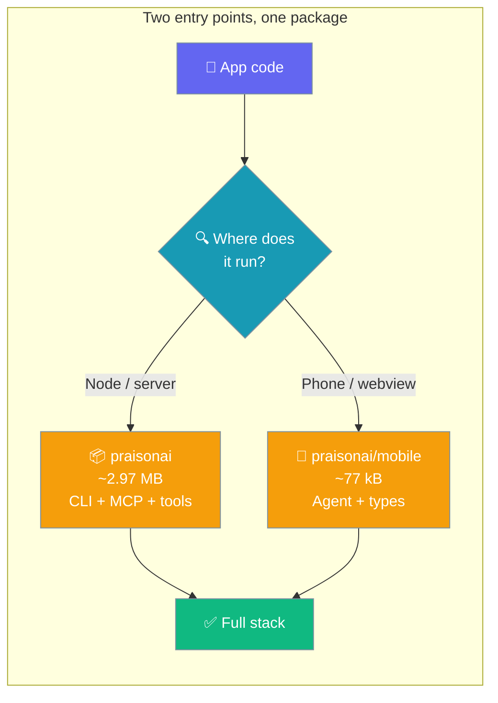
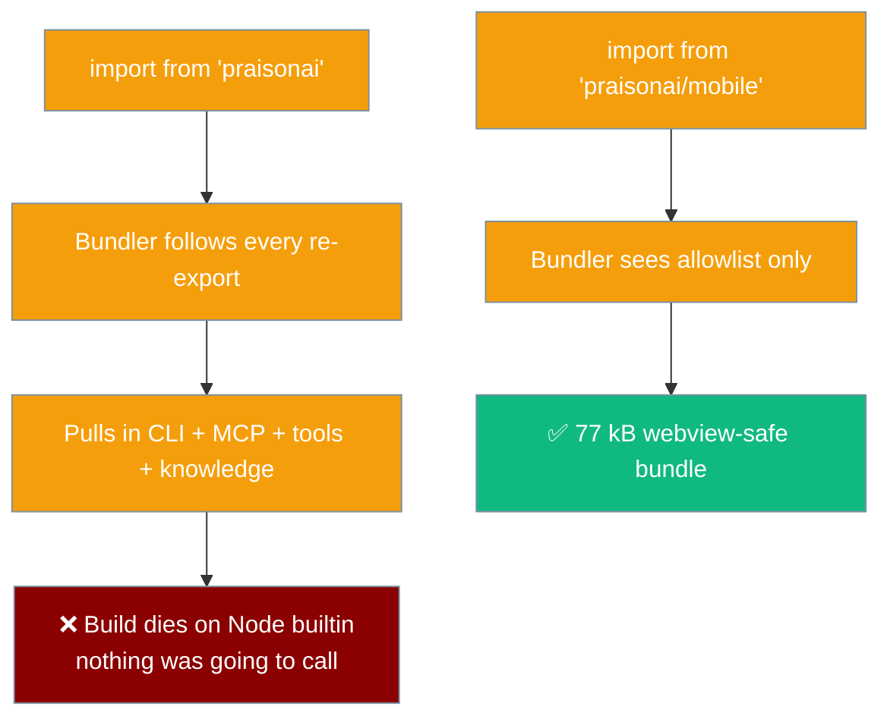

`praisonai/mobile` is a purpose-built entry point that bundles only the webview-safe surface of the SDK, so phones and browsers pull ~77 kB instead of 2.97 MB.



## Quick Start

<Steps>
<Step title="Import the phone-safe Agent">
The same `Agent`, from the webview-safe entry.

```typescript
import { Agent } from 'praisonai/mobile';

const agent = new Agent({
  instructions: 'You are a helpful assistant',
  llm: 'gpt-4o-mini',
  apiKey,  // supplied by your app at runtime, never bundled
});

const answer = await agent.start('Say hello');
```

<Warning>
**Never ship a raw API key into a phone or webview build.** Route requests through your own backend or an ephemeral-token endpoint. This example assumes `apiKey` was fetched from a trusted source at runtime.
</Warning>
</Step>
</Steps>

---

## Why a Separate Entry

The root `praisonai` entry re-exports the CLI, MCP server, tool registry, and knowledge store — a bundler cannot tell you don't call them, so it follows every re-export and dies on a Node builtin.



---

## What's Exported

The mobile entry is an allowlist matching `src/mobile.ts` — everything here is verified loadable in a webview.

| Export | Kind | Notes |
|--------|------|-------|
| `Agent` | class | The agent loop itself. |
| `AgentEvent` | type | Union: `text` \| `tool_call` \| `tool_result` \| `finish` \| `error`. See [Stream Events](/js/stream-events). |
| `AgentStreamOptions` | type | Options for `agent.streamEvents()`. |
| `SimpleAgentConfig` | type | Full `Agent` constructor config shape. |
| `StopReason` | type | Run stop reason: `completed` \| `max_steps` \| `cancelled` \| `error`. |
| `randomUUID` | function | Webview-safe UUID v4; use instead of Node's `crypto.randomUUID`. |
| `getEnv` | function | Safe env accessor; returns `undefined` when there is no `process`. |

**Not exported** (and why): CLI (spawns processes), MCP server (opens sockets), tool registry (reads the filesystem), knowledge store (reads/writes files). None of them can run in a webview, so importing them from a phone build was always a build-time crash waiting to happen.

---

## Bundle-Size Expectation

The mobile entry bundles well under the 400 kB target for a phone build.

```
praisonai/mobile, minified:   77.8 kB    (target: < 400 kB)
praisonai, root entry:         2.97 MB
```

The entry is verified on every CI run by `scripts/webview-gate.mjs`; if a maintainer adds an import that pulls a Node builtin into either entry, the build fails.

---

## Webview-Safe UUIDs

`randomUUID` from `praisonai/mobile` replaces `import { randomUUID } from 'crypto'`, a static Node builtin import that kills a webview bundle at load.

```typescript
import { randomUUID } from 'praisonai/mobile';

const runId = randomUUID();  // uses globalThis.crypto, falls back for older runtimes
```

It calls `globalThis.crypto.randomUUID` where available (every supported webview and Node ≥ 19), falls back to `getRandomValues`, and as a last resort uses `Math.random` — those ids are run and message identifiers, not secrets.

---

## Adding an Import to the Mobile Entry

For contributors: an export belongs in the mobile entry only if it can run in a webview.

If a piece of the SDK can run in a webview and would be useful on mobile, add it to `src/mobile.ts` **and** to the `WEBVIEW_ENTRIES` list in `scripts/webview-gate.mjs`. If it cannot run in a webview, it does not belong there — even if it would be convenient. A consumer reaching for something absent gets a clear build-time resolution error, which is a far better outcome than a blank screen on a device at import time.

---

## Framework Examples

The same 5-line `Agent` example, with the runtime-appropriate way to source `apiKey`.

<Tabs>
<Tab title="Tauri">
```typescript
import { Agent } from 'praisonai/mobile';
import { invoke } from '@tauri-apps/api/core';

const apiKey = await invoke<string>('get_api_key');  // from the Rust backend

const agent = new Agent({
  instructions: 'You are a helpful assistant',
  llm: 'gpt-4o-mini',
  apiKey,
});

const answer = await agent.start('Say hello');
```
</Tab>

<Tab title="React Native">
```typescript
import { Agent } from 'praisonai/mobile';

const res = await fetch('https://your-backend.example/token');
const { apiKey } = await res.json();  // ephemeral token from your backend

const agent = new Agent({
  instructions: 'You are a helpful assistant',
  llm: 'gpt-4o-mini',
  apiKey,
});

const answer = await agent.start('Say hello');
```
</Tab>

<Tab title="Browser">
```typescript
import { Agent } from 'praisonai/mobile';

const res = await fetch('/api/token');
const { apiKey } = await res.json();  // proxied through your server

const agent = new Agent({
  instructions: 'You are a helpful assistant',
  llm: 'gpt-4o-mini',
  apiKey,
});

const answer = await agent.start('Say hello');
```
</Tab>

<Tab title="Cloudflare Worker">
```typescript
import { Agent } from 'praisonai/mobile';

export default {
  async fetch(request: Request, env: { OPENAI_API_KEY: string }): Promise<Response> {
    const agent = new Agent({
      instructions: 'You are a helpful assistant',
      llm: 'gpt-4o-mini',
      apiKey: env.OPENAI_API_KEY,  // from the Worker's secret binding
    });

    const answer = await agent.start('Say hello');
    return new Response(answer);
  },
};
```
</Tab>
</Tabs>

---

## Best Practices

<AccordionGroup>
  <Accordion title="Never bundle an API key">
    A key shipped in a phone or webview build is extractable by anyone with the app. Fetch an ephemeral token from your own backend at runtime and pass it as `apiKey`.
  </Accordion>

  <Accordion title="Import types from the mobile entry too">
    `AgentEvent`, `AgentStreamOptions`, `SimpleAgentConfig`, and `StopReason` are all re-exported from `praisonai/mobile`. Import them from there so a mobile build never reaches into the root entry by accident.
  </Accordion>

  <Accordion title="Use randomUUID instead of Node's crypto">
    `import { randomUUID } from 'crypto'` is a static Node builtin import that kills a webview bundle at load. Use `randomUUID` from `praisonai/mobile` instead.
  </Accordion>

  <Accordion title="Add to the gate, not just the entry">
    If you add an export to `src/mobile.ts`, add its entry to `WEBVIEW_ENTRIES` in `scripts/webview-gate.mjs` so CI keeps verifying it stays webview-safe.
  </Accordion>
</AccordionGroup>

---

## Related

<CardGroup cols={2}>
  <Card title="Stream Events" icon="wave-pulse" href="/js/stream-events">
    Structured tool events from streamEvents()
  </Card>
  <Card title="TypeScript SDK" icon="scroll" href="/js/typescript">
    The full TypeScript framework
  </Card>
  <Card title="Streaming" icon="bolt" href="/js/streaming">
    Stream text token-by-token
  </Card>
  <Card title="Agent" icon="robot" href="/js/agent">
    Full agent configuration
  </Card>
</CardGroup>
