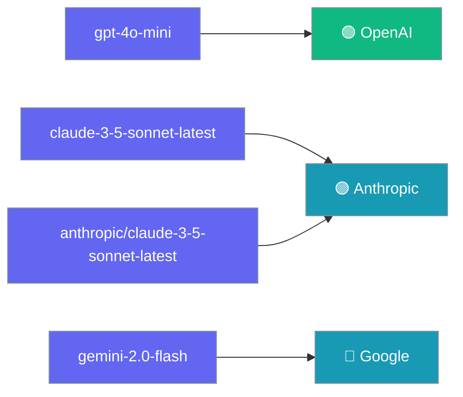
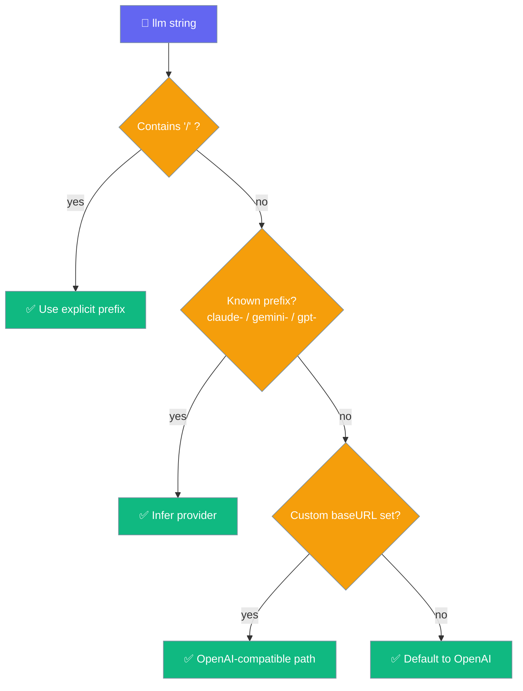

PraisonAI picks the vendor from your model string, so `claude-3-5-sonnet-latest` goes to Anthropic and `gemini-2.0-flash` goes to Google — no prefix required.



## Quick Start

<Steps>

<Step title="Just name the model">

Name the model and PraisonAI routes it to the right vendor.

```typescript
import { Agent } from 'praisonai';

const openai = new Agent({ instructions: 'x', llm: 'gpt-4o-mini' });
const claude = new Agent({ instructions: 'x', llm: 'claude-3-5-sonnet-latest' });
const gemini = new Agent({ instructions: 'x', llm: 'gemini-2.0-flash' });

await claude.chat('Hello!');
```

</Step>

<Step title="Be explicit when the name isn't enough">

Add a `provider/` prefix for custom-named or gateway models the bare name would not resolve.

```typescript
import { Agent } from 'praisonai';

const anthropic = new Agent({ instructions: 'x', llm: 'anthropic/my-custom-claude' });
const openai    = new Agent({ instructions: 'x', llm: 'openai/gpt-4o' });
const google    = new Agent({ instructions: 'x', llm: 'google/gemini-2.0-flash' });
```

</Step>

</Steps>

---

## How It Works

PraisonAI runs four checks in order to resolve every model string.



An explicit `provider/model` prefix wins over everything, including a custom `baseURL`.

---

## Routing Decision Table

This table is the single source of truth for user-visible routing behaviour.

| `llm` string | `baseURL` set? | Resolved provider | Backend used |
|--------------|----------------|-------------------|--------------|
| `gpt-4o-mini` | no | openai | OpenAI (native) |
| `claude-3-5-sonnet-latest` | no | **anthropic** | **AI SDK** |
| `gemini-2.0-flash` | no | **google** | **AI SDK** |
| `some-local-model` (unknown bare) | no | openai | OpenAI (native) |
| `openai/gpt-4o` | no | openai | OpenAI (native) |
| `anthropic/claude-3-5-sonnet-latest` | no | anthropic | AI SDK |
| `claude-3-5-sonnet-latest` | **yes** | openai | OpenAI-compatible (baseURL) |
| `anthropic/claude-3-5-sonnet-latest` | **yes** | **anthropic** | AI SDK (explicit prefix wins) |

---

## The baseURL Exception

<Note>
Pointing at a proxy that serves `claude-*` over an OpenAI-shaped API is a real deployment, so a **bare** name plus a custom `baseURL` stays on the OpenAI-compatible path — prefix inference would otherwise route it away from the endpoint you explicitly asked for. An **explicit** `provider/model` prefix still wins, because that request is unambiguous.
</Note>

```typescript
import { Agent } from 'praisonai';

// Bare name + baseURL → stays OpenAI-compatible (proxy case)
new Agent({ llm: 'claude-3-5-sonnet-latest',
            baseURL: 'https://my-gateway.example/v1' });

// Explicit prefix + baseURL → explicit prefix wins (unambiguous)
new Agent({ llm: 'anthropic/claude-3-5-sonnet-latest',
            baseURL: 'https://my-gateway.example/v1' });
```

---

## Per-Agent Credentials

Pass `apiKey` on the agent and PraisonAI honours it for whichever provider the model routes to.

```typescript
import { Agent } from 'praisonai';

const agent = new Agent({
  instructions: 'You are helpful.',
  llm: 'claude-3-5-sonnet-latest',
  apiKey: process.env.MY_ANTHROPIC_KEY,   // no ANTHROPIC_API_KEY needed
});
```

A programmatically-passed `apiKey` is honoured for every provider — env vars are optional, not required.

---

## Best Practices

<AccordionGroup>

<Accordion title="Prefer the bare name for major models">
`claude-3-5-sonnet-latest` reads more clearly than `anthropic/claude-3-5-sonnet-latest` and routes the same way.
</Accordion>

<Accordion title="Add the provider/ prefix when you're using a gateway">
A `baseURL` keeps a bare name on the OpenAI-compatible path; an explicit `provider/model` prefix overrides that.
</Accordion>

<Accordion title="Pass apiKey per agent when running multiple tenants">
No env-var juggling, no cross-tenant leakage — each agent carries its own key.
</Accordion>

<Accordion title="Do not name your own model claude-... or gemini-... unless you mean it">
The prefix inference is deliberate — a custom model with that name will route to Anthropic or Google.
</Accordion>

</AccordionGroup>

---

## Related

<CardGroup cols={2}>
  <Card title="Providers" icon="plug" href="/js/providers">
    Full provider reference and configuration
  </Card>
  <Card title="Multi-Provider Agents (AI SDK)" icon="microchip-ai" href="/js/ai-sdk">
    Build agents across 30+ providers
  </Card>
</CardGroup>
