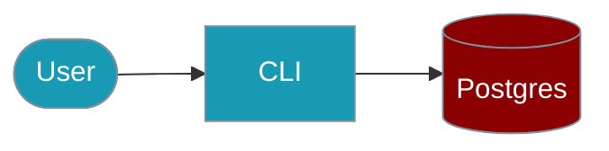

Query PostgreSQL databases using natural language from the command line.




## Quick Start

<Steps>

<Step title="Simple Usage">

```bash
praisonai-ts postgres query "Show all users" \
  --connection-url $DATABASE_URL
```

</Step>

<Step title="With Configuration">

```bash
praisonai-ts postgres query "Top 10 products by sales" \
  --connection-url $DATABASE_URL \
  --max-rows 10 \
  --json
```

</Step>

</Steps>

## Commands

### Query Database

```bash
# Simple query
praisonai-ts postgres query "Show all users" \
  --connection-url $DATABASE_URL

# With options
praisonai-ts postgres query "Top 10 products by sales" \
  --connection-url $DATABASE_URL \
  --max-rows 10 \
  --json
```

### Show Schema

```bash
# List all tables
praisonai-ts postgres schema \
  --connection-url $DATABASE_URL

# Show specific table
praisonai-ts postgres schema users \
  --connection-url $DATABASE_URL
```

### Interactive Mode

```bash
# Start interactive SQL chat
praisonai-ts postgres chat \
  --connection-url $DATABASE_URL \
  --read-only
```

## Options

| Option | Type | Default | Description |
|--------|------|---------|-------------|
| `--connection-url` | string | env | Database URL |
| `--read-only` | boolean | `true` | Read-only mode |
| `--max-rows` | number | `100` | Max rows returned |
| `--allowed-tables` | string | - | Comma-separated whitelist |
| `--blocked-tables` | string | - | Comma-separated blacklist |
| `--json` | boolean | `false` | JSON output |
| `--show-sql` | boolean | `false` | Show generated SQL |

## Examples

### Basic Queries

```bash
# List users
praisonai-ts postgres query "Show all active users"

# Aggregation
praisonai-ts postgres query "Average order value by month"

# With SQL output
praisonai-ts postgres query "Top customers" --show-sql
```

### Restricted Access

```bash
# Only allow specific tables
praisonai-ts postgres query "Show products" \
  --allowed-tables products,categories

# Block sensitive tables
praisonai-ts postgres query "Show data" \
  --blocked-tables users,payments
```

## Environment Variables

| Variable | Required | Description |
|----------|----------|-------------|
| `DATABASE_URL` | Yes | PostgreSQL connection URL |
| `OPENAI_API_KEY` | Yes | For NL to SQL |

## Related

<CardGroup cols={2}>
  <Card title="Natural Language Postgres" icon="database" href="/docs/js/nl-postgres">
    SDK usage
  </Card>
  <Card title="PostgreSQL" icon="elephant" href="/docs/js/postgres">
    Agent persistence
  </Card>
</CardGroup>
