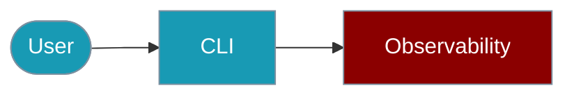

The `praisonai-ts` CLI manages the observability adapters. Only **Langfuse** delivers traces to a vendor backend; the other 13 external adapters record in memory only, and the CLI marks them `[no delivery - in-memory only]`.

<Warning>
Behaviour change: `observability test <tool>` now returns `success: false` and `status: "not_delivered"` for the 13 non-delivering adapters (previously `success: true`). CI pipelines that pipe `--json | jq .success` will now get `false` for those tools. Only `langfuse` returns delivered, and `console`/`memory` return `success: true` with `status: "recorded"`.
</Warning>



## Quick Start

<Steps>

<Step title="Simple Usage">

```bash
praisonai-ts observability list
```

</Step>

<Step title="With Configuration">

```bash
praisonai-ts observability list --verbose --json
```

</Step>

</Steps>

## Command Overview

| Command | Description |
|---------|-------------|
| `observability list` | List all available tools (marks non-delivering ones) |
| `observability doctor` | Check environment variables for all tools |
| `observability doctor <tool>` | Check specific tool setup |
| `observability test <tool>` | Test tool with a trace |
| `observability info` | Show observability feature information |

## List Observability Tools

```bash
# List all available tools
praisonai-ts observability list

# List with verbose output (shows env vars)
praisonai-ts observability list --verbose

# Get JSON output for CI/CD
praisonai-ts observability list --json
```

**Example Output:**

Non-delivering adapters show `❌` and the `[no delivery - in-memory only]` marker. Langfuse shows `⚠️` until its key is set (then `✅`), because it is the one adapter that can deliver.

```
Observability Tools

  Total: 17 tools (3 ready)

  Built-in (no setup required):
    ✅ console      Console logging (built-in)
    ✅ memory       In-memory storage (built-in)
    ✅ noop         No-op adapter (disabled)

  External Integrations:
    ⚠️ langfuse     Langfuse observability platform
    ❌ langsmith    LangSmith by LangChain          [no delivery - in-memory only]
    ❌ langwatch    LangWatch monitoring            [no delivery - in-memory only]
    ❌ arize        Arize AX (Phoenix)              [no delivery - in-memory only]
    ❌ axiom        Axiom logging and analytics     [no delivery - in-memory only]
    ❌ braintrust   Braintrust AI evaluation        [no delivery - in-memory only]
    ❌ helicone     Helicone observability proxy    [no delivery - in-memory only]
    ❌ laminar      Laminar AI observability        [no delivery - in-memory only]
    ❌ maxim        Maxim AI testing                [no delivery - in-memory only]
    ❌ patronus     Patronus AI evaluation          [no delivery - in-memory only]
    ❌ scorecard    Scorecard AI testing            [no delivery - in-memory only]
    ❌ signoz       SigNoz OpenTelemetry            [no delivery - in-memory only]
    ❌ traceloop    Traceloop OpenLLMetry           [no delivery - in-memory only]
    ❌ weave        Weights & Biases Weave          [no delivery - in-memory only]
```

**JSON Output:**

Each provider entry now includes a `delivers: boolean` field. `delivers: true` means traces reach the vendor backend; `delivers: false` means the adapter records in memory only.

```json
{
  "success": true,
  "data": {
    "providers": [
      { "name": "langfuse", "description": "Langfuse observability platform", "hasEnvKey": false, "delivers": true },
      { "name": "langsmith", "description": "LangSmith by LangChain", "hasEnvKey": false, "delivers": false },
      { "name": "weave", "description": "Weights & Biases Weave", "hasEnvKey": false, "delivers": false },
      { "name": "console", "description": "Console logging (built-in)", "hasEnvKey": true, "delivers": false }
    ],
    "total": 17,
    "ready": 3,
    "builtin": 3,
    "external": 14
  }
}
```

## Observability Doctor

Check environment setup for tools:

```bash
# Check all tools
praisonai-ts observability doctor

# Check specific tool
praisonai-ts observability doctor langfuse
praisonai-ts observability doctor langsmith
praisonai-ts observability doctor arize

# JSON output
praisonai-ts observability doctor langfuse --json
```

**Example Output (delivering tool, langfuse):**
```
Observability Doctor: langfuse
  Description: Langfuse observability platform
  Delivery: ✅ Implemented
  Package: langfuse
  Environment Variable: LANGFUSE_SECRET_KEY
  Status: ❌ Missing API Key

  Set the API key with:
    export LANGFUSE_SECRET_KEY=your-api-key

  Features:
    Traces: ✅  Spans: ✅  Events: ✅
    Errors: ✅  Metrics: ✅  Export: ✅
```

**Example Output (non-delivering tool, weave):**
```
Observability Doctor: weave
  Description: Weights & Biases Weave
  Delivery: ❌ NOT IMPLEMENTED - traces are kept in memory and never sent to weave.
            Setting WANDB_API_KEY will not change this.
  Package: weave
  Environment Variable: WANDB_API_KEY
  Status: ❌ Not Implemented

  Set the API key with:
    export WANDB_API_KEY=your-api-key

  Features:
    Traces: ✅  Spans: ✅  Events: ✅
    Errors: ✅  Metrics: ❌  Export: ❌
```

**Example Output (all tools):**
```
Observability Environment Check

  Total Tools: 17
  Ready: 3 ✅

  Ready Tools:
    ✅ console
    ✅ memory
    ✅ noop
```

## Observability Test

Test a tool with a real trace:

```bash
# Test built-in tools (no API key needed)
praisonai-ts observability test memory
praisonai-ts observability test console

# Test external tools (requires API key)
praisonai-ts observability test langfuse
praisonai-ts observability test langsmith

# JSON output
praisonai-ts observability test memory --json
```

**Example Output (built-in recorder, memory):**
```
Testing memory observability...

  ✅ Test Passed
  Tool: memory
  Recorded in memory (built-in). Nothing is sent to an external backend.
  Latency: 2ms
  Trace ID: abc123xyz
```

**JSON Output (memory):**

`success: true` but `delivered: false` \u2014 the trace was recorded locally and never left the process.

```json
{
  "success": true,
  "data": {
    "tool": "memory",
    "status": "recorded",
    "delivered": false,
    "latency_ms": 2,
    "trace_id": "abc123xyz"
  }
}
```

**Example Output (non-delivering tool, weave):**
```
Testing weave observability...

  ⚠️  Not Delivered
  Tool: weave
  The trace was recorded in memory but NOT sent to weave.
  This integration has no delivery implementation (isEnabled is false).
  Latency: 1ms
  Trace ID: abc123
```

**JSON Output (weave):**

`success: false` and `status: "not_delivered"`. CI pipelines that checked `.success` will now correctly see `false` for these adapters.

```json
{
  "success": false,
  "error": {
    "message": "The \"weave\" adapter recorded the trace in memory but did not send it anywhere. This integration has no delivery implementation.",
    "tool": "weave",
    "status": "not_delivered",
    "delivered": false,
    "latency_ms": 1,
    "trace_id": "abc123"
  }
}
```

## Observability Info

Get feature information:

```bash
praisonai-ts observability info
praisonai-ts observability info --json
```

## Options Matrix

| Option | Description | Default |
|--------|-------------|---------|
| `--json` | Output in JSON format | false |
| `--verbose` | Show detailed output | false |
| `--output <format>` | Output format (json/text/pretty) | pretty |
| `--tool <name>` | Specify tool | - |

## Available Tools

| Tool | Description | Env Variable | Delivers |
|------|-------------|--------------|----------|
| `langfuse` | Langfuse observability platform | `LANGFUSE_SECRET_KEY` | ✅ |
| `langsmith` | LangSmith by LangChain | `LANGCHAIN_API_KEY` | ❌ (in-memory only) |
| `langwatch` | LangWatch monitoring | `LANGWATCH_API_KEY` | ❌ (in-memory only) |
| `arize` | Arize AX (Phoenix) | `ARIZE_API_KEY` | ❌ (in-memory only) |
| `axiom` | Axiom logging and analytics | `AXIOM_TOKEN` | ❌ (in-memory only) |
| `braintrust` | Braintrust AI evaluation | `BRAINTRUST_API_KEY` | ❌ (in-memory only) |
| `helicone` | Helicone observability proxy | `HELICONE_API_KEY` | ❌ (in-memory only) |
| `laminar` | Laminar AI observability | `LMNR_PROJECT_API_KEY` | ❌ (in-memory only) |
| `maxim` | Maxim AI testing | `MAXIM_API_KEY` | ❌ (in-memory only) |
| `patronus` | Patronus AI evaluation | `PATRONUS_API_KEY` | ❌ (in-memory only) |
| `scorecard` | Scorecard AI testing | `SCORECARD_API_KEY` | ❌ (in-memory only) |
| `signoz` | SigNoz OpenTelemetry | `SIGNOZ_ACCESS_TOKEN` | ❌ (in-memory only) |
| `traceloop` | Traceloop OpenLLMetry | `TRACELOOP_API_KEY` | ❌ (in-memory only) |
| `weave` | Weights & Biases Weave | `WANDB_API_KEY` | ❌ (in-memory only) |
| `console` | Console logging (built-in) | (none) | ❌ (local stdout) |
| `memory` | In-memory storage (built-in) | (none) | ❌ (local in-process) |
| `noop` | No-op adapter (disabled) | (none) | ❌ |

## Environment Variables

```bash
# Langfuse
export LANGFUSE_PUBLIC_KEY=pk-...
export LANGFUSE_SECRET_KEY=sk-...
export LANGFUSE_HOST=https://cloud.langfuse.com

# LangSmith
export LANGCHAIN_API_KEY=ls-...
export LANGCHAIN_PROJECT=my-project

# LangWatch
export LANGWATCH_API_KEY=...

# Arize AX (Phoenix)
export ARIZE_API_KEY=...

# Axiom
export AXIOM_TOKEN=...
export AXIOM_DATASET=ai-traces

# Braintrust
export BRAINTRUST_API_KEY=...

# Helicone
export HELICONE_API_KEY=...

# Laminar
export LMNR_PROJECT_API_KEY=...

# Maxim
export MAXIM_API_KEY=...

# Patronus
export PATRONUS_API_KEY=...

# Scorecard
export SCORECARD_API_KEY=...

# SigNoz
export SIGNOZ_ACCESS_TOKEN=...
export SIGNOZ_ENDPOINT=...

# Traceloop
export TRACELOOP_API_KEY=...

# Weave (W&B)
export WANDB_API_KEY=...
export WANDB_PROJECT=my-project
```

## Troubleshooting

### My tool shows `[no delivery - in-memory only]` — what does that mean?

That adapter has no vendor transport. It records spans to memory and sends nothing to the vendor \u2014 setting its env var does not change this. Use `langfuse` (with `npm install langfuse`) for real delivery, or `console` for local development.

```bash
# Confirm delivery status
praisonai-ts observability doctor weave
# Delivery: ❌ NOT IMPLEMENTED - traces are kept in memory and never sent to weave.

# Use the one adapter that delivers
praisonai-ts observability doctor langfuse
```

### Missing API Key

```bash
# Check which keys are missing
praisonai-ts observability doctor

# Check specific tool
praisonai-ts observability doctor langfuse
# Output: ❌ Missing API Key
# Set it with: export LANGFUSE_SECRET_KEY=your-api-key
```

### Tool Not Available

```bash
# Check if tool package is installed
praisonai-ts observability doctor langfuse
# If package missing, install with:
# npm install langfuse
```

### Test Failures

```bash
# Run test with verbose output
praisonai-ts observability test langfuse --verbose

# Check JSON error details
praisonai-ts observability test langfuse --json
```

## SDK Usage

For programmatic observability:

```typescript
import { 
  createObservabilityAdapter, 
  setObservabilityAdapter,
  OBSERVABILITY_TOOLS,
  listObservabilityTools 
} from 'praisonai';

// List all tools
const tools = listObservabilityTools();
console.log(tools.map(t => t.name)); // ['langfuse', 'langsmith', ...]

// Create adapter
const obs = await createObservabilityAdapter('langfuse');
setObservabilityAdapter(obs);

// Use with agents
const agent = new Agent({
  instructions: 'You are helpful.'
});
await agent.chat('Hello');

// Flush traces
await obs.flush();
```

## Related

<CardGroup cols={2}>
  <Card title="Observability SDK" icon="eye" href="/js/observability">
    Code-based observability usage
  </Card>
  <Card title="Telemetry" icon="chart-line" href="/js/telemetry">
    Performance metrics
  </Card>
</CardGroup>
