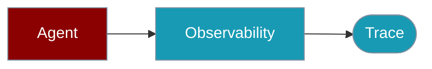

PraisonAI TypeScript records every LLM call, tool execution, and Agent decision as traces. **Langfuse** delivers those traces to a real backend (install `langfuse`). The other 13 external adapters are wired in but **record to memory only** — they do not send traces to their vendor backends today. The built-in `console` and `memory` adapters record locally.

<Warning>
Only **Langfuse** (with the `langfuse` npm package installed) ships traces to an external vendor. `console` and `memory` record locally. The other 13 external adapters accept traces and hold them in memory only — no network call is made, and setting the vendor's env var does not enable delivery. See the [Delivery Matrix](#observability-delivery-matrix) below.
</Warning>



## Observability Delivery Matrix

One table decides where your traces actually go today. This mirrors the `delivers` field in the SDK (`src/observability/types.ts`).

| Adapter | Delivers to vendor today? | Backend used |
|---|---|---|
| `langfuse` | ✅ (requires `npm install langfuse`) | Langfuse Cloud / self-hosted |
| `console` | ❌ (records locally to stdout) | stdout |
| `memory` | ❌ (records locally in-process) | in-process array (read via `getAllTraces()`) |
| `noop` | ❌ (records nothing) | nothing |
| `arize`, `axiom`, `braintrust`, `helicone`, `laminar`, `langsmith`, `langwatch`, `maxim`, `patronus`, `scorecard`, `signoz`, `traceloop`, `weave` | ❌ *(in-memory only)* | none — traces stay in the adapter's memory buffer |

<Note>
`console` and `memory` are genuine local recorders: they do exactly what they claim (write to stdout / hold spans in memory), but they do not deliver to an external vendor. The 13 external adapters above record to memory and discard on exit.
</Note>

## Supported Observability Tools

The `Env Variable` column shows what the SDK reads. **Setting the variable does not enable delivery** for any adapter marked `❌` — those traces stay in memory. The CLI marks these with `[no delivery - in-memory only]`.

| Tool | Description | Env Variable | Delivers to vendor? |
|------|-------------|--------------|---------------------|
| **Langfuse** | Langfuse observability platform | `LANGFUSE_SECRET_KEY` | ✅ (with `npm install langfuse`) |
| **LangSmith** | LangSmith by LangChain | `LANGCHAIN_API_KEY` | ❌ (in-memory only) |
| **LangWatch** | LangWatch monitoring | `LANGWATCH_API_KEY` | ❌ (in-memory only) |
| **Arize AX** | Arize AX (Phoenix) | `ARIZE_API_KEY` | ❌ (in-memory only) |
| **Axiom** | Axiom logging and analytics | `AXIOM_TOKEN` | ❌ (in-memory only) |
| **Braintrust** | Braintrust AI evaluation | `BRAINTRUST_API_KEY` | ❌ (in-memory only) |
| **Helicone** | Helicone observability proxy | `HELICONE_API_KEY` | ❌ (in-memory only) |
| **Laminar** | Laminar AI observability | `LMNR_PROJECT_API_KEY` | ❌ (in-memory only) |
| **Maxim** | Maxim AI testing | `MAXIM_API_KEY` | ❌ (in-memory only) |
| **Patronus** | Patronus AI evaluation | `PATRONUS_API_KEY` | ❌ (in-memory only) |
| **Scorecard** | Scorecard AI testing | `SCORECARD_API_KEY` | ❌ (in-memory only) |
| **SigNoz** | SigNoz OpenTelemetry | `SIGNOZ_ACCESS_TOKEN` | ❌ (in-memory only) |
| **Traceloop** | Traceloop OpenLLMetry | `TRACELOOP_API_KEY` | ❌ (in-memory only) |
| **Weave** | Weights & Biases Weave | `WANDB_API_KEY` | ❌ (in-memory only) |
| **Console** | Console logging (built-in) | (none) | ❌ (local stdout) |
| **Memory** | In-memory storage (built-in) | (none) | ❌ (local in-process) |

## Quick Start

<Steps>

<Step title="Simple Usage">

```typescript
import { Agent, createObservabilityAdapter, setObservabilityAdapter } from 'praisonai';

// Create adapter (langfuse, langsmith, console, memory, etc.)
const obs = await createObservabilityAdapter('langfuse');
setObservabilityAdapter(obs);

const agent = new Agent({
  name: 'Support Agent',
  instructions: 'Help users with their questions.'
});

// All Agent actions are now traced
await agent.chat('How do I reset my password?');

// Flush traces to the backend
await obs.flush();
```

</Step>

<Step title="With Configuration">

```typescript
import { Agent, MemoryObservabilityAdapter, setObservabilityAdapter } from 'praisonai';

const obs = new MemoryObservabilityAdapter();
setObservabilityAdapter(obs);

const agent = new Agent({
  name: 'Support Agent',
  instructions: 'Help users with their questions.',
  observability: true
});

await agent.chat('How do I reset my password?');
```

</Step>

</Steps>

## Agent with Tracing

```typescript
import { Agent, MemoryObservabilityAdapter, setObservabilityAdapter } from 'praisonai';

// Enable observability globally
const obs = new MemoryObservabilityAdapter();
setObservabilityAdapter(obs);

const agent = new Agent({
  name: 'Support Agent',
  instructions: 'Help users with their questions.',
  observability: true  // Enable tracing for this Agent
});

// All Agent actions are now traced
const response = await agent.chat('How do I reset my password?');

// View what happened
const traces = obs.getAllTraces();
for (const trace of traces) {
  console.log(`Trace: ${trace.name}`);
  for (const span of trace.spans) {
    console.log(`  ${span.type}: ${span.name} (${span.duration}ms)`);
  }
}
```

## Multi-Agent Tracing

Track interactions between multiple Agents:

```typescript
import { Agent, Agents, MemoryObservabilityAdapter, setObservabilityAdapter } from 'praisonai';

const obs = new MemoryObservabilityAdapter();
setObservabilityAdapter(obs);

const researcher = new Agent({
  name: 'Researcher',
  instructions: 'Research topics thoroughly.',
  observability: true
});

const writer = new Agent({
  name: 'Writer',
  instructions: 'Write clear summaries.',
  observability: true
});

const agents = new AgentTeam({
  agents: [researcher, writer],
  tasks: [
    { agent: researcher, description: 'Research: {topic}' },
    { agent: writer, description: 'Summarize the research' }
  ],
  observability: true  // Trace the entire workflow
});

await agents.start({ topic: 'AI trends 2024' });

// Analyze the workflow
const traces = obs.getAllTraces();
console.log(`Total traces: ${traces.length}`);
console.log(`Total LLM calls: ${traces.flatMap(t => t.spans).filter(s => s.type === 'llm').length}`);
```

## Agent Performance Monitoring

Track latency, tokens, and costs:

```typescript
import { Agent, createTool, MemoryObservabilityAdapter, setObservabilityAdapter } from 'praisonai';

const obs = new MemoryObservabilityAdapter();
setObservabilityAdapter(obs);

const agent = new Agent({
  name: 'Analytics Agent',
  instructions: 'Analyze data and provide insights.',
  observability: true
});

// Run multiple queries
await agent.chat('Analyze sales trends');
await agent.chat('Compare Q1 vs Q2');
await agent.chat('Predict Q3 performance');

// Analyze Agent performance
const traces = obs.getAllTraces();
const llmSpans = traces.flatMap(t => t.spans).filter(s => s.type === 'llm');

const stats = {
  totalCalls: llmSpans.length,
  avgLatency: llmSpans.reduce((sum, s) => sum + s.duration, 0) / llmSpans.length,
  totalTokens: llmSpans.reduce((sum, s) => sum + (s.attributes?.tokens || 0), 0)
};

console.log('Agent Performance:');
console.log(`  LLM Calls: ${stats.totalCalls}`);
console.log(`  Avg Latency: ${stats.avgLatency.toFixed(0)}ms`);
console.log(`  Total Tokens: ${stats.totalTokens}`);
```

## Agent Debugging

Debug Agent decisions and tool calls:

```typescript
import { Agent, createTool, ConsoleObservabilityAdapter, setObservabilityAdapter } from 'praisonai';

// Console adapter logs everything in real-time
const obs = new ConsoleObservabilityAdapter();
setObservabilityAdapter(obs);

const searchTool = createTool({
  name: 'search',
  description: 'Search for information',
  parameters: {
    type: 'object',
    properties: { query: { type: 'string' } },
    required: ['query']
  },
  execute: async ({ query }) => `Results for: ${query}`
});

const agent = new Agent({
  name: 'Debug Agent',
  instructions: 'Search for information to answer questions.',
  tools: [searchTool],
  observability: true
});

await agent.chat('Find information about TypeScript');

// Console output shows:
// [TRACE START] agent-execution
//   [SPAN START] llm-call (llm)
//   [SPAN END] llm-call - completed (1234ms)
//   [SPAN START] tool-call (tool) - search
//   [SPAN END] tool-call - completed (56ms)
//   [SPAN START] llm-call (llm)
//   [SPAN END] llm-call - completed (987ms)
// [TRACE END] agent-execution - completed
```

## Langfuse Integration (the delivery recipe)

Langfuse is the one external adapter that ships traces to a real backend. `langfuse` is an **optional peer dependency** of `praisonai` \u2014 install it separately:

```bash
npm install langfuse
```

`isEnabled` becomes `true` only after the adapter successfully creates a Langfuse client from that package. If the package is missing, the adapter falls back to memory and `flush()` warns that nothing was delivered.

```typescript
import { Agent, createObservabilityAdapter, setObservabilityAdapter } from 'praisonai';

const langfuse = await createObservabilityAdapter('langfuse', {
  name: 'langfuse',
  apiKey: process.env.LANGFUSE_SECRET_KEY,
  baseUrl: process.env.LANGFUSE_HOST
});

console.log(langfuse.isEnabled); // true once the langfuse client is created

setObservabilityAdapter(langfuse);

const agent = new Agent({
  name: 'Production Agent',
  instructions: 'Handle customer inquiries.',
  observability: true
});

// All traces automatically sent to Langfuse
await agent.chat('I need help with my order');

// View in Langfuse dashboard:
// - Trace timeline
// - Token usage
// - Latency breakdown
// - Cost tracking
```

## How to know if my traces are actually going anywhere

Check `isEnabled`. The 13 external adapters have no transport, so it is always `false` \u2014 this is not a config bug.

```typescript
import { createObservabilityAdapter } from 'praisonai';

const obs = await createObservabilityAdapter('weave');
console.log(obs.isEnabled);
// false \u2014 the weave adapter has no transport yet; traces stay in memory.

const langfuse = await createObservabilityAdapter('langfuse');
console.log(langfuse.isEnabled);
// true once the langfuse client is created (langfuse package installed + keys set).
```

Constructing any of the 13 non-delivering adapters prints a `console.warn`, and calling `flush()` on them warns that nothing was delivered:

```
[OBSERVABILITY] The "weave" adapter does not send traces to weave. Delivery is not
implemented: traces are held in memory only and are lost when the process exits.
isEnabled is false for this reason. Use the "langfuse" adapter, or the built-in
"console"/"memory" adapters, if you need trace output.
```

## Why an in-memory adapter for a vendor I've never used?

The 13 non-delivering adapters still record spans to an in-memory buffer you can drain via `getAllTraces()` or route through a custom `flush()`. They share the `UndeliveredObservabilityAdapter` base class (`src/observability/adapters/external/undelivered.ts`) and act as placeholders for future real delivery. Until then, use `langfuse` for vendor delivery or `console`/`memory` for local development.

## Custom Observability for Agents

Build custom monitoring:

```typescript
import { Agent, ObservabilityAdapter, TraceContext, SpanContext } from 'praisonai';

class DatadogAgentAdapter implements ObservabilityAdapter {
  startTrace(name: string, metadata?: Record<string, any>): TraceContext {
    // Send to Datadog APM
    const traceId = datadogTracer.startSpan(name, { tags: metadata });
    return {
      traceId,
      name,
      startSpan: (spanName, type) => this.createSpan(traceId, spanName, type),
      end: (status) => datadogTracer.finishSpan(traceId, { status })
    };
  }
  
  private createSpan(traceId: string, name: string, type: string): SpanContext {
    const spanId = datadogTracer.startChildSpan(traceId, name, { type });
    return {
      spanId,
      name,
      type,
      setAttributes: (attrs) => datadogTracer.setTags(spanId, attrs),
      addEvent: (event, data) => datadogTracer.addEvent(spanId, event, data),
      end: (status) => datadogTracer.finishSpan(spanId, { status })
    };
  }
}

// Use with Agents
setObservabilityAdapter(new DatadogAgentAdapter());
```

## Agent Audit Logging

Track Agent actions for compliance:

```typescript
import { Agent, createTool, MemoryObservabilityAdapter, setObservabilityAdapter } from 'praisonai';

const obs = new MemoryObservabilityAdapter();
setObservabilityAdapter(obs);

const sensitiveDataTool = createTool({
  name: 'access_customer_data',
  description: 'Access customer information',
  parameters: {
    type: 'object',
    properties: { customerId: { type: 'string' } },
    required: ['customerId']
  },
  execute: async ({ customerId }) => {
    // Tool execution is automatically traced
    return `Customer data for ${customerId}`;
  }
});

const agent = new Agent({
  name: 'Support Agent',
  instructions: 'Help customers with their accounts.',
  tools: [sensitiveDataTool],
  observability: true
});

await agent.chat('Look up customer C-12345');

// Generate audit log
const auditLog = obs.getAllTraces().flatMap(t => 
  t.spans.filter(s => s.type === 'tool').map(s => ({
    timestamp: s.startTime,
    action: s.name,
    agent: t.metadata?.agentName,
    details: s.attributes
  }))
);

console.log('Audit Log:', JSON.stringify(auditLog, null, 2));
```

## Switching Observability Tools

<Warning>
Switching adapters is not equivalent. Only `langfuse`, `console`, and `memory` produce user-visible artifacts today (`noop` records nothing). The other 13 adapters accept traces and discard them on exit \u2014 switching to `weave` or `arize` records to memory only, no matter what env var you set.
</Warning>

```typescript
import { createObservabilityAdapter, setObservabilityAdapter } from 'praisonai';

// Switch between tools easily
const tool = process.env.OBS_TOOL || 'memory';
const obs = await createObservabilityAdapter(tool as any);
setObservabilityAdapter(obs);

// Supported tools: langfuse, langsmith, langwatch, arize, axiom,
// braintrust, helicone, laminar, maxim, patronus, scorecard,
// signoz, traceloop, weave, console, memory, noop
// Only 'langfuse' delivers to a vendor; 'console'/'memory' record locally.
```

## Multi-Agent Attribution

Track agent_id, run_id, and trace_id across multi-agent workflows:

```typescript
import { Agent, Agents, MemoryObservabilityAdapter, setObservabilityAdapter } from 'praisonai';

const obs = new MemoryObservabilityAdapter();
setObservabilityAdapter(obs);

const researcher = new Agent({
  name: 'Researcher',
  instructions: 'Research topics thoroughly.'
});

const writer = new Agent({
  name: 'Writer', 
  instructions: 'Write clear summaries.'
});

const agents = new AgentTeam({
  agents: [researcher, writer],
  tasks: [
    { agent: researcher, description: 'Research: {topic}' },
    { agent: writer, description: 'Summarize the research' }
  ]
});

await agents.start({ topic: 'AI trends 2024' });

// Traces include agent attribution
const traces = obs.getAllTraces();
for (const trace of traces) {
  console.log(`Agent: ${trace.attribution?.agentId}`);
  console.log(`Run: ${trace.attribution?.runId}`);
}
```

## Environment Variables

Langfuse is the only env-configured adapter that delivers. The rest are read by the SDK for future compatibility \u2014 **setting them today does not enable delivery**; traces still stay in memory.

```bash
# Langfuse (delivers when the `langfuse` package is installed)
export LANGFUSE_PUBLIC_KEY=pk-...
export LANGFUSE_SECRET_KEY=sk-...
export LANGFUSE_HOST=https://cloud.langfuse.com

# The variables below are read but do NOT enable delivery (in-memory only):

# LangSmith
export LANGCHAIN_API_KEY=ls-...
export LANGCHAIN_PROJECT=my-project

# LangWatch
export LANGWATCH_API_KEY=...

# Arize AX (Phoenix)
export ARIZE_API_KEY=...

# Axiom
export AXIOM_TOKEN=...
export AXIOM_DATASET=ai-traces

# Braintrust
export BRAINTRUST_API_KEY=...

# Helicone
export HELICONE_API_KEY=...

# Laminar
export LMNR_PROJECT_API_KEY=...

# Maxim
export MAXIM_API_KEY=...

# Patronus
export PATRONUS_API_KEY=...

# Scorecard
export SCORECARD_API_KEY=...

# SigNoz
export SIGNOZ_ACCESS_TOKEN=...
export SIGNOZ_ENDPOINT=...

# Traceloop
export TRACELOOP_API_KEY=...

# Weave (W&B)
export WANDB_API_KEY=...
export WANDB_PROJECT=my-project
```

## Tool Features Matrix

**Recording ≠ delivery.** Every adapter records Traces/Spans/Events/Errors to memory, but only Langfuse can `Export` (deliver). The `Delivers` column is the one that decides whether traces leave the process. Values match `OBSERVABILITY_TOOLS` in `src/observability/types.ts`.

| Tool | Delivers | Traces | Spans | Events | Errors | Metrics | Export |
|------|----------|--------|-------|--------|--------|---------|--------|
| Langfuse | ✅ | ✅ | ✅ | ✅ | ✅ | ✅ | ✅ |
| LangSmith | ❌ | ✅ | ✅ | ✅ | ✅ | ❌ | ❌ |
| LangWatch | ❌ | ✅ | ✅ | ✅ | ✅ | ❌ | ❌ |
| Arize | ❌ | ✅ | ✅ | ✅ | ✅ | ❌ | ❌ |
| Axiom | ❌ | ✅ | ✅ | ✅ | ✅ | ❌ | ❌ |
| Braintrust | ❌ | ✅ | ✅ | ✅ | ✅ | ❌ | ❌ |
| Helicone | ❌ | ✅ | ✅ | ✅ | ✅ | ❌ | ❌ |
| Laminar | ❌ | ✅ | ✅ | ✅ | ✅ | ❌ | ❌ |
| Maxim | ❌ | ✅ | ✅ | ✅ | ✅ | ❌ | ❌ |
| Patronus | ❌ | ✅ | ✅ | ✅ | ✅ | ❌ | ❌ |
| Scorecard | ❌ | ✅ | ✅ | ✅ | ✅ | ❌ | ❌ |
| SigNoz | ❌ | ✅ | ✅ | ✅ | ✅ | ❌ | ❌ |
| Traceloop | ❌ | ✅ | ✅ | ✅ | ✅ | ❌ | ❌ |
| Weave | ❌ | ✅ | ✅ | ✅ | ✅ | ❌ | ❌ |
| Console | ❌ | ✅ | ✅ | ✅ | ✅ | ❌ | ❌ |
| Memory | ❌ | ✅ | ✅ | ✅ | ✅ | ❌ | ❌ |

<Note>
Recording is not delivery. A ✅ in Traces/Spans/Events/Errors means the adapter records it to memory. Only a ✅ in the `Delivers` column means traces reach the vendor \u2014 see the [Delivery Matrix](#observability-delivery-matrix).
</Note>

## Related

<CardGroup cols={2}>
  <Card title="Observability CLI" icon="terminal" href="/js/observability-cli">
    CLI commands
  </Card>
  <Card title="Evaluation" icon="clipboard-check" href="/js/evaluation">
    Test Agent quality
  </Card>
</CardGroup>
