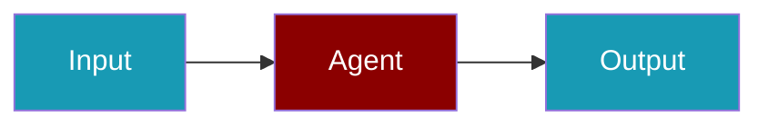

# Arize CLI Commands

## Environment Setup

```bash
export ARIZE_API_KEY=...
```

## Commands

```bash
praisonai-ts observability doctor arize
praisonai-ts observability doctor arize --json
praisonai-ts observability test arize
```

## Related

<CardGroup cols={2}>
  <Card title="Arize Code Usage" icon="book" href="/docs/js/observability/arize-code">
    Arize Code Usage
  </Card>
</CardGroup>
