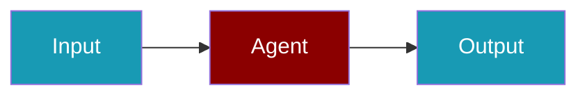

# Axiom CLI Commands

## Environment Setup

```bash
export AXIOM_TOKEN=...
```

## Commands

```bash
praisonai-ts observability doctor axiom
praisonai-ts observability doctor axiom --json
praisonai-ts observability test axiom
```

## Related

<CardGroup cols={2}>
  <Card title="Axiom Code Usage" icon="book" href="/docs/js/observability/axiom-code">
    Axiom Code Usage
  </Card>
</CardGroup>
