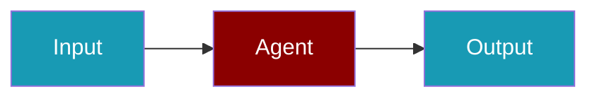

# Braintrust CLI Commands

## Environment Setup

```bash
export BRAINTRUST_API_KEY=...
```

## Commands

```bash
praisonai-ts observability doctor braintrust
praisonai-ts observability doctor braintrust --json
praisonai-ts observability test braintrust
```

## Related

<CardGroup cols={2}>
  <Card title="Braintrust Code Usage" icon="book" href="/docs/js/observability/braintrust-code">
    Braintrust Code Usage
  </Card>
</CardGroup>
