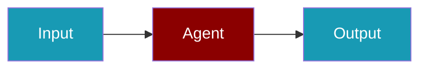

# Helicone Observability CLI Commands

## Environment Setup

```bash
export HELICONE_API_KEY=...
```

## Commands

```bash
praisonai-ts observability doctor helicone
praisonai-ts observability doctor helicone --json
praisonai-ts observability test helicone
```

## Related

<CardGroup cols={2}>
  <Card title="Helicone Code Usage" icon="book" href="/docs/js/observability/helicone-obs-code">
    Helicone Code Usage
  </Card>
</CardGroup>
